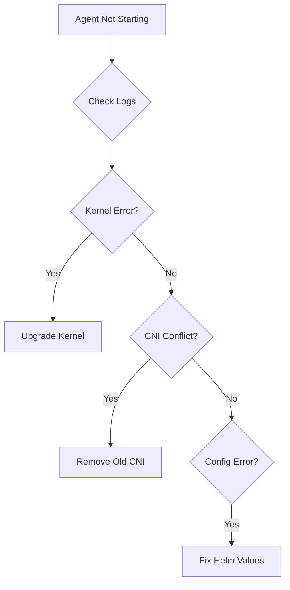

# Troubleshooting Common Cilium Installation and Setup Issues

Author: [nawazdhandala](https://github.com/nawazdhandala)

Tags: Cilium, Kubernetes, Troubleshooting, Installation, Networking

Description: How to diagnose and resolve common problems encountered during Cilium installation and initial setup, including kernel issues, CNI conflicts, and agent failures.

---

## Introduction

Cilium installation issues typically fall into three categories: environment prerequisites not met (kernel version, kernel modules), conflicts with existing CNI configurations, and agent startup failures due to misconfiguration. Because Cilium relies on eBPF, it has stricter kernel requirements than traditional CNI plugins.

Most installation problems appear during the first few minutes when agents try to load BPF programs and allocate IPs. If an agent fails to start, pods scheduled on that node will remain in ContainerCreating state indefinitely.

This guide covers the most common installation issues and their resolutions.

## Prerequisites

- Kubernetes cluster where Cilium installation was attempted
- kubectl configured with cluster access
- SSH access to cluster nodes (for kernel checks)

## Diagnosing Agent Startup Failures

```bash
# Check agent pod status
kubectl get pods -n kube-system -l k8s-app=cilium

# View agent logs
kubectl logs -n kube-system -l k8s-app=cilium --tail=200

# Check for specific error patterns
kubectl logs -n kube-system -l k8s-app=cilium | grep -iE "error|fatal|fail" | tail -20
```



## Kernel Version and Module Issues

```bash
# Check kernel version on nodes
kubectl get nodes -o wide

# SSH to a node and check kernel version
uname -r

# Check required kernel modules
lsmod | grep -E "bpf|xdp|vxlan"

# Check BPF filesystem is mounted
mount | grep bpf
```

Required kernel features:
- Kernel 5.10+ (5.15+ recommended)
- BPF filesystem mounted at `/sys/fs/bpf`
- Required modules: `bpf`, `vxlan` (if using tunnel mode)

## Resolving CNI Conflicts

```bash
# Check for existing CNI configurations
ls /etc/cni/net.d/

# Remove old CNI configuration files
# WARNING: This will disrupt existing pod networking
sudo rm /etc/cni/net.d/10-flannel.conflist  # Example for Flannel

# Check CNI binary directory
ls /opt/cni/bin/ | grep cilium

# Verify Cilium CNI config is present
cat /etc/cni/net.d/05-cilium.conflist
```

## Fixing IP Allocation Issues

```bash
# Check IPAM status
cilium status | grep IPAM

# Verify no CIDR conflicts
kubectl get nodes -o jsonpath='{.items[*].spec.podCIDR}'

# Check operator logs for IPAM errors
kubectl logs -n kube-system -l name=cilium-operator | grep -i "ipam"
```

## Verification

```bash
# After fixes, verify everything works
cilium status
cilium connectivity test
kubectl get pods -n kube-system -l k8s-app=cilium -o wide
kubectl get pods --all-namespaces | grep -v Running
```

## Troubleshooting

- **"BPF filesystem is not mounted"**: Mount it with `mount bpffs /sys/fs/bpf -t bpf` or add to `/etc/fstab`.
- **"Unable to load BPF program"**: Kernel too old. Upgrade to 5.10+.
- **Agents running but pods stuck in ContainerCreating**: Check CNI binary and config. Verify `/opt/cni/bin/cilium-cni` exists.
- **Operator crashlooping**: Check RBAC permissions. The operator needs cluster-wide access for IPAM and CRD management.

## Conclusion

Most Cilium installation issues stem from kernel requirements, CNI conflicts, or IPAM configuration. Check kernel version first, ensure no other CNI is competing, and verify IPAM configuration matches your cluster setup. The `cilium connectivity test` is your definitive verification that the installation is working.