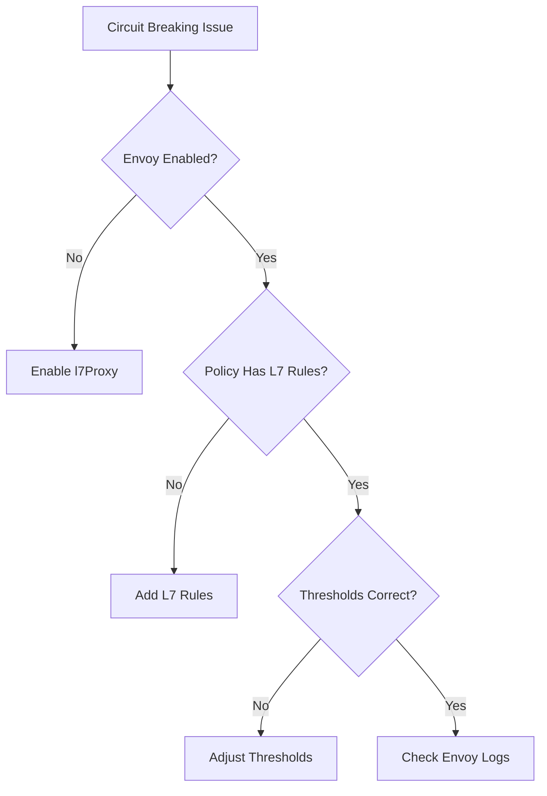

# Troubleshooting Cilium L7 Circuit Breaking

Author: [nawazdhandala](https://github.com/nawazdhandala)

Tags: Cilium, Kubernetes, L7, Circuit Breaking, Troubleshooting

Description: How to diagnose and resolve Cilium L7 circuit breaking issues including misconfigured thresholds, Envoy proxy errors, and unexpected connection rejections.

---

## Introduction

Cilium L7 circuit breaking uses the Envoy proxy to limit the impact of failing or slow backend services. When circuit breaking is misconfigured, it can either not trigger when it should (allowing cascading failures) or trigger too aggressively (blocking legitimate traffic during normal load spikes).

Common issues include thresholds set too low for production traffic, circuit breaker not activating because Envoy proxy is not enabled, and conflicting circuit breaker settings across multiple policies.

## Prerequisites

- Kubernetes cluster with Cilium installed
- Envoy proxy enabled (l7Proxy=true)
- kubectl and Cilium CLI configured

## Understanding Cilium Circuit Breaking

Cilium implements circuit breaking through Envoy CDS (Cluster Discovery Service) configuration. Circuit breaking limits are applied per upstream cluster:

```yaml
# Example CiliumNetworkPolicy with L7 rules that trigger Envoy
apiVersion: cilium.io/v2
kind: CiliumNetworkPolicy
metadata:
  name: l7-policy-with-limits
  namespace: default
spec:
  endpointSelector:
    matchLabels:
      app: frontend
  egress:
    - toEndpoints:
        - matchLabels:
            app: backend
      toPorts:
        - ports:
            - port: "8080"
              protocol: TCP
          rules:
            http:
              - method: GET
```

## Diagnosing Circuit Breaking Issues

```bash
# Check if Envoy proxy is enabled
cilium status | grep Envoy

# View Envoy configuration for circuit breaking
kubectl exec -n kube-system -l k8s-app=cilium -- \
  cilium bpf proxy list

# Check Envoy stats for circuit breaking
kubectl exec -n kube-system -l k8s-app=cilium -- \
  curl -s localhost:9901/stats | grep circuit

# Monitor Hubble for L7 traffic
hubble observe --protocol http -n default --last 20
```



## Enabling L7 Proxy

```bash
helm upgrade cilium cilium/cilium \
  --namespace kube-system \
  --reuse-values \
  --set l7Proxy=true
```

## Checking Envoy Circuit Breaker Stats

```bash
# Access Envoy admin interface through Cilium agent
kubectl exec -n kube-system <cilium-pod> -- \
  curl -s localhost:9901/stats | grep -E "cx_open|rq_pending|rq_retry"

# Check for overflow (circuit breaker triggered)
kubectl exec -n kube-system <cilium-pod> -- \
  curl -s localhost:9901/stats | grep "upstream_cx_overflow"
```

## Adjusting Circuit Breaking Behavior

Circuit breaking in Cilium is controlled through the Envoy configuration. For advanced tuning, use CiliumEnvoyConfig:

```yaml
apiVersion: cilium.io/v2
kind: CiliumEnvoyConfig
metadata:
  name: circuit-breaker-config
  namespace: default
spec:
  services:
    - name: backend
      namespace: default
  resources:
    - "@type": type.googleapis.com/envoy.config.cluster.v3.Cluster
      name: default/backend
      circuit_breakers:
        thresholds:
          - max_connections: 1000
            max_pending_requests: 1000
            max_requests: 1000
            max_retries: 3
```

## Verification

```bash
cilium status | grep Envoy
hubble observe --protocol http -n default --last 10
kubectl exec -n kube-system <cilium-pod> -- \
  curl -s localhost:9901/stats | grep circuit
```

## Troubleshooting

- **Circuit breaker never triggers**: Verify Envoy proxy is handling the traffic (L7 policy must be in place).
- **All requests rejected**: Thresholds may be too low. Increase max_connections and max_requests.
- **Envoy not in the path**: Without L7 rules in a policy, traffic bypasses Envoy.
- **Stats show zero values**: The service may not have enough traffic to trigger circuit breaking.

## Conclusion

L7 circuit breaking in Cilium requires Envoy proxy to be enabled and L7 rules in your network policies. Diagnose issues by checking Envoy stats, adjusting thresholds based on your traffic patterns, and monitoring with Hubble for L7 flow visibility.