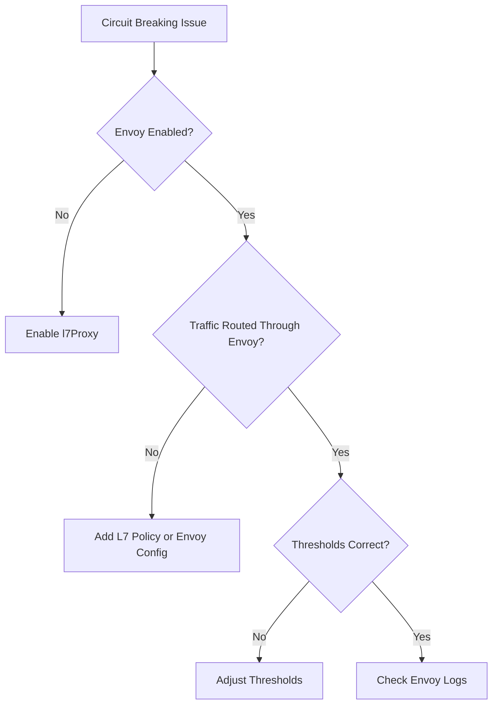

# Troubleshooting Cilium L7 Circuit Breaking

Author: [nawazdhandala](https://github.com/nawazdhandala)

Tags: Cilium, Kubernetes, L7, Circuit Breaking, Troubleshooting

Description: How to diagnose and resolve Cilium L7 circuit breaking issues including misconfigured thresholds, Envoy proxy errors, and unexpected connection rejections.

---

## Introduction

Cilium L7 circuit breaking uses the Envoy proxy to limit the impact of failing or slow backend services. When Envoy circuit breaking is misconfigured, it can either not trigger when it should (allowing cascading failures) or trigger too aggressively (blocking legitimate traffic during normal load spikes).

Common issues include thresholds set too low for production traffic, circuit breaker not activating because Envoy traffic management is not enabled, and conflicting circuit breaker settings across multiple Envoy resources.

## Prerequisites

- Kubernetes cluster with Cilium installed
- Envoy proxy enabled (l7Proxy=true)
- CiliumEnvoyConfig support enabled (envoyConfig.enabled=true) when managing Envoy resources directly
- kubectl and Cilium CLI configured

## Understanding Cilium Circuit Breaking

Cilium implements circuit breaking through Envoy CDS (Cluster Discovery Service) configuration, usually by applying a CiliumClusterwideEnvoyConfig or CiliumEnvoyConfig. Circuit breaking limits are applied per upstream cluster. CiliumNetworkPolicy L7 rules put matching traffic through Envoy, but they do not set circuit breaker thresholds themselves:

```yaml
# Example CiliumNetworkPolicy with L7 rules that send matching traffic through Envoy

apiVersion: cilium.io/v2
kind: CiliumNetworkPolicy
metadata:
  name: l7-policy-with-limits
  namespace: default
spec:
  endpointSelector:
    matchLabels:
      app: frontend
  egress:
    - toEndpoints:
        - matchLabels:
            app: backend
      toPorts:
        - ports:
            - port: "8080"
              protocol: TCP
          rules:
            http:
              - method: GET
```

## Diagnosing Circuit Breaking Issues

```bash
# Check Cilium and Envoy status
cilium status | grep Envoy

# View Envoy cluster configuration for circuit breaking
kubectl exec -n kube-system <cilium-pod> -- \
  cilium-dbg envoy admin config clusters | grep -A20 circuit_breakers

# Check Envoy stats for circuit breaking
kubectl exec -n kube-system <cilium-pod> -- \
  cilium-dbg envoy admin metrics -f "circuit_breakers|upstream_.*overflow"

# Monitor Hubble for L7 traffic
hubble observe --protocol http -n default --last 20
```


```mermaid
graph TD
    A[Circuit Breaking Issue] --> B{Envoy Enabled?}
    B -->|No| C[Enable l7Proxy]
    B -->|Yes| D{Traffic Routed Through Envoy?}
    D -->|No| E[Add L7 Policy or Envoy Config]
    D -->|Yes| F{Thresholds Correct?}
    F -->|No| G[Adjust Thresholds]
    F -->|Yes| H[Check Envoy Logs]
```

## Enabling L7 Proxy

```bash
helm upgrade cilium cilium/cilium \
  --namespace kube-system \
  --reuse-values \
  --set l7Proxy=true \
  --set envoyConfig.enabled=true

kubectl -n kube-system rollout restart deployment/cilium-operator
kubectl -n kube-system rollout restart ds/cilium
```

## Checking Envoy Circuit Breaker Stats

```bash
# Access Envoy admin interface through Cilium agent
kubectl exec -n kube-system <cilium-pod> -- \
  cilium-dbg envoy admin metrics -f "cx_open|rq_pending_open|rq_open|rq_retry_open"

# Check for overflow (circuit breaker triggered)
kubectl exec -n kube-system <cilium-pod> -- \
  cilium-dbg envoy admin metrics -f "upstream_cx_overflow|upstream_rq_pending_overflow|upstream_rq_active_overflow"
```

## Adjusting Circuit Breaking Behavior

Circuit breaking in Cilium is controlled through the Envoy configuration. For advanced tuning, use CiliumClusterwideEnvoyConfig or CiliumEnvoyConfig:

```yaml
apiVersion: cilium.io/v2
kind: CiliumClusterwideEnvoyConfig
metadata:
  name: circuit-breaker-config
spec:
  services:
    - name: backend
      namespace: default
  resources:
    - "@type": type.googleapis.com/envoy.config.cluster.v3.Cluster
      name: default/backend
      connect_timeout: 5s
      lb_policy: ROUND_ROBIN
      type: EDS
      circuit_breakers:
        thresholds:
          - priority: "DEFAULT"
            max_connections: 1000
            max_pending_requests: 1000
            max_requests: 1000
            max_retries: 3
```

## Verification

```bash
cilium status | grep Envoy
hubble observe --protocol http -n default --last 10
kubectl exec -n kube-system <cilium-pod> -- \
  cilium-dbg envoy admin metrics -f "circuit_breakers|upstream_.*overflow"
```

## Troubleshooting

- **Circuit breaker never triggers**: Verify Envoy proxy is handling the traffic and the matching Envoy cluster has circuit breaker thresholds configured.
- **All requests rejected**: Thresholds may be too low. Increase max_connections and max_requests.
- **Envoy not in the path**: Without L7 policy, Cilium Ingress, Gateway API, L7 load balancing, or another Envoy traffic management configuration, traffic bypasses Envoy.
- **Stats show zero values**: The service may not have enough traffic to trigger circuit breaking.

## Conclusion

L7 circuit breaking in Cilium requires Envoy proxy to be enabled and an Envoy configuration that defines circuit breaker thresholds. Diagnose issues by checking Envoy stats, adjusting thresholds based on your traffic patterns, and monitoring with Hubble for L7 flow visibility.
