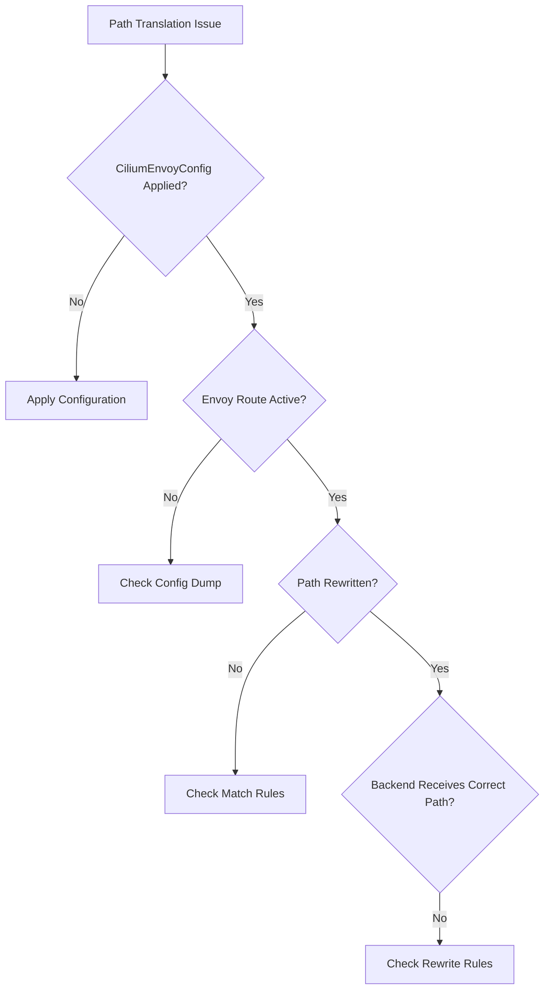

# Troubleshooting Cilium L7 Path Translation Issues

Author: [nawazdhandala](https://github.com/nawazdhandala)

Tags: Cilium, Kubernetes, L7, Troubleshooting, Envoy

Description: How to diagnose and fix Cilium L7 path translation problems including misconfigured routes, Envoy errors, and unexpected rewrite behavior.

---

## Introduction

L7 path translation issues in Cilium manifest as requests hitting the wrong backend endpoint, 404 errors after path rewriting, or path translation not happening at all. Because path translation runs inside the Envoy proxy, debugging requires checking both the CiliumEnvoyConfig and the Envoy runtime state.

## Prerequisites

- Kubernetes cluster with Cilium and L7 proxy enabled
- kubectl and Cilium CLI configured
- CiliumEnvoyConfig applied for path translation

## Diagnosing Path Translation Failures

```bash
# Check CiliumEnvoyConfig status
kubectl get ciliumenvoyconfigs -n default

# Verify Envoy picked up the configuration
kubectl exec -n kube-system <cilium-pod> -- \
  curl -s localhost:9901/config_dump | \
  jq '.configs[] | select(.["@type"] | contains("RoutesConfigDump"))' | head -50

# Check Envoy logs for route errors
kubectl logs -n kube-system <cilium-pod> | grep -i "route" | tail -20

# Monitor actual HTTP requests through Hubble
hubble observe --protocol http -n default --last 20 -o json | \
  jq '.flow.l7.http | {url: .url, code: .code}'
```



## Fixing Configuration Issues

```bash
# Validate CiliumEnvoyConfig YAML
kubectl apply --dry-run=client -f path-translation.yaml

# Check for rejected configurations
kubectl get ciliumenvoyconfigs -n default -o json | \
  jq '.items[] | {name: .metadata.name, status: .status}'

# Test with a simple configuration first
cat <<EOF | kubectl apply -f -
apiVersion: cilium.io/v2
kind: CiliumEnvoyConfig
metadata:
  name: simple-rewrite-test
  namespace: default
spec:
  services:
    - name: backend-service
      namespace: default
  resources:
    - "@type": type.googleapis.com/envoy.config.route.v3.RouteConfiguration
      name: default/backend-service
      virtual_hosts:
        - name: backend
          domains: ["*"]
          routes:
            - match:
                prefix: "/test-old/"
              route:
                cluster: default/backend-service
                prefix_rewrite: "/test-new/"
            - match:
                prefix: "/"
              route:
                cluster: default/backend-service
EOF
```

## Verification

```bash
kubectl get ciliumenvoyconfigs -n default
kubectl exec deploy/client -- curl -s http://backend-service:8080/test-old/path
hubble observe --protocol http -n default --last 5
```

## Troubleshooting

- **Config not applied**: Check CiliumEnvoyConfig syntax. Ensure service name matches exactly.
- **Route order matters**: Envoy evaluates routes in order. Put specific matches before catch-all.
- **Regex errors**: Envoy uses RE2, not PCRE. Some patterns may not be supported.
- **502/503 after rewrite**: The rewritten path may not exist on the backend. Verify backend routes.

## Conclusion

Troubleshoot path translation by checking the CiliumEnvoyConfig is applied, verifying Envoy route configuration, and testing with simple cases first. Use Hubble to observe actual HTTP request paths.