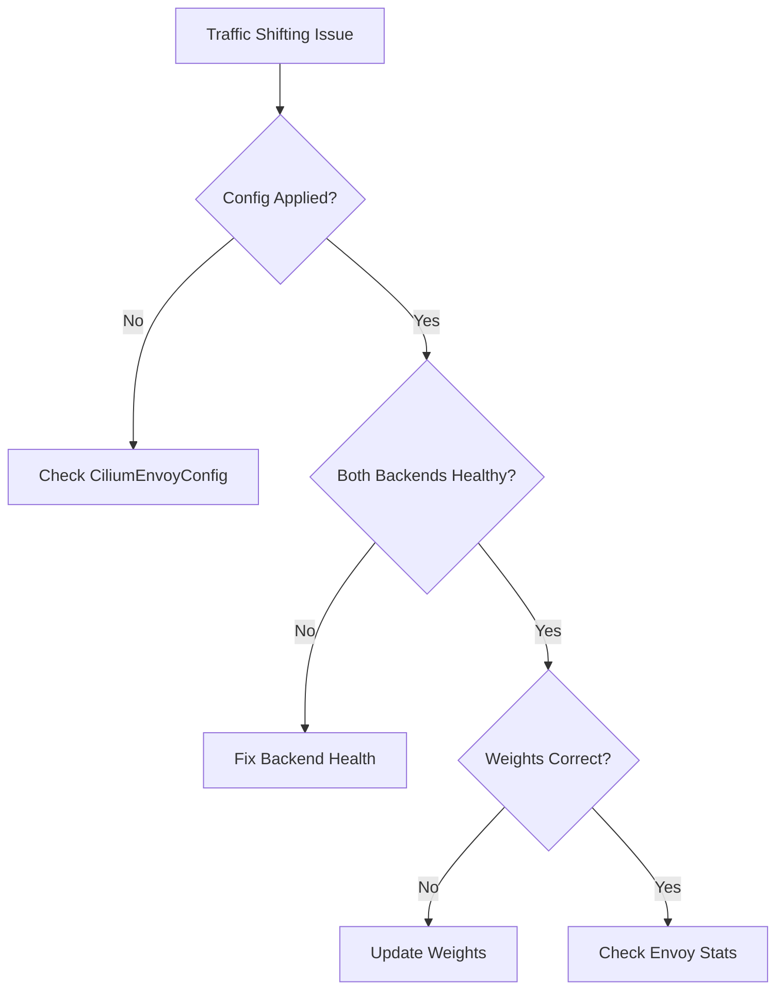

# Troubleshooting Cilium L7 Traffic Shifting Issues

Author: [nawazdhandala](https://github.com/nawazdhandala)

Tags: Cilium, Kubernetes, L7, Traffic Shifting, Troubleshooting

Description: How to diagnose and fix Cilium L7 traffic shifting problems including uneven distribution, configuration errors, and backend routing failures.

---

## Introduction

Traffic shifting issues manifest as all traffic going to one version, weights not being respected, or errors when shifting begins. Because traffic shifting runs through the Envoy proxy, debugging requires checking both the CiliumEnvoyConfig and Envoy runtime state.

## Prerequisites

- Kubernetes cluster with Cilium L7 proxy and traffic shifting configured
- kubectl, Cilium CLI, and Hubble CLI configured
- Multiple service versions deployed

## Diagnosing Shifting Issues

```bash
# Check CiliumEnvoyConfig resources and Cilium agent provisioning logs

kubectl get ciliumenvoyconfigs -n default -o yaml
kubectl logs -n kube-system ds/cilium --timestamps | grep -E "envoy|CiliumEnvoyConfig|xDS"

# Verify Envoy weighted cluster configuration
kubectl exec -n kube-system ds/cilium -- \
  cilium-dbg envoy admin config routes | grep -A20 "weighted_clusters"

# Check cluster health for both versions
kubectl exec -n kube-system ds/cilium -- \
  cilium-dbg envoy admin clusters | grep -E "backend-v[12]"
```


```mermaid
graph TD
    A[Traffic Shifting Issue] --> B{Config Applied?}
    B -->|No| C[Check CiliumEnvoyConfig]
    B -->|Yes| D{Both Backends Healthy?}
    D -->|No| E[Fix Backend Health]
    D -->|Yes| F{Weights Correct?}
    F -->|No| G[Update Weights]
    F -->|Yes| H[Check Envoy Stats]
```

## Fixing Uneven Distribution

```bash
# Verify both backend versions have healthy EndpointSlices
kubectl get endpointslice -n default -l kubernetes.io/service-name=backend-v1
kubectl get endpointslice -n default -l kubernetes.io/service-name=backend-v2

# Test with enough requests to see distribution
for i in $(seq 1 1000); do
  kubectl exec deploy/client -- curl -s http://backend/ >/dev/null 2>&1
done

# Check Envoy stats for per-cluster request counts
kubectl exec -n kube-system ds/cilium -- \
  cilium-dbg envoy admin metrics --filter "upstream_rq_total.*backend"
```

## Verification

```bash
kubectl get ciliumenvoyconfigs -n default
kubectl get pods -l app=backend -o wide
hubble observe --protocol http --to-label app=backend --last 50
```

## Troubleshooting

- **All traffic to v1**: CiliumEnvoyConfig may not be applied. Check `envoyConfig.enabled` is enabled and Cilium agent logs for CEC errors.
- **Statistical variance**: Need 1000+ requests for weights to converge. Small samples show variance.
- **One version gets 503s**: That version may have unhealthy pods. Check readiness probes.
- **Config rejected**: Weighted clusters must reference valid Envoy cluster names. Check naming.

## Conclusion

Traffic shifting troubleshooting focuses on configuration correctness, backend health, and sample size. Verify both versions are healthy, ensure CiliumEnvoyConfig uses correct cluster names, and test with enough requests to observe the configured weights.
