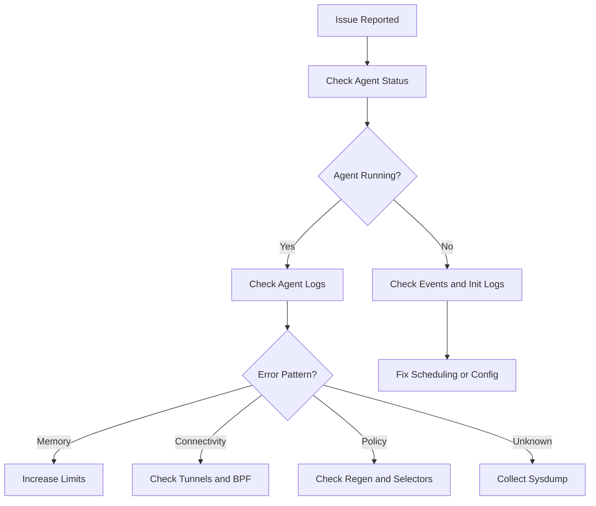

# How to Troubleshoot Cilium Scalability

Author: [nawazdhandala](https://github.com/nawazdhandala)

Tags: Cilium, Troubleshooting, Performance

Description: A practical guide covering how to troubleshoot cilium scalability with step-by-step instructions and real-world examples for production Kubernetes clusters.

---

## Introduction

Scalability issues in Cilium can manifest as slow endpoint provisioning, delayed policy enforcement, high memory consumption, or increased latency. A systematic troubleshooting approach helps isolate the root cause quickly.

In this guide, we cover troubleshooting Cilium scalability in a Kubernetes environment. Cilium leverages eBPF technology to provide high-performance networking, security, and observability for cloud-native workloads. The eBPF programs are loaded directly into the Linux kernel, enabling efficient packet processing without the overhead of traditional iptables-based networking stacks.

Whether you are running a small development cluster or a large production environment with thousands of pods, the techniques in this guide will help you maintain a reliable Cilium deployment. We provide step-by-step instructions with real commands and configuration examples that you can adapt to your environment.

## Prerequisites

- A running Kubernetes cluster (v1.21+) with Cilium installed (v1.14+)
- `kubectl` configured for cluster access
- `cilium` CLI installed (matching your Cilium version)
- Helm 3.x for configuration management
- Basic familiarity with Kubernetes networking concepts
- Access to cluster nodes for troubleshooting (recommended)
- Prometheus and Grafana for metrics visualization (recommended)

## Initial Diagnosis

Start with a high-level assessment of the Cilium deployment health.

```bash
# Quick health check
cilium status --verbose

# Check for pods that are not running
kubectl get pods -n kube-system -l k8s-app=cilium -o wide | grep -v Running

# Review recent events
kubectl get events -n kube-system --sort-by='.lastTimestamp' | grep cilium | tail -15
```

## Analyzing Agent Logs

The cilium-agent logs are the primary source of troubleshooting information.

```bash
# Check for errors in the last 100 log lines
kubectl logs -n kube-system -l k8s-app=cilium --tail=100 -c cilium-agent | grep -i -E "error|fail|timeout"

# Check for warnings that might indicate degraded performance
kubectl logs -n kube-system -l k8s-app=cilium --tail=200 -c cilium-agent | grep -i warn | tail -20

# Check operator logs for cluster-wide issues
kubectl logs -n kube-system -l name=cilium-operator --tail=100 | grep -i -E "error|fail"

# Look for specific subsystem issues
kubectl logs -n kube-system -l k8s-app=cilium --tail=200 -c cilium-agent | grep "subsys=endpoint" | tail -10
kubectl logs -n kube-system -l k8s-app=cilium --tail=200 -c cilium-agent | grep "subsys=policy" | tail -10
```

## Common Issues and Resolutions

### Issue 1: Agent High Memory Usage

```bash
# Check current memory usage
kubectl top pods -n kube-system -l k8s-app=cilium --sort-by=memory

# Check identity count (high identity count increases memory usage)
cilium identity list | wc -l

# Resolution: Increase memory limits and enable label exclusion
helm upgrade cilium cilium/cilium \
  --namespace kube-system \
  --reuse-values \
  --set resources.limits.memory=2Gi \
  --set 'labels.exclude={k8s:pod-template-hash,k8s:controller-revision-hash}'
```

### Issue 2: Connectivity Failures

```bash
# Run the comprehensive connectivity test
cilium connectivity test

# Check for dropped packets
cilium metrics list | grep drop

# Verify tunnel connectivity between nodes
cilium bpf tunnel list

# Check BPF service maps
cilium bpf lb list | head -20
```

### Issue 3: Slow Policy Enforcement

```bash
# Check policy regeneration times
kubectl logs -n kube-system -l k8s-app=cilium --tail=200 | grep "regeneration completed" | tail -5

# Check for policy computation errors
cilium policy get | head -20

# Verify endpoint regeneration rate
cilium metrics list | grep endpoint_regeneration
```



## Collecting a Diagnostic Bundle

When the issue requires deeper analysis, collect a comprehensive diagnostic bundle.

```bash
# Generate a Cilium sysdump with all diagnostic information
cilium sysdump --output-filename cilium-troubleshoot-$(date +%Y%m%d-%H%M%S)

# The sysdump includes:
# - Agent and operator logs
# - BPF map contents
# - Endpoint and identity state
# - Cluster configuration
# - Node health information
```


## Verification

After completing the steps above, run a comprehensive verification to confirm everything is working as expected.

```bash
# Check overall Cilium deployment health
cilium status --verbose

# Verify inter-node connectivity
cilium health status

# Confirm all Cilium pods are running and ready
kubectl get pods -n kube-system -l k8s-app=cilium -o wide

# Verify the Cilium operator is healthy
kubectl get pods -n kube-system -l name=cilium-operator

# Check for recent error events
kubectl get events -n kube-system --sort-by='.lastTimestamp' | grep cilium | tail -10

# Run a connectivity test to validate the data plane
cilium connectivity test --single-node

# Verify endpoint count matches expected pod count
echo "Cilium endpoints: $(cilium endpoint list -o json 2>/dev/null | python3 -c 'import json,sys; print(len(json.load(sys.stdin)))' 2>/dev/null || echo 'N/A')"
```

## Troubleshooting

If you encounter issues during or after the steps in this guide, use the following troubleshooting procedures:

- **Cilium agent not starting**: Check resource limits and node capacity with `kubectl describe pod -n kube-system -l k8s-app=cilium`. Verify the BPF filesystem is mounted at `/sys/fs/bpf` and the kernel version is 4.19 or later. Check init container logs with `kubectl logs -n kube-system <pod> -c cilium-init`.

- **Connectivity failures**: Run `cilium connectivity test` and inspect the specific failing test case. Check for conflicting network policies with `cilium policy get`. Verify inter-node tunnel connectivity with `cilium bpf tunnel list`.

- **Configuration not applied**: Verify the Helm values or ConfigMap are correctly formatted. Run `kubectl rollout restart daemonset/cilium -n kube-system` and wait for the rollout to complete. Confirm with `cilium config view`.

- **High resource usage**: Review resource consumption with `kubectl top pods -n kube-system -l k8s-app=cilium`. Consider tuning label exclusion to reduce identity count. Increase agent memory limits if needed. Check `cilium metrics list | grep process_resident_memory`.

- **Endpoints stuck in regenerating state**: This usually indicates the agent is overloaded or encountering errors during BPF program compilation. Check agent logs with `kubectl logs -n kube-system -l k8s-app=cilium --tail=200 | grep -i error`.

- **Policy not being enforced**: Verify the policy selectors match the intended pods using `cilium endpoint list`. Confirm the policy is applied with `cilium policy get`. Check that the endpoint has the correct identity with `cilium endpoint get <id>`.

To collect a comprehensive diagnostic bundle for further analysis:

```bash
# Generate a Cilium sysdump containing all diagnostic information
# This collects logs, configs, BPF maps, and cluster state
cilium sysdump --output-filename cilium-diag-$(date +%Y%m%d)
```

## Conclusion

This guide covered troubleshooting Cilium scalability with practical steps you can apply to your Kubernetes cluster. Regular monitoring, systematic validation, and proactive management are essential for maintaining a healthy Cilium deployment at any scale.

Key takeaways from this guide:

- Always assess the current state before making changes to your Cilium configuration
- Use Helm for configuration management to ensure consistency and reproducibility across environments
- Monitor Cilium metrics through Prometheus to detect issues before they impact workloads
- Test changes in a staging environment before applying them to production clusters
- Maintain runbooks documenting your Cilium configuration decisions and operational procedures
- Use `cilium sysdump` to collect comprehensive diagnostic data when investigating issues

As your cluster grows and evolves, revisit these configurations periodically and adjust them to match your current requirements. The Cilium community and documentation are excellent resources for staying current with best practices and new features.
