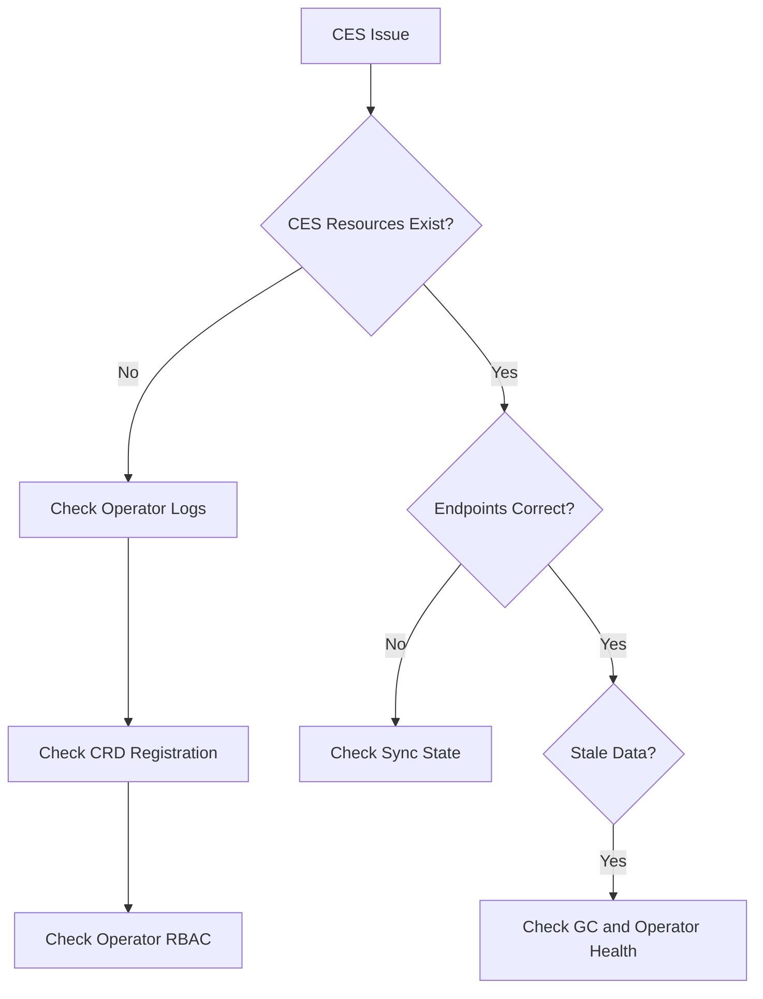

# Troubleshooting CiliumEndpointSlice Issues in Kubernetes

Author: [nawazdhandala](https://github.com/nawazdhandala)

Tags: Cilium, Kubernetes, Troubleshooting, EndpointSlice, Networking

Description: A step-by-step guide to diagnosing and fixing CiliumEndpointSlice issues including slice creation failures, stale entries, and synchronization errors.

---

## Introduction

CiliumEndpointSlice (CES) groups multiple CiliumEndpoints into batched resources. When CES encounters issues, symptoms can be subtle: endpoints may appear healthy individually but the aggregated view may be stale or inconsistent. Because the Cilium operator manages CES lifecycle, problems often trace back to operator health or configuration.

Common CES issues include slices that are not created, stale endpoint data in slices, operator crashes during reconciliation, and synchronization gaps.

This guide walks through systematic troubleshooting for each scenario.

## Prerequisites

- Kubernetes cluster with Cilium and CES enabled
- kubectl configured with cluster access
- Cilium CLI installed
- Access to Cilium operator logs

## Diagnostic Overview



## Checking CES Resource State

```bash
# List all CiliumEndpointSlices
kubectl get ciliumendpointslices --all-namespaces

# Count endpoints in all slices
kubectl get ciliumendpointslices --all-namespaces -o json | \
  jq '[.items[].endpoints[]?] | length'

# Compare with individual CiliumEndpoints
kubectl get ciliumendpoints --all-namespaces --no-headers | wc -l
```

## Operator Health and Logs

```bash
# Check operator pod status
kubectl get pods -n kube-system -l name=cilium-operator

# View CES-related operator logs
kubectl logs -n kube-system -l name=cilium-operator --tail=200 | \
  grep -i "endpointslice"

# Check for restarts
kubectl get pods -n kube-system -l name=cilium-operator \
  -o jsonpath='{.items[*].status.containerStatuses[*].restartCount}'
```

## Fixing CRD and RBAC Issues

```bash
# Verify the CRD exists
kubectl get crd ciliumendpointslices.cilium.io

# Check Helm values
helm get values cilium -n kube-system | grep -i endpointslice

# Verify operator RBAC
kubectl get clusterrole cilium-operator -o yaml | \
  grep -A5 "ciliumendpointslices"
```

## Resolving Synchronization Issues

```bash
# Force operator to reconcile
kubectl rollout restart deployment/cilium-operator -n kube-system

# Check for empty slices that should be garbage collected
kubectl get ciliumendpointslices --all-namespaces -o json | \
  jq '.items[] | select((.endpoints // []) | length == 0) | .metadata.name'
```

## Verification

```bash
kubectl get pods -n kube-system -l name=cilium-operator
CES_COUNT=$(kubectl get ciliumendpointslices --all-namespaces -o json | \
  jq '[.items[].endpoints[]?] | length')
CEP_COUNT=$(kubectl get ciliumendpoints --all-namespaces --no-headers | wc -l)
echo "CES: $CES_COUNT, CEP: $CEP_COUNT"
```

## Troubleshooting

- **CRD not found**: Feature may not be enabled. Re-run Helm with `ciliumEndpointSlice.enabled=true`.
- **Operator OOMKilled**: Increase memory limits. CES adds overhead proportional to endpoint count.
- **Sync lag**: In very large clusters, the operator may take time to reconcile. Monitor operator logs.
- **Duplicate endpoints in slices**: Restart the operator. File an issue if it persists.

## Conclusion

CES issues typically stem from the Cilium operator. Focus on operator health, RBAC permissions, and CRD registration. Compare endpoint counts between CES and individual CiliumEndpoints to identify synchronization gaps.