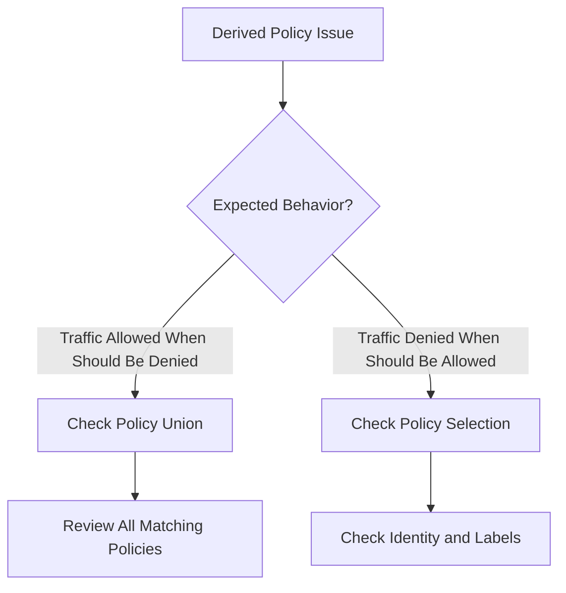

# Troubleshooting Derived Policy Validation in Cilium

Author: [nawazdhandala](https://github.com/nawazdhandala)

Tags: Cilium, Kubernetes, Derived Policy, Troubleshooting, Security

Description: How to diagnose and fix issues with Cilium derived policy computation including incorrect policy merging, identity conflicts, and enforcement gaps.

---

## Introduction

Derived policy issues occur when the effective policy on an endpoint does not match your intent. This happens when multiple policies interact in unexpected ways, when identities change causing policy reevaluation, or when policy updates are not propagated to the datapath.

## Prerequisites

- Kubernetes cluster with Cilium
- kubectl and Cilium CLI configured

## Diagnosing Derived Policy Issues

```bash
# Check the derived policy on a specific endpoint
cilium endpoint get <endpoint-id> -o json | \
  jq '.status.policy.realized'

# List all policies affecting an endpoint
cilium endpoint get <endpoint-id> -o json | \
  jq '.status.policy.spec.policy-map-state'

# Trace a specific policy decision
cilium policy trace -s <src-identity> -d <dst-identity> --dport <port>
```



## Fixing Policy Merge Issues

```bash
# List all policies that select a specific endpoint
ENDPOINT_LABELS=$(kubectl get ciliumendpoint <pod-name> -n default \
  -o jsonpath='{.status.identity.labels}')
echo "Endpoint labels: $ENDPOINT_LABELS"

# Check each policy selector
kubectl get ciliumnetworkpolicies -n default -o json | jq '.items[] | {
  name: .metadata.name,
  selector: .spec.endpointSelector
}'
```

## Forcing Policy Recalculation

```bash
# Trigger endpoint regeneration
cilium endpoint config <endpoint-id> ConntrackLocal=Enabled

# Or restart the agent (last resort)
kubectl delete pod -n kube-system <cilium-pod-on-node>
```

## Verification

```bash
cilium endpoint get <endpoint-id> -o json | jq '.status.policy'
cilium policy trace -s <src> -d <dst> --dport <port>
hubble observe --to-endpoint <endpoint-id> --last 10
```

## Troubleshooting

- **Policies not merging correctly**: Cilium uses union (OR) for matching policies. Multiple allow policies are additive.
- **Identity changed**: Label changes cause identity recalculation. Check current identity matches policy expectations.
- **Stale derived policy**: Force regeneration or restart the agent.

## Conclusion

Derived policy troubleshooting requires understanding how Cilium merges multiple policies for each endpoint. Use policy trace and endpoint inspection to see the effective rules.