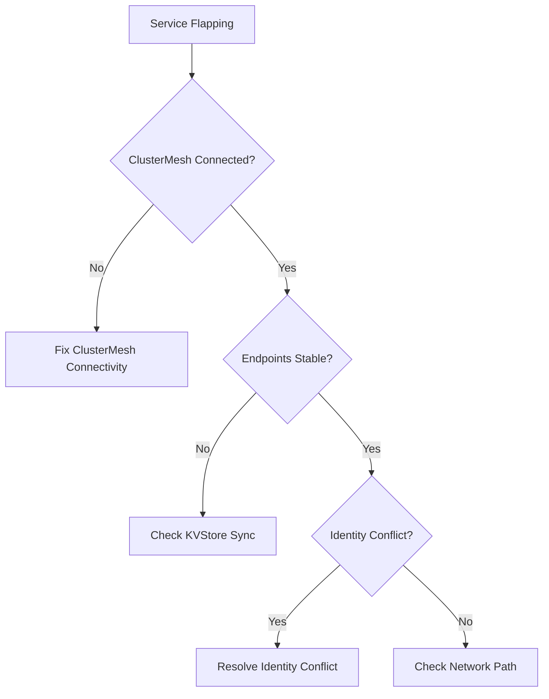

# Troubleshooting Global Services Flapping Between Cilium Clusters

Author: [nawazdhandala](https://github.com/nawazdhandala)

Tags: Cilium, Kubernetes, ClusterMesh, Troubleshooting, Multi-Cluster

Description: How to diagnose and resolve global service flapping between Cilium ClusterMesh clusters, including connectivity oscillation, identity conflicts, and synchronization issues.

---

## Introduction

In Cilium ClusterMesh deployments, global services allow pods in one cluster to reach services in another cluster transparently. When these services flap, meaning they oscillate between being reachable and unreachable, it creates unpredictable application behavior. Requests randomly succeed or fail, latencies spike, and error rates become inconsistent.

Global service flapping typically stems from ClusterMesh connectivity issues between clusters, identity synchronization problems, stale endpoint data in the KVStore, or network partitions between cluster control planes.

This guide provides a systematic approach to diagnosing and resolving global service flapping.

## Prerequisites

- Two or more Kubernetes clusters connected via Cilium ClusterMesh
- kubectl contexts configured for each cluster
- Cilium CLI installed
- Access to ClusterMesh KVStore (etcd)

## Diagnosing the Flapping

```bash
# Check ClusterMesh status
cilium clustermesh status

# Watch for service endpoint changes
kubectl get ciliumendpoints --all-namespaces -w

# Check for flapping in Hubble
hubble observe --service-name <flapping-service> --last 100

# Check ClusterMesh connectivity
cilium clustermesh status --wait=false
```



## Checking ClusterMesh Connectivity

```bash
# Verify connectivity between clusters
cilium clustermesh status

# Check the ClusterMesh agent on each cluster
kubectl get pods -n kube-system -l k8s-app=clustermesh-apiserver

# View ClusterMesh agent logs
kubectl logs -n kube-system -l k8s-app=clustermesh-apiserver --tail=100

# Check KVStore connectivity
cilium kvstore get --recursive cilium/state/identities/
```

## Resolving KVStore Synchronization Issues

```bash
# Check KVStore health
kubectl logs -n kube-system -l k8s-app=clustermesh-apiserver | \
  grep -iE "sync|connect|error" | tail -30

# Verify remote cluster endpoints are synced
cilium endpoint list | grep -i "remote"

# Force a resync by restarting ClusterMesh
kubectl rollout restart deployment/clustermesh-apiserver -n kube-system
```

## Fixing Identity Conflicts

When two clusters assign different identities to the same labels:

```bash
# Compare identities across clusters
# On cluster 1:
cilium identity list | grep <service-labels>

# On cluster 2:
cilium identity list | grep <service-labels>

# If they differ, the clusters may need shared identity allocation
# Configure shared CA and identity allocation
```

## Stabilizing Global Services

```yaml
# Annotate the service for global visibility
apiVersion: v1
kind: Service
metadata:
  name: my-global-service
  annotations:
    service.cilium.io/global: "true"
    service.cilium.io/shared: "true"
spec:
  ports:
    - port: 80
  selector:
    app: my-app
```

```bash
# Apply on both clusters
kubectl apply -f global-service.yaml --context=cluster1
kubectl apply -f global-service.yaml --context=cluster2
```

## Verification

```bash
# Verify ClusterMesh is stable
cilium clustermesh status

# Test global service connectivity
kubectl exec -it test-pod -- curl http://my-global-service

# Monitor for flapping over time
watch -n5 "cilium clustermesh status; echo '---'; cilium endpoint list | grep remote"
```

## Troubleshooting

- **ClusterMesh shows disconnected**: Check network connectivity between clusters. Verify firewall rules allow traffic on ClusterMesh ports.
- **Identity conflicts**: Ensure both clusters use the same Cilium CA certificate. Configure shared identity allocation mode.
- **Intermittent connectivity**: Check for network partitions or packet loss between cluster control planes.
- **Stale endpoints after reconnect**: Restart ClusterMesh agents on both clusters to force a clean sync.

## Conclusion

Global service flapping in Cilium ClusterMesh is usually caused by control plane connectivity issues rather than data plane problems. Start by verifying ClusterMesh status, check KVStore synchronization, resolve identity conflicts, and ensure stable network paths between clusters. Monitoring ClusterMesh health proactively prevents flapping from affecting applications.