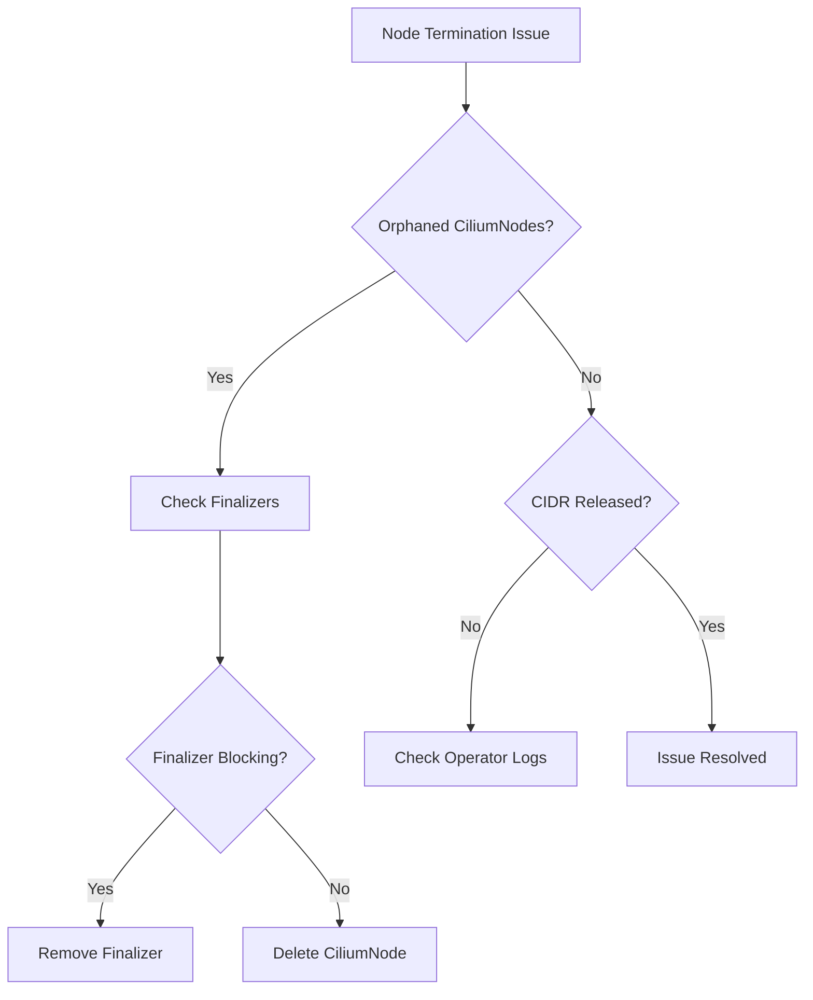

# Troubleshooting Node Termination Issues in Cilium IPAM

Author: [nawazdhandala](https://github.com/nawazdhandala)

Tags: Cilium, Kubernetes, IPAM, Troubleshooting, Node Management

Description: How to diagnose and resolve Cilium IPAM issues during node termination including orphaned resources, leaked IPs, and failed cleanup operations.

---

## Introduction

Node termination issues in Cilium IPAM cause IP address pool shrinkage over time. Every node that terminates without proper cleanup holds onto its CIDR allocation indefinitely. In clusters with frequent scaling events, this can exhaust the IP pool within days.

The most common issues are orphaned CiliumNode resources, finalizers preventing deletion, operator failures during cleanup, and race conditions between node termination and IP release.

## Prerequisites

- Kubernetes cluster with Cilium installed
- kubectl and Cilium CLI configured
- Access to operator logs

## Diagnosing Orphaned Resources

```bash
# Find orphaned CiliumNodes
NODES=$(kubectl get nodes -o jsonpath='{.items[*].metadata.name}' | tr ' ' '\n' | sort)
CILIUMNODES=$(kubectl get ciliumnodes -o jsonpath='{.items[*].metadata.name}' | tr ' ' '\n' | sort)
ORPHANS=$(comm -13 <(echo "$NODES") <(echo "$CILIUMNODES"))

if [ -n "$ORPHANS" ]; then
  echo "Orphaned CiliumNodes found:"
  echo "$ORPHANS"
else
  echo "No orphaned CiliumNodes"
fi
```



## Fixing Finalizer Issues

```bash
# Check for finalizers on orphaned CiliumNodes
for cn in $ORPHANS; do
  FINALIZERS=$(kubectl get ciliumnode "$cn" -o jsonpath='{.metadata.finalizers}')
  if [ -n "$FINALIZERS" ]; then
    echo "CiliumNode $cn has finalizers: $FINALIZERS"
    # Remove finalizers to allow deletion
    kubectl patch ciliumnode "$cn" -p '{"metadata":{"finalizers":null}}' --type=merge
  fi
  kubectl delete ciliumnode "$cn"
done
```

## Checking Operator Cleanup Logic

```bash
# Check operator logs for GC events
kubectl logs -n kube-system -l name=cilium-operator | \
  grep -iE "garbage|cleanup|delete.*node" | tail -20

# Check operator GC interval
kubectl get configmap cilium-config -n kube-system \
  -o jsonpath='{.data.nodes-gc-interval}'

# Verify operator is healthy
kubectl get pods -n kube-system -l name=cilium-operator
```

## Recovering Leaked CIDRs

```bash
# Count total allocated CIDRs
ALLOCATED=$(kubectl get ciliumnodes -o json | \
  jq '[.items[].spec.ipam.podCIDRs[]?] | length')
echo "Allocated CIDRs: $ALLOCATED"

# Count active node CIDRs
ACTIVE=$(kubectl get ciliumnodes -o json | jq --argjson nodes "$(kubectl get nodes -o json | jq '[.items[].metadata.name]')" '
  [.items[] | select(.metadata.name as $n | $nodes | index($n)) | .spec.ipam.podCIDRs[]?] | length')
echo "Active CIDRs: $ACTIVE"
echo "Leaked CIDRs: $((ALLOCATED - ACTIVE))"
```

## Verification

```bash
echo "Nodes: $(kubectl get nodes --no-headers | wc -l)"
echo "CiliumNodes: $(kubectl get ciliumnodes --no-headers | wc -l)"
cilium status | grep IPAM
```

## Troubleshooting

- **Finalizers prevent deletion**: Use `kubectl patch` to remove them, then delete.
- **Operator not performing GC**: Check operator is running and has RBAC for CiliumNode deletion.
- **CIDRs not returned to pool**: May need operator restart. In severe cases, update the cluster CIDR list.
- **Race condition during scale-down**: Increase terminationGracePeriodSeconds for the agent.

## Conclusion

Node termination cleanup in Cilium IPAM requires monitoring for orphaned CiliumNodes and ensuring the operator GC runs reliably. Remove stuck finalizers, verify operator health, and run periodic cleanup scripts in environments with high node churn.