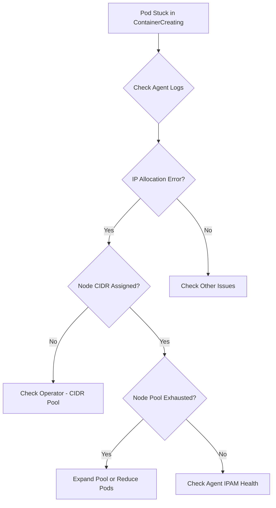

# Troubleshooting Cilium IPAM Operational Issues

Author: [nawazdhandala](https://github.com/nawazdhandala)

Tags: Cilium, Kubernetes, IPAM, Troubleshooting, Networking

Description: How to diagnose and resolve Cilium IPAM operational problems including IP exhaustion, allocation failures, slow pod startup, and CIDR conflicts.

---

## Introduction

IPAM issues in Cilium typically manifest as pods stuck in ContainerCreating state, slow pod startup times, or IP address conflicts. Because IPAM is handled by the Cilium operator and agents working together, problems can occur at either layer: the operator may fail to allocate node CIDRs, or agents may fail to assign individual pod IPs from their pool.

The most common operational issues are CIDR pool exhaustion (no more IPs available), node CIDR allocation failures (operator cannot assign a range to a new node), IP conflicts (duplicate IPs), and slow allocation (operator or agent lag).

This guide provides a systematic approach to diagnosing each of these issues.

## Prerequisites

- Kubernetes cluster with Cilium installed
- kubectl and Cilium CLI configured
- Access to operator and agent logs

## Diagnostic Workflow



## Diagnosing IP Exhaustion

```bash
# Check overall IPAM status
cilium status | grep IPAM

# View per-node IP usage
kubectl get ciliumnodes -o json | jq '.items[] | {
  name: .metadata.name,
  podCIDRs: .spec.ipam.podCIDRs,
  allocated: (.status.ipam.used // {} | length)
}'

# Check for nodes near exhaustion
kubectl get ciliumnodes -o json | jq '.items[] | {
  name: .metadata.name,
  available: ((.spec.ipam.pool // {} | length) - (.status.ipam.used // {} | length))
}' | jq 'select(.available < 10)'

# Check events for allocation failures
kubectl get events --all-namespaces | grep -i "allocat"
```

## Fixing Node CIDR Allocation

```bash
# Check operator logs for CIDR allocation errors
kubectl logs -n kube-system -l name=cilium-operator | grep -i "cidr" | tail -20

# View assigned node CIDRs
kubectl get ciliumnodes -o json | jq '.items[] | {
  name: .metadata.name,
  cidrs: .spec.ipam.podCIDRs
}'

# Check if the cluster CIDR is exhausted
kubectl get configmap cilium-config -n kube-system \
  -o jsonpath='{.data.cluster-pool-ipv4-cidr}'
```

## Resolving Slow Allocation

```bash
# Check agent IPAM allocation timing
kubectl logs -n kube-system -l k8s-app=cilium | grep "allocation" | tail -20

# Monitor operator reconciliation
kubectl logs -n kube-system -l name=cilium-operator | grep "reconcil" | tail -20

# Check operator resource constraints
kubectl top pods -n kube-system -l name=cilium-operator
```

## Handling IP Conflicts

```bash
# Find duplicate IPs across endpoints
kubectl get ciliumendpoints --all-namespaces -o json | jq -r '
  [.items[] | .status.networking.addressing[]? | .ipv4 // empty] |
  group_by(.) | .[] | select(length > 1) |
  "CONFLICT: \(.[0]) used \(length) times"'

# If conflicts found, restart agents on affected nodes
kubectl delete pod -n kube-system <cilium-agent-pod>
```

## Verification

```bash
cilium status | grep IPAM
kubectl get pods --all-namespaces | grep -c "ContainerCreating"
cilium connectivity test
```

## Troubleshooting

- **"No more IPs available"**: Reduce clusterPoolIPv4MaskSize to give nodes smaller pools, or add additional CIDRs.
- **New nodes have no CIDR**: Check operator is running. Verify clusterPoolIPv4PodCIDRList has enough space.
- **Pod takes 30+ seconds to start**: Check operator CPU/memory. Consider increasing operator replicas.
- **IP conflicts after node reboot**: Known issue in some versions. Upgrade Cilium and restart agents.

## Conclusion

IPAM troubleshooting focuses on three layers: operator CIDR allocation, per-node pool management, and individual pod IP assignment. Check IP utilization regularly and plan capacity before pools run out. Most operational issues are resolved by expanding CIDRs or tuning pool sizes.