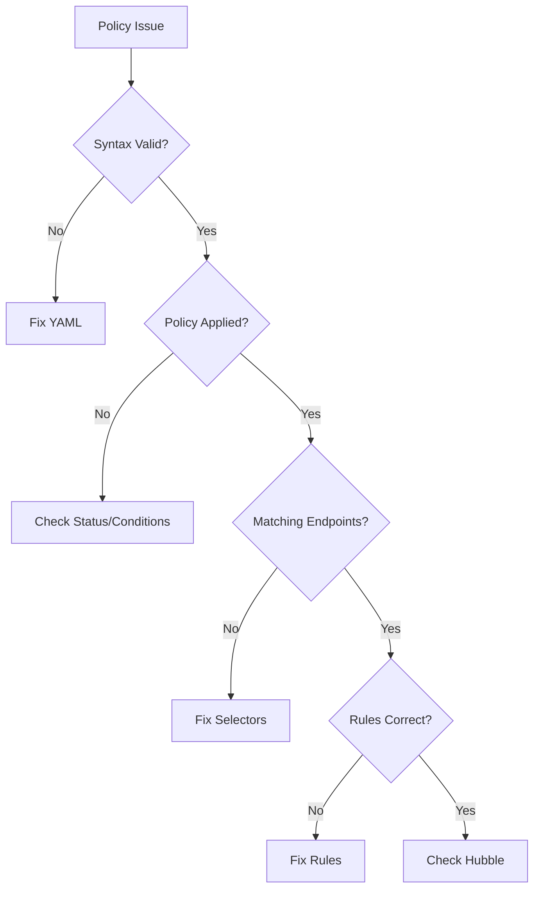

# Troubleshooting Cilium Policy Language Issues

Author: [nawazdhandala](https://github.com/nawazdhandala)

Tags: Cilium, Kubernetes, Policy Language, Troubleshooting, Security

Description: How to diagnose and fix issues with CiliumNetworkPolicy language constructs including syntax errors, selector mismatches, and rule evaluation problems.

---

## Introduction

Policy language issues in Cilium range from simple syntax errors to complex rule evaluation problems. The policy language is powerful but strict, and small mistakes can cause policies to not match or to match unexpectedly.

## Prerequisites

- Kubernetes cluster with Cilium
- kubectl and Hubble configured

## Common Syntax Issues

```bash
# Validate policy YAML before applying
kubectl apply --dry-run=client -f policy.yaml

# Check for rejected policies
kubectl get ciliumnetworkpolicies -n default -o json | \
  jq '.items[] | select(.status.conditions[]?.type == "Error") | .metadata.name'

# View policy status
kubectl describe ciliumnetworkpolicy <name> -n default
```



## Fixing Selector Issues

```bash
# Check what labels endpoints actually have
cilium endpoint list -o json | jq '.[] | {id: .id, labels: .status.labels}'

# Compare with policy selector
kubectl get ciliumnetworkpolicy <name> -o jsonpath='{.spec.endpointSelector}'

# Common mistake: using pod labels vs Cilium identity labels
# Pod label: app=frontend
# Cilium sees: k8s:app=frontend
```

## Fixing Rule Evaluation

```bash
# Check which rules match/deny traffic
hubble observe --to-pod default/my-pod --verdict DROPPED --last 20 -o json | \
  jq '.flow | {src: .source.labels, verdict: .verdict, drop_reason: .drop_reason_desc}'

# Check policy trace for a specific connection
cilium policy trace \
  --src-identity <source-identity> \
  --dst-identity <dest-identity> \
  --dport 8080
```

## Verification

```bash
kubectl get ciliumnetworkpolicies -n default
hubble observe -n default --last 10
cilium policy get
```

## Troubleshooting

- **Policy not accepted**: Check YAML syntax and API version.
- **Labels do not match**: Cilium prefixes pod labels with `k8s:`. Use `cilium endpoint list` to see actual labels.
- **Rules not evaluated**: Policy must be in the same namespace as the target pods (except clusterwide policies).

## Conclusion

Troubleshoot policy language issues by validating syntax, checking selector matching, and using Hubble and policy trace for rule evaluation. Pay attention to label prefixing and namespace scope.