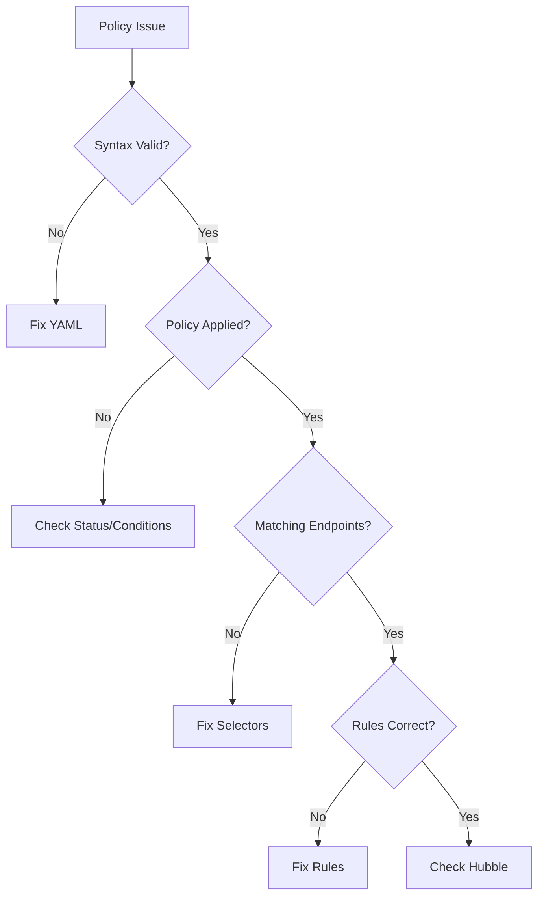

# Troubleshooting Cilium Policy Language Issues

Author: [nawazdhandala](https://github.com/nawazdhandala)

Tags: Cilium, Kubernetes, Policy Language, Troubleshooting, Security

Description: How to diagnose and fix issues with CiliumNetworkPolicy language constructs including syntax errors, selector mismatches, and rule evaluation problems.

---

## Introduction

Policy language issues in Cilium range from simple syntax errors to complex rule evaluation problems. The policy language is powerful but strict, and small mistakes can cause policies to not match or to match unexpectedly.

## Prerequisites

- Kubernetes cluster with Cilium
- kubectl and Hubble configured
- Access to `cilium-dbg` in a Cilium agent pod

## Common Syntax Issues

```bash
# Validate policy YAML before applying

kubectl apply --dry-run=client -f policy.yaml

# Check for policies that failed Cilium validation
kubectl get ciliumnetworkpolicies -n default -o json | \
  jq '.items[] | select(.status.conditions[]? | .type == "Valid" and .status == "False") | .metadata.name'

# View policy status
kubectl describe ciliumnetworkpolicy <name> -n default
```


```mermaid
graph TD
    A[Policy Issue] --> B{Syntax Valid?}
    B -->|No| C[Fix YAML]
    B -->|Yes| D{Policy Applied?}
    D -->|No| E[Check Status/Conditions]
    D -->|Yes| F{Matching Endpoints?}
    F -->|No| G[Fix Selectors]
    F -->|Yes| H{Rules Correct?}
    H -->|No| I[Fix Rules]
    H -->|Yes| J[Check Hubble]
```

## Fixing Selector Issues

```bash
# Check what labels endpoints actually have
cilium-dbg endpoint list -o json | jq '.[] | {id: .id, labels: .status.identity.labels}'

# Compare with policy selector
kubectl get ciliumnetworkpolicy <name> -o jsonpath='{.spec.endpointSelector}'

# Cilium endpoint output shows the label source prefix
# Pod label: app=frontend
# Cilium sees: k8s:app=frontend
# In policy selectors, an unprefixed key matches labels from any source.
```

## Fixing Rule Evaluation

```bash
# Check which rules match/deny traffic
hubble observe --to-pod default/my-pod --verdict DROPPED --last 20 -o json | \
  jq '.flow | {src: .source.labels, verdict: .verdict, drop_reason: .drop_reason_desc}'

# Check the rendered policy for a specific endpoint
cilium-dbg endpoint get <endpoint-id>
```

## Verification

```bash
kubectl get ciliumnetworkpolicies -n default
hubble observe -n default --last 10
cilium-dbg endpoint list
```

## Troubleshooting

- **Policy not accepted**: Check YAML syntax and API version.
- **Labels do not match**: Cilium endpoint output prefixes pod labels with `k8s:`, while unprefixed policy selector keys match labels from any source. Use `cilium-dbg endpoint list` to see actual labels.
- **Rules not evaluated**: Policy must be in the same namespace as the target pods (except clusterwide policies).

## Conclusion

Troubleshoot policy language issues by validating syntax, checking selector matching, and using Hubble and rendered endpoint policy for rule evaluation. Pay attention to label prefixing and namespace scope.
