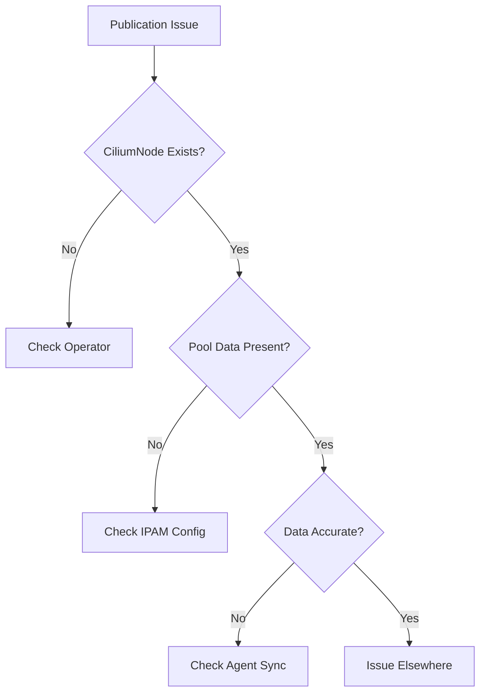

# Troubleshooting IP Availability Publication in Cilium IPAM

Author: [nawazdhandala](https://github.com/nawazdhandala)

Tags: Cilium, Kubernetes, IPAM, Troubleshooting, Networking

Description: How to diagnose and fix issues with Cilium IPAM publishing available IP counts, including stale data, missing publications, and integration problems.

---

## Introduction

When Cilium IPAM fails to correctly publish available IP counts, downstream systems like autoscalers and monitoring tools receive incorrect data. This can lead to pods being scheduled on nodes with no available IPs or clusters not scaling when they should.

Publication issues typically stem from agent-operator communication problems, stale CiliumNode resources, or IPAM pool calculation errors.

## Prerequisites

- Kubernetes cluster with Cilium installed
- kubectl and Cilium CLI configured
- Access to agent and operator logs

## Diagnosing Publication Issues

```bash
# Check CiliumNode resources for publication data
kubectl get ciliumnodes -o json | jq '.items[] | {
  name: .metadata.name,
  has_pool: (.spec.ipam.pool != null),
  has_used: (.status.ipam.used != null)
}'

# Check agent logs for IPAM publication
kubectl logs -n kube-system -l k8s-app=cilium | \
  grep -i "ipam" | tail -20

# Check operator logs
kubectl logs -n kube-system -l name=cilium-operator | \
  grep -i "ipam" | tail -20
```



## Fixing Missing Publication Data

```bash
# Verify IPAM mode
kubectl get configmap cilium-config -n kube-system \
  -o jsonpath='{.data.ipam}'

# Force agent to re-publish
kubectl delete pod -n kube-system -l k8s-app=cilium \
  --field-selector spec.nodeName=<affected-node>

# Verify data appears after agent restart
kubectl get ciliumnode <node-name> -o json | jq '.spec.ipam'
```

## Fixing Stale Data

```bash
# Compare reported available with actual usage
for node in $(kubectl get nodes -o jsonpath='{.items[*].metadata.name}'); do
  REPORTED=$(kubectl get ciliumnode "$node" -o json | \
    jq '(.spec.ipam.pool // {} | length) - (.status.ipam.used // {} | length)')
  ACTUAL_PODS=$(kubectl get pods --all-namespaces --field-selector spec.nodeName="$node" \
    --no-headers | wc -l)
  echo "$node: reported_available=$REPORTED actual_pods=$ACTUAL_PODS"
done
```

## Verification

```bash
cilium status | grep IPAM
kubectl get ciliumnodes -o json | jq '.items[] | {
  name: .metadata.name,
  available: ((.spec.ipam.pool // {} | length) - (.status.ipam.used // {} | length))
}'
```

## Troubleshooting

- **Pool data is null**: IPAM may not be initialized. Check agent startup logs.
- **Used count does not match pod count**: Some IPs are allocated for health checking and router. This is normal.
- **Data updates very slowly**: Check agent-to-API-server connectivity.
- **Publication stops after upgrade**: Restart agents after Cilium upgrades.

## Conclusion

IP availability publication issues usually stem from agent or operator communication problems. Verify CiliumNode resources have pool and used data, compare with actual pod counts, and restart agents if data is stale. Accurate publication is critical for autoscaler integration.