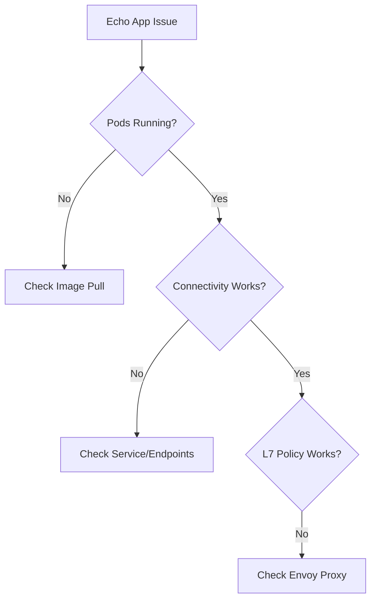

# Troubleshooting the Cilium Echo App

Author: [nawazdhandala](https://github.com/nawazdhandala)

Tags: Cilium, Kubernetes, Testing, Troubleshooting, Echo App

Description: How to diagnose and fix common issues with the Cilium echo app including deployment failures, connectivity problems, and L7 policy testing errors.

---

## Introduction

The Cilium echo app is used for testing networking and policies. When it does not work correctly, it undermines your ability to validate Cilium features. Common issues include image pull failures, connectivity test failures that do not reflect actual problems, and L7 policy tests that behave unexpectedly.

## Prerequisites

- Kubernetes cluster with Cilium installed
- kubectl and Cilium CLI configured
- Echo app deployed (or attempted)

## Diagnosing Deployment Issues

```bash
# Check pod status
kubectl get pods -n cilium-test

# Check events for failing pods
kubectl describe pod -n cilium-test -l app=echo-server

# Check image pull issues
kubectl get events -n cilium-test | grep -i "pull"

# Check resource constraints
kubectl describe node | grep -A5 "Allocated resources"
```



## Fixing Image Pull Failures

```bash
# If images cannot be pulled from quay.io
# Check node internet access
kubectl run test-pull --image=busybox:1.36 --restart=Never -- echo "pull works"
kubectl get pod test-pull
kubectl delete pod test-pull

# If behind a proxy, check proxy settings
kubectl get pods -n cilium-test -o yaml | grep -i proxy
```

## Fixing Connectivity Issues

```bash
# Check service endpoints
kubectl get endpoints -n cilium-test echo-server

# Verify DNS resolution
kubectl exec -n cilium-test deploy/echo-client -- \
  nslookup echo-server.cilium-test

# Test direct pod IP
POD_IP=$(kubectl get pods -n cilium-test -l app=echo-server \
  -o jsonpath='{.items[0].status.podIP}')
kubectl exec -n cilium-test deploy/echo-client -- \
  curl -s --connect-timeout 5 http://$POD_IP:8080/
```

## Fixing L7 Policy Testing

```bash
# Ensure Envoy proxy is enabled
cilium status | grep Envoy

# If not enabled
helm upgrade cilium cilium/cilium \
  --namespace kube-system \
  --reuse-values \
  --set l7Proxy=true

# Check L7 policy is parsed correctly
kubectl get ciliumnetworkpolicies -n cilium-test -o yaml

# Use Hubble to observe L7 traffic
hubble observe -n cilium-test --protocol http --last 20
```

## Verification

```bash
kubectl get pods -n cilium-test
kubectl exec -n cilium-test deploy/echo-client -- \
  curl -s http://echo-server:8080/
cilium connectivity test
```

## Troubleshooting

- **Image pull rate limited**: Use a pull secret or mirror the images to a private registry.
- **Service has no endpoints**: Check pod labels match service selector.
- **L7 rules ignored**: Envoy proxy must be enabled. Check `l7Proxy` setting.
- **Connectivity test hangs**: Increase timeout or check for resource constraints.

## Conclusion

Troubleshooting the echo app follows the standard Kubernetes debugging flow: check pods, then services, then network policies. The echo app itself is simple; most issues are environmental.