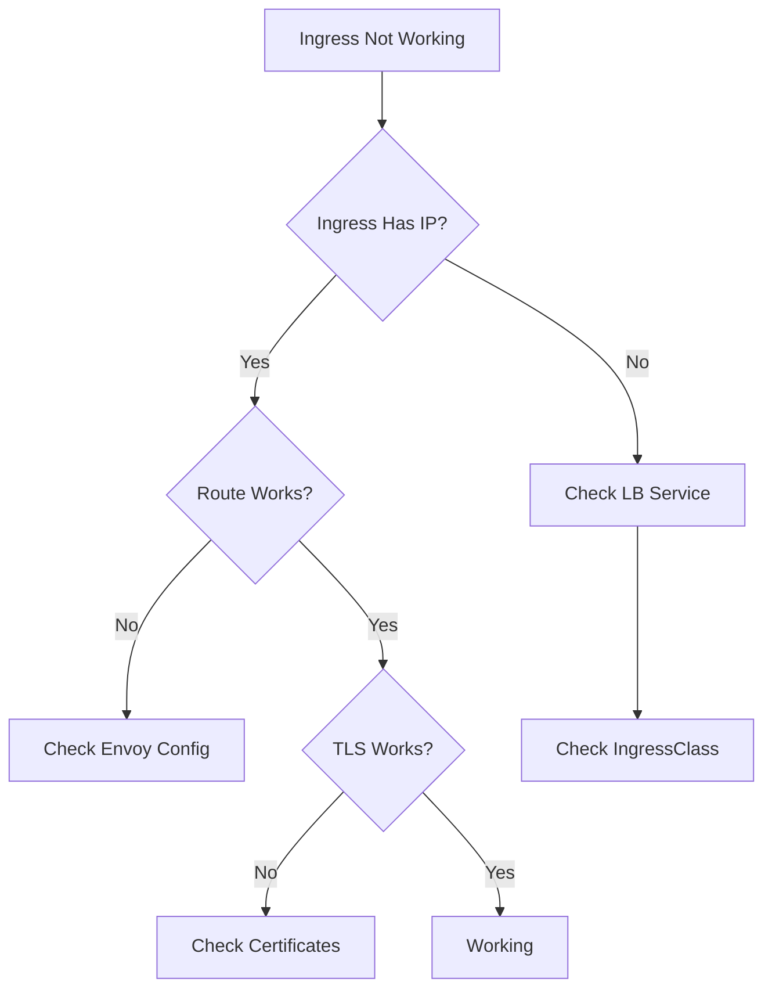

# Troubleshooting Your First Ingress with Cilium

Author: [nawazdhandala](https://github.com/nawazdhandala)

Tags: Cilium, Kubernetes, Ingress, Troubleshooting, Networking

Description: How to diagnose and fix common issues when setting up your first Cilium Ingress resource, including routing failures, TLS problems, and backend connectivity.

---

## Introduction

Cilium can function as a Kubernetes Ingress controller, replacing external solutions like NGINX Ingress. When setting up your first Cilium Ingress, common issues include the Ingress not getting an external IP, routing not reaching backend services, TLS termination failures, and HTTP path matching not working as expected.

Most first-time Ingress issues stem from Cilium not being configured as an Ingress controller, missing IngressClass configuration, or the Envoy proxy not being enabled.

This guide walks through the most common setup issues and their fixes.

## Prerequisites

- Kubernetes cluster with Cilium installed (v1.14+)
- kubectl configured
- A test application deployed with a Service

## Enabling Cilium Ingress

First, ensure Cilium Ingress is enabled:

```bash
# Check if Ingress is enabled
cilium status | grep -i ingress

# Enable Ingress controller
helm upgrade cilium cilium/cilium \
  --namespace kube-system \
  --reuse-values \
  --set ingressController.enabled=true \
  --set ingressController.default=true \
  --set ingressController.loadbalancerMode=shared
```

## Diagnosing Ingress Issues

```bash
# Check Ingress resource status
kubectl get ingress

# Check if the Ingress has an address
kubectl get ingress <name> -o jsonpath='{.status.loadBalancer.ingress}'

# Check Cilium Envoy proxy
kubectl get pods -n kube-system -l k8s-app=cilium-envoy

# View Ingress-related events
kubectl describe ingress <name>
```



## Fixing No External IP

```bash
# Check the Cilium Ingress LoadBalancer service
kubectl get svc -n kube-system | grep cilium-ingress

# If no external IP, check cloud LB provisioning
kubectl describe svc cilium-ingress -n kube-system

# For bare-metal, you may need MetalLB or similar
# Or use NodePort mode
helm upgrade cilium cilium/cilium \
  --namespace kube-system \
  --reuse-values \
  --set ingressController.service.type=NodePort
```

## Fixing Routing Issues

```bash
# Create a test Ingress
cat <<EOF | kubectl apply -f -
apiVersion: networking.k8s.io/v1
kind: Ingress
metadata:
  name: test-ingress
spec:
  ingressClassName: cilium
  rules:
    - host: test.example.com
      http:
        paths:
          - path: /
            pathType: Prefix
            backend:
              service:
                name: my-service
                port:
                  number: 80
EOF

# Test routing
INGRESS_IP=$(kubectl get ingress test-ingress -o jsonpath='{.status.loadBalancer.ingress[0].ip}')
curl -H "Host: test.example.com" http://$INGRESS_IP/

# Check Envoy listeners
kubectl exec -n kube-system -l k8s-app=cilium -- \
  cilium bpf lb list
```

## Fixing TLS Issues

```bash
# Create TLS secret
kubectl create secret tls test-tls \
  --cert=tls.crt --key=tls.key

# Update Ingress with TLS
cat <<EOF | kubectl apply -f -
apiVersion: networking.k8s.io/v1
kind: Ingress
metadata:
  name: test-ingress
spec:
  ingressClassName: cilium
  tls:
    - hosts:
        - test.example.com
      secretName: test-tls
  rules:
    - host: test.example.com
      http:
        paths:
          - path: /
            pathType: Prefix
            backend:
              service:
                name: my-service
                port:
                  number: 80
EOF
```

## Verification

```bash
kubectl get ingress
curl -v -H "Host: test.example.com" http://$INGRESS_IP/
cilium status | grep -i ingress
```

## Troubleshooting

- **IngressClass not found**: Ensure `ingressController.enabled=true` in Helm values.
- **503 errors**: Backend service may not be reachable. Check service endpoints.
- **TLS handshake failure**: Verify the secret is in the same namespace as the Ingress.
- **Path matching incorrect**: Use `pathType: Prefix` for prefix matching, `Exact` for exact.

## Conclusion

Setting up the first Cilium Ingress requires enabling the Ingress controller in Helm, creating the correct IngressClass, and ensuring Envoy proxy is running. Most issues stem from feature not being enabled or LoadBalancer service not getting an IP.