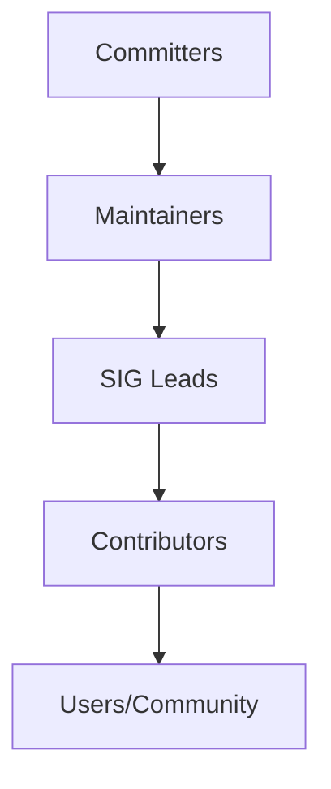

# Understanding Cilium Project Governance

Author: [nawazdhandala](https://github.com/nawazdhandala)

Tags: Cilium, Governance, Open Source, CNCF, Community

Description: Learn how the Cilium project is governed, including decision-making processes, roles, and community structures.

---

## Introduction

The Cilium project has grown into a mature CNCF project with structured governance and community processes. Understanding Cilium project governance is essential for effective participation, whether you are a user, contributor, or organization adopting Cilium.

Governance defines how decisions are made, responsibilities are assigned, and the project evolves over time. This structure ensures transparency, fairness, and sustainable growth.

This guide provides a comprehensive overview of Cilium project governance and how to engage with it.

## Prerequisites

- Familiarity with the Cilium project and its ecosystem
- A GitHub account for participating in project discussions
- Basic understanding of open source governance models

## Cilium Governance Structure

### Overview

As a CNCF graduated project, Cilium follows established governance principles:

- **Transparency**: All decisions are made in public
- **Meritocracy**: Influence is earned through contributions
- **Community-driven**: Major decisions involve community input
- **Code of Conduct**: All participants follow the CNCF Code of Conduct

### Roles and Responsibilities

- **Maintainers**: Overall project direction, release management, final review authority
- **Committers**: Merge rights, regular code review duties
- **SIG Leads**: Technical direction within their area
- **Contributors**: Anyone who submits patches, docs, or issues
- **Community Members**: Users, testers, advocates

### Decision Making

- **Lazy consensus**: Proposals are accepted if no objections within a review period
- **Voting**: Used for contentious issues; each committer gets one vote
- **RFC process**: Major changes go through a Request for Comments process

### Path to Committer

1. Consistent, high-quality contributions over time
2. Demonstrated understanding of project standards
3. Active participation in code review
4. Nomination by existing committer
5. Approval by majority of maintainers

## Verification

Check that governance documents are accessible and current.

## Troubleshooting

- **Cannot find meeting links**: Check the Cilium community calendar and #community Slack channel.
- **Slack workspace access**: Request an invite through the Cilium website.
- **GitHub permissions**: Ensure your account has the necessary access for the repositories you need.
- **Timezone confusion**: All official times are in UTC. Use a timezone converter for your local time.

## Conclusion

Project governance provides a valuable resource for ensuring project health. Active participation strengthens both your own Cilium practice and the broader community.
