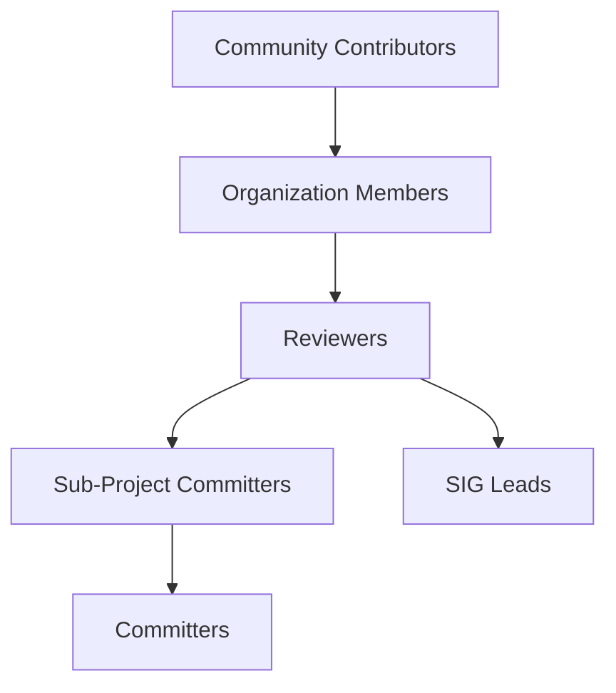

# Understanding Cilium Project Governance

Author: [nawazdhandala](https://github.com/nawazdhandala)

Tags: Cilium, Governance, Open Source, CNCF, Community

Description: Learn how the Cilium project is governed, including decision-making processes, roles, and community structures.

---

## Introduction

The Cilium project has grown into a mature CNCF project with structured governance and community processes. Understanding Cilium project governance is essential for effective participation, whether you are a user, contributor, or organization adopting Cilium.

Governance defines how decisions are made, responsibilities are assigned, and the project evolves over time. This structure ensures transparency, fairness, and sustainable growth.

This guide provides a comprehensive overview of Cilium project governance and how to engage with it.

## Prerequisites

- Familiarity with the Cilium project and its ecosystem
- A GitHub account for participating in project discussions
- Basic understanding of open source governance models

## Cilium Governance Structure

### Overview

As a CNCF graduated project, Cilium follows established governance principles:

- **Transparency**: Project work happens in public where possible, with private handling for sensitive matters such as committer nominations and Code of Conduct reports
- **Meritocracy**: Influence is earned through contributions
- **Community-driven**: Major decisions involve community input
- **Code of Conduct**: All participants follow the CNCF Code of Conduct

### Roles and Responsibilities

```mermaid
flowchart TD
    A[Community Contributors] --> B[Organization Members]
    B --> C[Reviewers]
    C --> D[Sub-Project Committers]
    D --> E[Committers]
    C --> F[SIG Leads]
```

- **Committers**: Project-wide write, merge, and voting privileges; collectively responsible for steering the project
- **Sub-Project Committers**: Write and merge privileges within a specific Cilium sub-project
- **Reviewers**: Review responsibility for specific code, documentation, test, or project areas
- **SIG Leads**: Coordinate a SIG, keep notes and cadence, and help drive charter work; SIGs do not have additional authority beyond what the Committer community accepts
- **Organization Members**: Established contributors with repository privileges such as triggering CI and leaving reviews
- **Community Contributors**: Anyone who participates through patches, docs, issues, testing, discussions, or other project contributions

### Decision Making

- **Lazy consensus**: Used for editorial governance policy changes such as spelling, grammar, style, or link updates
- **Voting**: Used when disputes cannot otherwise be resolved; each committer receives one vote, subject to the Company Block Vote Limit
- **CFP process**: Significant enhancements and feature requests are discussed through Cilium Feature Proposals

### Path to Committer

1. Consistent, high-quality contributions over time
2. Demonstrated understanding of project standards
3. Active participation in code review
4. Nomination by existing committer
5. Approval by a majority of existing committers with zero no votes

## Verification

Check that governance documents are accessible and current.

## Troubleshooting

- **Cannot find meeting links**: Check the Cilium community meeting notes and the `#development` Slack channel.
- **Slack workspace access**: Request an invite through the Cilium website.
- **GitHub permissions**: Ensure your account has the necessary access for the repositories you need.
- **Timezone confusion**: The weekly community meeting is listed in US/Pacific time, while the monthly APAC meeting is listed in UTC. Use a timezone converter for your local time.

## Conclusion

Project governance provides a valuable resource for ensuring project health. Active participation strengthens both your own Cilium practice and the broader community.
