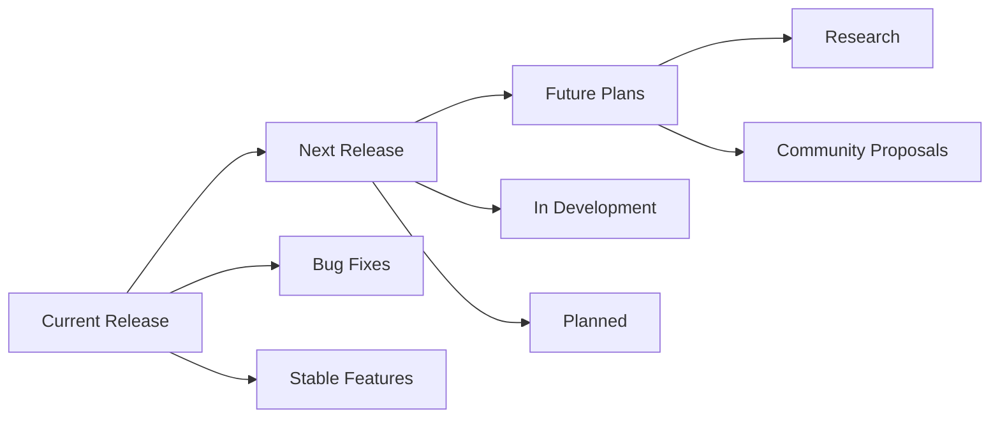

# Understanding the Cilium Project Roadmap

Author: [nawazdhandala](https://github.com/nawazdhandala)

Tags: Cilium, Roadmap, Planning, Open Source, Kubernetes

Description: Learn how to read and interpret the Cilium project roadmap to plan your adoption, contributions, and infrastructure decisions.

---

## Introduction

The Cilium project has grown into a mature CNCF project with structured governance and community processes. Understanding the Cilium project roadmap is essential for effective participation, whether you are a user, contributor, or organization adopting Cilium.

Roadmap defines how decisions are made, responsibilities are assigned, and the project evolves over time. This structure ensures transparency, fairness, and sustainable growth.

This guide provides a comprehensive overview of the Cilium project roadmap and how to engage with it.

## Prerequisites

- Familiarity with the Cilium project and its ecosystem
- A GitHub account for participating in project discussions
- Understanding of Cilium architecture and features

## Reading the Cilium Roadmap

### Where to Find It

The Cilium roadmap is published through:
- **GitHub Projects**: The cilium/cilium repository's project boards
- **Documentation**: The Cilium docs site includes a roadmap section
- **Community Meetings**: Roadmap updates are discussed regularly
- **Blog Posts**: Major releases include roadmap context

### Roadmap Structure

### Understanding Roadmap Categories

- **Committed**: Features actively being developed for the next release
- **Planned**: Features with design approval but not yet in development
- **Under Discussion**: Proposals being evaluated by the community
- **Future**: Long-term vision items without timeline commitment

### How Features Get on the Roadmap

1. Community need identified through issues and discussions
2. Design proposal created and reviewed
3. SIG approval for the relevant area
4. Resource commitment from maintainers
5. Timeline assignment based on priority and complexity

## Verification

Verify roadmap information is accessible and up to date.

## Troubleshooting

- **Cannot find meeting links**: Check the Cilium community calendar and #community Slack channel.
- **Slack workspace access**: Request an invite through the Cilium website.
- **GitHub permissions**: Ensure your account has the necessary access for the repositories you need.
- **Timezone confusion**: All official times are in UTC. Use a timezone converter for your local time.

## Conclusion

The project roadmap provides a valuable resource for understanding project direction. Active participation strengthens both your own Cilium practice and the broader community.
