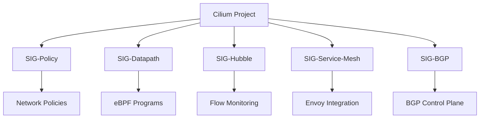

# Understanding Special Interest Groups in Cilium

Author: [nawazdhandala](https://github.com/nawazdhandala)

Tags: Cilium, SIG, Governance, Open Source, Community

Description: Learn how Cilium Special Interest Groups (SIGs) are organized, their responsibilities, and how they drive project development.

---

## Introduction

The Cilium project has grown into a mature CNCF project with structured governance and community processes. Understanding Cilium Special Interest Groups (SIGs) is essential for effective participation, whether you are a user, contributor, or organization adopting Cilium.

Special Interest Groups defines how decisions are made, responsibilities are assigned, and the project evolves over time. This structure ensures transparency, fairness, and sustainable growth.

This guide provides a comprehensive overview of Cilium Special Interest Groups (SIGs) and how to engage with them.

## Prerequisites

- Familiarity with the Cilium project and its ecosystem
- Internet access and a calendar application
- Willingness to participate in community discussions

## What Are Special Interest Groups?

### SIG Structure

Cilium SIGs are organized around specific technical areas:

- **SIG-Policy**: Network policy design and implementation
- **SIG-Datapath**: BPF/eBPF datapath development
- **SIG-Hubble**: Observability and flow monitoring
- **SIG-Service-Mesh**: Service mesh and Envoy integration
- **SIG-BGP**: BGP and external networking

### SIG Responsibilities

Each SIG is responsible for:
- Technical direction in their area
- Reviewing and approving related PRs
- Maintaining documentation for their components
- Running SIG-specific meetings
- Mentoring new contributors in their area

### SIG Membership

SIGs have different roles:
- **Chair**: Leads the SIG, runs meetings, makes decisions
- **Technical Lead**: Guides technical direction
- **Member**: Regular participant and contributor
- **Observer**: Interested community member

## Verification

Verify roadmap information is accessible and up to date.

## Troubleshooting

- **Cannot find meeting links**: Check the Cilium community calendar and #community Slack channel.
- **Slack workspace access**: Request an invite through the Cilium website.
- **GitHub permissions**: Ensure your account has the necessary access for the repositories you need.
- **Timezone confusion**: All official times are in UTC. Use a timezone converter for your local time.

## Conclusion

The project roadmap provides a valuable resource for working with Cilium programmatically. Active participation strengthens both your own Cilium practice and the broader community.
