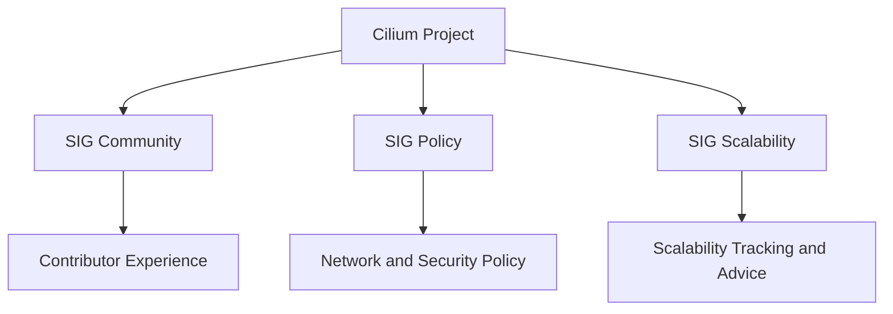

# Understanding Special Interest Groups in Cilium

Author: [nawazdhandala](https://github.com/nawazdhandala)

Tags: Cilium, SIG, Governance, Open Source, Community

Description: Learn how Cilium Special Interest Groups (SIGs) are organized, their responsibilities, and how they drive project development.

---

## Introduction

The Cilium project has grown into a mature CNCF project with structured governance and community processes. Understanding Cilium Special Interest Groups (SIGs) is essential for effective participation, whether you are a user, contributor, or organization adopting Cilium.

Special Interest Groups define how focused areas coordinate work, responsibilities are assigned, and the project evolves over time. This structure supports transparency, fairness, and sustainable growth.

This guide provides a comprehensive overview of Cilium Special Interest Groups (SIGs) and how to engage with them.

## Prerequisites

- Familiarity with the Cilium project and its ecosystem
- Internet access and a calendar application
- Willingness to participate in community discussions

## What Are Special Interest Groups?

### SIG Structure

Cilium SIGs are organized around specific project areas. Current active SIGs include:

- **SIG Community**: Fostering, growing, and sustaining the Cilium open source community
- **SIG Policy**: Defining, maintaining, and evolving network policy and security policy capabilities in Cilium
- **SIG Scalability**: Maintaining, tracking, and improving Cilium scalability, and advising other SIGs on subsystem scalability

### SIG Responsibilities

Each SIG is responsible for:
- Defining a charter that specifies its scope and responsibilities
- Keeping membership and leadership information up to date
- Maintaining meeting notes and open communication channels
- Tracking project enhancements related to its area
- Helping contributors build depth in the SIG's area

```mermaid
flowchart TD
    A[Cilium Project] --> B[SIG Community]
    A --> C[SIG Policy]
    A --> D[SIG Scalability]
    B --> B1[Contributor Experience]
    C --> C1[Network and Security Policy]
    D --> D1[Scalability Tracking and Advice]
```

### SIG Membership

Cilium's SIG governance defines a required **SIG Lead** role. SIG Leads must be tracked in `sigs.yaml`, must be reviewers of one or more project areas, and should be subject matter experts in their SIG area. SIGs may define additional roles in their charters when needed.

## Verification

Verify SIG information in the Cilium community repository and check that the relevant charter and `sigs.yaml` entries are up to date.

## Troubleshooting

- **Cannot find meeting links**: Check the Cilium community documentation and the relevant `#sig-` Slack channel.
- **Slack workspace access**: Request an invite through the Cilium website.
- **GitHub permissions**: Ensure your account has the necessary access for the repositories you need.
- **Timezone confusion**: Check each meeting entry for its listed timezone and use a timezone converter for your local time.

## Conclusion

Cilium SIGs provide focused forums for contributors to collaborate on specific project areas. Active participation strengthens both your own Cilium practice and the broader community.
