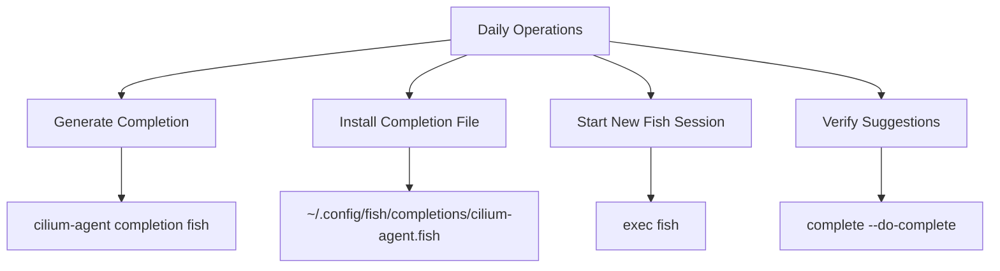

# How to Use cilium-agent completion fish

Author: [nawazdhandala](https://github.com/nawazdhandala)

Tags: Cilium, CLI

Description: A practical guide covering how to use cilium-agent completion fish with step-by-step instructions and real-world examples for production Kubernetes clusters.

---

## Introduction

Shell completion dramatically improves CLI productivity by providing tab-completion for commands, subcommands, flags, and arguments. Setting up completion for Fish takes only a few minutes and saves significant time in daily operations.

In this guide, we cover cilium-agent shell completion for Fish in a Kubernetes environment. Cilium leverages eBPF technology to provide high-performance networking, security, and observability for cloud-native workloads. The eBPF programs are loaded directly into the Linux kernel, enabling efficient packet processing without the overhead of traditional iptables-based networking stacks.

Whether you run `cilium-agent` directly on an operations workstation or generate the completion script from a Cilium pod, the techniques in this guide will help you keep shell completion aligned with the Cilium version you operate. We provide step-by-step instructions with real commands and configuration examples that you can adapt to your environment.

## Prerequisites

- Fish shell installed
- `cilium-agent` binary available locally, or access to a Cilium agent pod in Kubernetes
- A running Kubernetes cluster with Cilium installed, if generating the script from a pod
- `kubectl` configured for cluster access, if using the pod-based workflow
- Basic familiarity with Kubernetes networking concepts

## Getting Started

Familiarize yourself with the tools and commands needed for cilium-agent shell completion for Fish.

```bash
# Confirm Fish is installed
fish --version

# Confirm cilium-agent is available locally
cilium-agent --version

# If cilium-agent is only available in the Cilium pod, identify a pod to use
CILIUM_POD=$(kubectl -n kube-system get pods -l k8s-app=cilium -o jsonpath='{.items[0].metadata.name}')
kubectl -n kube-system exec "$CILIUM_POD" -c cilium-agent -- cilium-agent --version
```

## Core Operations

### Loading Completion for the Current Session

```fish
# Load cilium-agent completion in the current Fish session
cilium-agent completion fish | source

# Generate completion without descriptions if you prefer shorter suggestions
cilium-agent completion fish --no-descriptions | source
```

### Installing Completion Permanently

```bash
# Create Fish's user completion directory if it does not already exist
mkdir -p ~/.config/fish/completions

# Write the cilium-agent completion script to Fish's completion path
cilium-agent completion fish > ~/.config/fish/completions/cilium-agent.fish

# Start a new Fish shell so it loads the completion file
exec fish
```

### Generating Completion from a Cilium Pod

```bash
# Select one Cilium agent pod
CILIUM_POD=$(kubectl -n kube-system get pods -l k8s-app=cilium -o jsonpath='{.items[0].metadata.name}')

# Create Fish's user completion directory locally
mkdir -p ~/.config/fish/completions

# Generate the completion script from the cilium-agent binary in the pod
kubectl -n kube-system exec "$CILIUM_POD" -c cilium-agent -- \
  cilium-agent completion fish > ~/.config/fish/completions/cilium-agent.fish
```

## Practical Examples

### Example 1: Inspecting the Generated Script

```bash
# Generate the script into a temporary file for review
cilium-agent completion fish > /tmp/cilium-agent.fish

# Check that the script was created
test -s /tmp/cilium-agent.fish && echo "completion script generated"

# Preview the beginning of the generated completion script
head -20 /tmp/cilium-agent.fish
```

### Example 2: Updating Completion After a Cilium Upgrade

```bash
# Regenerate the completion script after upgrading Cilium
cilium-agent completion fish > ~/.config/fish/completions/cilium-agent.fish

# Or regenerate it from the upgraded Cilium agent pod
CILIUM_POD=$(kubectl -n kube-system get pods -l k8s-app=cilium -o jsonpath='{.items[0].metadata.name}')
kubectl -n kube-system exec "$CILIUM_POD" -c cilium-agent -- \
  cilium-agent completion fish > ~/.config/fish/completions/cilium-agent.fish
```

### Example 3: Verifying Completion Is Available

```fish
# Start a new Fish session
exec fish

# Ask Fish which completion file is associated with cilium-agent
complete --do-complete "cilium-agent --"

# Confirm the persistent completion file exists
test -s ~/.config/fish/completions/cilium-agent.fish; and echo "completion installed"
```




## Verification

After completing the steps above, run a comprehensive verification to confirm everything is working as expected.

```bash
# Check that the completion command is available locally
cilium-agent completion fish --help

# Confirm Fish's completion directory exists
test -d ~/.config/fish/completions && echo "Fish completion directory exists"

# Confirm the cilium-agent completion file exists and is not empty
test -s ~/.config/fish/completions/cilium-agent.fish && echo "completion file installed"

# Confirm the generated script contains cilium-agent completion definitions
grep -q "cilium-agent" ~/.config/fish/completions/cilium-agent.fish && echo "completion file references cilium-agent"

# If generating from Kubernetes, confirm a Cilium pod can produce the script
CILIUM_POD=$(kubectl -n kube-system get pods -l k8s-app=cilium -o jsonpath='{.items[0].metadata.name}')
kubectl -n kube-system exec "$CILIUM_POD" -c cilium-agent -- \
  cilium-agent completion fish --help
```

## Troubleshooting

If you encounter issues during or after the steps in this guide, use the following troubleshooting procedures:

- **`cilium-agent` not found locally**: Generate the completion script from a running Cilium pod with `kubectl -n kube-system exec "$CILIUM_POD" -c cilium-agent -- cilium-agent completion fish > ~/.config/fish/completions/cilium-agent.fish`, or install the matching Cilium binaries for your environment.

- **Completion file not loaded**: Verify the file is named `~/.config/fish/completions/cilium-agent.fish`. Fish loads completion files from this directory automatically for new shell sessions.

- **Completion only works in the current shell**: The `cilium-agent completion fish | source` command loads completions only for the current session. Write the generated script to `~/.config/fish/completions/cilium-agent.fish` for persistent completion.

- **Descriptions are too verbose**: Regenerate the script with `cilium-agent completion fish --no-descriptions > ~/.config/fish/completions/cilium-agent.fish`.

- **Pod-based generation fails**: Confirm the Cilium pod is running with `kubectl -n kube-system get pods -l k8s-app=cilium` and that the command targets the `cilium-agent` container.

- **Completion does not include new flags after an upgrade**: Regenerate the completion file from the upgraded `cilium-agent` binary and start a new Fish session.

If you also have the Cilium CLI installed, collect a comprehensive diagnostic bundle for further analysis:

```bash
# Generate a Cilium sysdump containing diagnostic information
cilium sysdump --output-filename cilium-diag-$(date +%Y%m%d)
```

## Conclusion

This guide covered cilium-agent shell completion for Fish with practical steps you can apply to your Kubernetes cluster. Regularly regenerating completion after Cilium upgrades helps keep the available flags and subcommands synchronized with the version you operate.

Key takeaways from this guide:

- Use `cilium-agent completion fish | source` for the current Fish session
- Write the script to `~/.config/fish/completions/cilium-agent.fish` for persistent completion
- Generate the script from a Cilium pod when `cilium-agent` is not installed locally
- Use `--no-descriptions` when you want shorter completion output
- Regenerate the completion file after upgrading Cilium
- Use `cilium sysdump` to collect comprehensive diagnostic data when investigating Cilium issues

As your cluster grows and evolves, revisit these configurations periodically and adjust them to match your current requirements. The Cilium community and documentation are excellent resources for staying current with best practices and new features.
