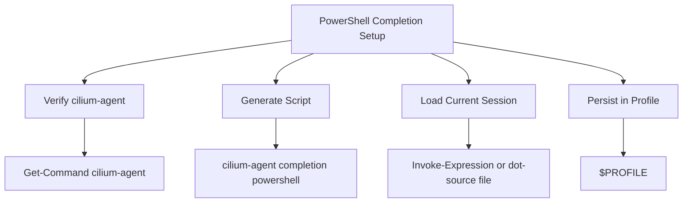

# How to Use cilium-agent completion powershell

Author: [nawazdhandala](https://github.com/nawazdhandala)

Tags: Cilium, CLI

Description: A practical guide covering how to use cilium-agent completion powershell with step-by-step instructions and real-world examples for production Kubernetes clusters.

---

## Introduction

Shell completion dramatically improves CLI productivity by providing tab-completion for commands, subcommands, flags, and arguments. Setting up completion for PowerShell takes only a few minutes and saves significant time in daily operations.

In this guide, we cover `cilium-agent completion powershell`, which generates a PowerShell completion script for the `cilium-agent` command. Cilium leverages eBPF technology to provide high-performance networking, security, and observability for cloud-native workloads. The eBPF programs are loaded directly into the Linux kernel, enabling efficient packet processing and policy enforcement.

Whether you are running a small development cluster or a large production environment with thousands of pods, the techniques in this guide will help you work more efficiently with the Cilium agent CLI. We provide step-by-step instructions with real commands and configuration examples that you can adapt to your environment.

## Prerequisites

- PowerShell available in the shell where you want completion
- The `cilium-agent` binary available in that shell, or access to a Cilium agent pod where the binary is available
- A running Kubernetes cluster with Cilium installed, if you are generating the completion script from a Cilium pod
- `kubectl` configured for cluster access, if you are generating the completion script from a Cilium pod
- Basic familiarity with Kubernetes networking concepts
- Access to cluster nodes or Cilium pods for troubleshooting (recommended)

## Getting Started

Familiarize yourself with the command used to generate cilium-agent shell completion for PowerShell.

```powershell
# Verify that cilium-agent is available in the current shell
Get-Command cilium-agent

# Confirm that the PowerShell completion command is supported
cilium-agent completion powershell --help

# Load completions in the current PowerShell session
cilium-agent completion powershell | Out-String | Invoke-Expression
```

## Core Operations

### Working with Current-Session Completion

```powershell
# Load cilium-agent completions for only the current shell session
cilium-agent completion powershell | Out-String | Invoke-Expression

# Generate completions without command descriptions
cilium-agent completion powershell --no-descriptions | Out-String | Invoke-Expression
```

### Working with PowerShell Profiles

```powershell
# Check which profile file PowerShell uses for the current user and host
$PROFILE

# Create the profile file if it does not exist
if (!(Test-Path -Path $PROFILE)) {
    New-Item -ItemType File -Path $PROFILE -Force
}

# Add the generated cilium-agent completion script to the profile
cilium-agent completion powershell | Add-Content -Path $PROFILE
```

### Working from a Cilium Pod

```powershell
# Select one Cilium agent pod
$CiliumPod = kubectl -n kube-system get pods -l k8s-app=cilium -o jsonpath='{.items[0].metadata.name}'

# Generate the completion script from the cilium-agent binary inside that pod
kubectl -n kube-system exec $CiliumPod -c cilium-agent -- cilium-agent completion powershell |
    Out-File -Encoding utf8 ./cilium-agent-completion.ps1

# Load the generated completion script in the current PowerShell session
. ./cilium-agent-completion.ps1
```

## Practical Examples

### Example 1: Inspecting the Generated Script

```powershell
# Save the generated script to a file before loading it
cilium-agent completion powershell | Out-File -Encoding utf8 ./cilium-agent-completion.ps1

# Review the first few lines
Get-Content ./cilium-agent-completion.ps1 -TotalCount 20

# Load the reviewed script
. ./cilium-agent-completion.ps1
```

### Example 2: Enabling Completion for New Sessions

```powershell
# Create the current user's PowerShell profile if needed
if (!(Test-Path -Path $PROFILE)) {
    New-Item -ItemType File -Path $PROFILE -Force
}

# Append a marker and the generated completion script
Add-Content -Path $PROFILE -Value "`n# cilium-agent completion"
cilium-agent completion powershell | Add-Content -Path $PROFILE

# Reload the profile in the current session
. $PROFILE
```

### Example 3: Regenerating Completion After an Upgrade

```powershell
# Replace a saved completion file after upgrading Cilium
cilium-agent completion powershell | Out-File -Encoding utf8 ./cilium-agent-completion.ps1

# Load the refreshed completion script
. ./cilium-agent-completion.ps1
```




## Verification

After completing the steps above, run a comprehensive verification to confirm everything is working as expected.

```powershell
# Confirm the command is available
Get-Command cilium-agent

# Confirm the completion command still works
cilium-agent completion powershell --help

# Confirm the profile exists if you enabled persistent completion
Test-Path -Path $PROFILE

# Confirm the profile contains cilium-agent completion content
Select-String -Path $PROFILE -Pattern "cilium-agent" -SimpleMatch

# Start a new PowerShell session and press Tab after typing:
cilium-agent 
```

## Troubleshooting

If you encounter issues during or after the steps in this guide, use the following troubleshooting procedures:

- **`cilium-agent` is not found**: Confirm that the `cilium-agent` binary is installed locally or generate the script from a Cilium pod with `kubectl exec`. If you only installed the separate `cilium` CLI, that does not provide the `cilium-agent completion powershell` command.

- **The profile does not load in new sessions**: Confirm the path in `$PROFILE`, create the file with `New-Item -ItemType File -Path $PROFILE -Force`, and restart PowerShell. PowerShell profiles are scoped by user and host, so update the profile for the host where you want completion.

- **PowerShell blocks the profile**: Check the execution policy with `Get-ExecutionPolicy -List`. On Windows, a restricted policy can prevent profile scripts from running.

- **Completion was generated from an old Cilium version**: Regenerate the script after upgrading Cilium so the completion data matches the installed `cilium-agent` binary.

- **Completion works only in the current session**: The `cilium-agent completion powershell | Out-String | Invoke-Expression` command loads completion for the active session only. Add the generated script to `$PROFILE` if you want it in future sessions.

- **Generating from a pod fails**: Confirm the Cilium pod name and container name with `kubectl -n kube-system get pods -l k8s-app=cilium` and `kubectl -n kube-system describe pod <pod-name>`.

To collect a generated completion script for further review:

```powershell
# Generate the PowerShell completion script into a local file
cilium-agent completion powershell | Out-File -Encoding utf8 ./cilium-agent-completion.ps1
```

## Conclusion

This guide covered `cilium-agent completion powershell` with practical steps you can apply to your Kubernetes cluster tooling. Regularly regenerating completion after Cilium upgrades helps keep local command suggestions aligned with the installed `cilium-agent` binary.

Key takeaways from this guide:

- Use `cilium-agent completion powershell` to generate the PowerShell completion script
- Use `Out-String | Invoke-Expression` to load completion in the current session
- Add the generated script to `$PROFILE` to make completion available in new PowerShell sessions
- Regenerate the script after upgrading Cilium
- Generate the script from a Cilium pod with `kubectl exec` if `cilium-agent` is not installed locally
- Verify that you are using `cilium-agent`, not the separate `cilium` CLI, for this completion command

As your cluster grows and evolves, revisit these configurations periodically and adjust them to match your current requirements. The Cilium community and documentation are excellent resources for staying current with best practices and new features.
