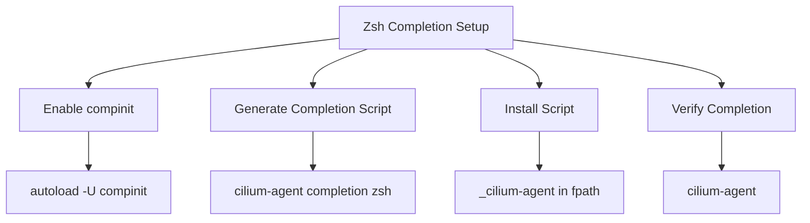

# How to Use cilium-agent completion zsh

Author: [nawazdhandala](https://github.com/nawazdhandala)

Tags: Cilium, CLI

Description: A practical guide covering how to use cilium-agent completion zsh with step-by-step instructions and real-world examples for production Kubernetes clusters.

---

## Introduction

Shell completion dramatically improves CLI productivity by providing tab-completion for commands, subcommands, flags, and arguments. Setting up completion for Zsh takes only a few minutes and saves significant time in daily operations.

In this guide, we cover `cilium-agent completion zsh` in a Kubernetes environment. Cilium leverages eBPF technology to provide high-performance networking, security, and observability for cloud-native workloads. The eBPF programs are loaded directly into the Linux kernel, enabling efficient packet processing without relying on traditional iptables-based service load-balancing paths.

Whether you are running a small development cluster or a large production environment with thousands of pods, the techniques in this guide will help you make the `cilium-agent` command easier to use when you need to inspect or troubleshoot agent options. We provide step-by-step instructions with real commands and configuration examples that you can adapt to your environment.

## Prerequisites

- A running Kubernetes cluster with Cilium installed
- `kubectl` configured for cluster access
- Access to a Cilium agent pod, or a local environment where the `cilium-agent` binary is installed
- Zsh installed on the workstation where you want tab completion
- Basic familiarity with Kubernetes networking concepts
- Access to cluster nodes for troubleshooting (recommended)
- Prometheus and Grafana for metrics visualization (recommended)

## Getting Started

Familiarize yourself with the tools and commands needed for `cilium-agent` shell completion for Zsh.

```bash
# Verify Cilium is installed and accessible from your workstation
cilium version

# Check the current deployment status
cilium status --verbose

# Select a Cilium agent pod if you need to generate completion from the running container
CILIUM_POD=$(kubectl -n kube-system get pods -l k8s-app=cilium -o jsonpath='{.items[0].metadata.name}')

# Verify the agent binary exposes the completion command
kubectl -n kube-system exec "$CILIUM_POD" -c cilium-agent -- cilium-agent completion zsh --help
```

## Core Operations

### Enabling Zsh Completion

```bash
# Enable Zsh completion support if it is not already enabled
grep -q "compinit" ~/.zshrc || echo "autoload -U compinit; compinit" >> ~/.zshrc

# Load cilium-agent completion in the current shell when cilium-agent is installed locally
source <(cilium-agent completion zsh)
```

### Generating the Completion Script

```bash
# Generate the completion script from a running Cilium agent pod
kubectl -n kube-system exec "$CILIUM_POD" -c cilium-agent -- cilium-agent completion zsh > /tmp/_cilium-agent

# Review the generated script before installing it
head -20 /tmp/_cilium-agent
```

### Installing the Completion Script

```bash
# Install the generated completion script for future Zsh sessions on Linux
kubectl -n kube-system exec "$CILIUM_POD" -c cilium-agent -- cilium-agent completion zsh > "${fpath[1]}/_cilium-agent"

# Reload completion definitions in the current shell
autoload -U compinit
compinit
```

## Practical Examples

### Example 1: Installing on macOS

```bash
# Install completion for every new Zsh session on macOS with Homebrew
kubectl -n kube-system exec "$CILIUM_POD" -c cilium-agent -- cilium-agent completion zsh > "$(brew --prefix)/share/zsh/site-functions/_cilium-agent"

# Start a new shell after writing the completion file
exec zsh
```

### Example 2: Disabling Completion Descriptions

```bash
# Generate completion without command descriptions if you prefer shorter suggestions
kubectl -n kube-system exec "$CILIUM_POD" -c cilium-agent -- cilium-agent completion zsh --no-descriptions > /tmp/_cilium-agent

# Confirm the generated file defines completion for cilium-agent
grep "_cilium-agent" /tmp/_cilium-agent | head
```

### Example 3: Verifying Agent Access

```bash
# Check the Kubernetes-facing Cilium deployment after installing completion
cilium status --verbose

# Check the local agent status from inside a Cilium pod
kubectl -n kube-system exec "$CILIUM_POD" -c cilium-agent -- cilium-dbg status --verbose

# Check for recent agent events
kubectl get events -n kube-system --sort-by='.lastTimestamp' | grep cilium | tail -10
```




## Verification

After completing the steps above, run a comprehensive verification to confirm everything is working as expected.

```bash
# Confirm the completion command exists in the running agent container
kubectl -n kube-system exec "$CILIUM_POD" -c cilium-agent -- cilium-agent completion zsh --help

# Confirm the generated completion script is not empty
test -s "${fpath[1]}/_cilium-agent" && echo "cilium-agent Zsh completion is installed"

# Confirm all Cilium pods are running and ready
kubectl get pods -n kube-system -l k8s-app=cilium -o wide

# Verify the Cilium operator is healthy
kubectl get pods -n kube-system -l name=cilium-operator

# Check for recent error events
kubectl get events -n kube-system --sort-by='.lastTimestamp' | grep cilium | tail -10

# Run a connectivity test to validate the data plane
cilium connectivity test --single-node

# Verify the agent-side debug CLI can reach the local agent API
kubectl -n kube-system exec "$CILIUM_POD" -c cilium-agent -- cilium-dbg status --brief
```

## Troubleshooting

If you encounter issues during or after the steps in this guide, use the following troubleshooting procedures:

- **`cilium-agent` command not found locally**: Generate the completion script from a running Cilium pod with `kubectl -n kube-system exec "$CILIUM_POD" -c cilium-agent -- cilium-agent completion zsh > /tmp/_cilium-agent`, or install completion on a host where the `cilium-agent` binary is available.

- **Completion does not load in Zsh**: Check that `autoload -U compinit; compinit` is present in your Zsh startup files. Verify that the `_cilium-agent` file is installed in a directory listed by `print -l $fpath`.

- **Permission denied while writing the completion file**: Write the generated script to a temporary file first, then move it with the privileges required for your chosen completion directory.

- **Generated completion is stale after a Cilium upgrade**: Regenerate the script from the upgraded `cilium-agent` binary because available flags can change between Cilium releases.

- **Cilium agent not starting**: Check resource limits and node capacity with `kubectl describe pod -n kube-system -l k8s-app=cilium`. Verify the BPF filesystem is mounted at `/sys/fs/bpf`. Check pod logs with `kubectl logs -n kube-system <pod> -c cilium-agent`.

- **Connectivity failures**: Run `cilium connectivity test` and inspect the specific failing test case. For node-local inspection, use `kubectl -n kube-system exec "$CILIUM_POD" -c cilium-agent -- cilium-dbg status --verbose`.

To collect a comprehensive diagnostic bundle for further analysis:

```bash
# Generate a Cilium sysdump containing diagnostic information
cilium sysdump --output-filename cilium-diag-$(date +%Y%m%d)
```

## Conclusion

This guide covered `cilium-agent` shell completion for Zsh with practical steps you can apply to your Kubernetes cluster. Regular monitoring, systematic validation, and proactive management are essential for maintaining a healthy Cilium deployment at any scale.

Key takeaways from this guide:

- Enable Zsh `compinit` before loading generated completion scripts
- Generate completion from the same `cilium-agent` version that you operate
- Install the generated `_cilium-agent` file in a directory listed by Zsh `fpath`
- Regenerate completion after Cilium upgrades so flags and subcommands stay current
- Test changes in a staging environment before applying them to production clusters
- Use `cilium sysdump` to collect comprehensive diagnostic data when investigating issues

As your cluster grows and evolves, revisit these configurations periodically and adjust them to match your current requirements. The Cilium community and documentation are excellent resources for staying current with best practices and new features.
