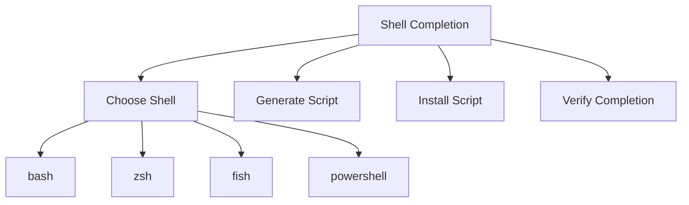

# How to Use cilium-agent completion

Author: [nawazdhandala](https://github.com/nawazdhandala)

Tags: Cilium, CLI

Description: A practical guide covering how to use cilium-agent completion with step-by-step instructions and real-world examples for production Kubernetes clusters.

---

## Introduction

Shell completion dramatically improves CLI productivity by providing tab-completion for commands, subcommands, flags, and arguments. Setting up completion for your shell takes only a few minutes and saves significant time in daily operations.

In this guide, we cover `cilium-agent completion` for your shell in a Kubernetes environment. Cilium leverages eBPF technology to provide high-performance networking, security, and observability for cloud-native workloads. The eBPF programs are loaded into the Linux kernel, enabling efficient packet processing without the overhead of traditional iptables-based networking stacks.

Whether you are running a small development cluster or a large production environment with thousands of pods, shell completion helps make Cilium agent commands easier to discover and type correctly. We provide step-by-step instructions with real commands and configuration examples that you can adapt to your environment.

## Prerequisites

- A running Kubernetes cluster with Cilium installed
- `kubectl` configured for cluster access
- Access to a Cilium agent pod, or a local `cilium-agent` binary available in your `PATH`
- The shell you want to configure: bash, zsh, fish, or PowerShell
- The `bash-completion` package installed if you are configuring bash completion
- Basic familiarity with Kubernetes networking concepts
- Access to cluster nodes for troubleshooting (recommended)
- Prometheus and Grafana for metrics visualization (recommended)

## Getting Started

Familiarize yourself with the tools and commands needed for `cilium-agent` shell completion for your shell.

```bash
# Verify Cilium pods are running
kubectl get pods -n kube-system -l k8s-app=cilium -o wide

# Select one Cilium agent pod to generate completion from
CILIUM_POD=$(kubectl get pods -n kube-system -l k8s-app=cilium -o jsonpath='{.items[0].metadata.name}')

# Confirm that cilium-agent exposes the completion command
kubectl exec -n kube-system "$CILIUM_POD" -c cilium-agent -- cilium-agent completion --help
```

## Core Operations

### Working with Bash

```bash
# Load completion in the current bash session when cilium-agent is local
source <(cilium-agent completion bash)

# Generate completion from a Cilium pod and install it system-wide on Linux
kubectl exec -n kube-system "$CILIUM_POD" -c cilium-agent -- cilium-agent completion bash | sudo tee /etc/bash_completion.d/cilium-agent >/dev/null

# Start a new shell after installing the completion file
exec bash
```

### Working with Zsh

```zsh
# Enable zsh completion if it is not already enabled
echo "autoload -U compinit; compinit" >> ~/.zshrc

# Load completion in the current zsh session when cilium-agent is local
source <(cilium-agent completion zsh)

# Generate completion from a Cilium pod and install it in the first zsh fpath directory
kubectl exec -n kube-system "$CILIUM_POD" -c cilium-agent -- cilium-agent completion zsh > "${fpath[1]}/_cilium-agent"
```

### Working with Fish

```fish
# Load completion in the current fish session when cilium-agent is local
cilium-agent completion fish | source

# Generate completion from a Cilium pod and install it for future fish sessions
mkdir -p ~/.config/fish/completions
kubectl exec -n kube-system "$CILIUM_POD" -c cilium-agent -- cilium-agent completion fish > ~/.config/fish/completions/cilium-agent.fish
```

## Practical Examples

### Example 1: Inspecting Supported Shells

```bash
# Show the top-level completion help
cilium-agent completion --help

# Show shell-specific help for bash
cilium-agent completion bash --help

# Show shell-specific help for zsh
cilium-agent completion zsh --help
```

### Example 2: Installing Completion on a Workstation

```bash
# Generate the completion script from the running Cilium agent pod
CILIUM_POD=$(kubectl get pods -n kube-system -l k8s-app=cilium -o jsonpath='{.items[0].metadata.name}')
kubectl exec -n kube-system "$CILIUM_POD" -c cilium-agent -- cilium-agent completion bash > /tmp/cilium-agent.bash

# Review the generated script before installing it
head -20 /tmp/cilium-agent.bash

# Install the generated script for bash
sudo install -m 0644 /tmp/cilium-agent.bash /etc/bash_completion.d/cilium-agent
```

### Example 3: Monitoring Agent Health

```bash
# Check the Cilium deployment status with the Cilium CLI
cilium status --verbose

# Check agent pods after changing local completion configuration
kubectl get pods -n kube-system -l k8s-app=cilium -o wide

# Check for recent agent events
kubectl get events -n kube-system --sort-by='.lastTimestamp' | grep cilium | tail -10
```




## Verification

After completing the steps above, run a comprehensive verification to confirm everything is working as expected.

```bash
# Check that the generated bash completion file exists
test -s /etc/bash_completion.d/cilium-agent && echo "bash completion installed"

# Check that the generated fish completion file exists
test -s ~/.config/fish/completions/cilium-agent.fish && echo "fish completion installed"

# Verify that cilium-agent can still generate completion output
kubectl exec -n kube-system "$CILIUM_POD" -c cilium-agent -- cilium-agent completion bash | head -5

# Confirm all Cilium pods are running and ready
kubectl get pods -n kube-system -l k8s-app=cilium -o wide

# Verify the Cilium operator is healthy
kubectl get pods -n kube-system -l io.cilium/app=operator

# Check for recent error events
kubectl get events -n kube-system --sort-by='.lastTimestamp' | grep cilium | tail -10
```

## Troubleshooting

If you encounter issues during or after the steps in this guide, use the following troubleshooting procedures:

- **`cilium-agent` command not found locally**: The `cilium-agent` binary is normally part of the Cilium agent container. Generate the completion script with `kubectl exec` from a running Cilium pod, or install the matching `cilium-agent` binary locally if you need to run agent commands on your workstation.

- **Bash completion not loading**: Confirm the `bash-completion` package is installed and start a new shell after writing `/etc/bash_completion.d/cilium-agent`. For a current shell only, use `source <(cilium-agent completion bash)` when `cilium-agent` is available locally.

- **Zsh completion not loading**: Make sure completion is enabled with `autoload -U compinit; compinit`. The generated file should be named `_cilium-agent` and stored in a directory listed in `fpath`.

- **Fish completion not loading**: Confirm the file is stored at `~/.config/fish/completions/cilium-agent.fish`, then start a new fish session. For a current session only, use `cilium-agent completion fish | source` when `cilium-agent` is available locally.

- **PowerShell completion not loading**: Load it in the current session with `cilium-agent completion powershell | Out-String | Invoke-Expression`, or add the generated output to your PowerShell profile for future sessions.

- **Generated script is empty or contains an error**: Re-check the selected pod and container name with `kubectl get pods -n kube-system -l k8s-app=cilium -o wide`. Then run `kubectl exec -n kube-system "$CILIUM_POD" -c cilium-agent -- cilium-agent completion --help` to confirm the command is available.

To collect a comprehensive diagnostic bundle for further analysis:

```bash
# Generate a Cilium sysdump containing diagnostic information
cilium sysdump --output-filename cilium-diag-$(date +%Y%m%d)
```

## Conclusion

This guide covered `cilium-agent` shell completion for your shell with practical steps you can apply to your Kubernetes cluster. Regular monitoring, systematic validation, and proactive management are essential for maintaining a healthy Cilium deployment at any scale.

Key takeaways from this guide:

- Use `cilium-agent completion` to generate completion scripts for bash, zsh, fish, and PowerShell
- Generate completion from a running Cilium pod when `cilium-agent` is not installed locally
- Install the generated script in the standard completion directory for your shell
- Start a new shell session after installing persistent completion files
- Keep generated completion scripts aligned with the Cilium version running in your cluster
- Use `cilium sysdump` to collect comprehensive diagnostic data when investigating issues

As your cluster grows and evolves, revisit these configurations periodically and adjust them to match your current requirements. The Cilium community and documentation are excellent resources for staying current with best practices and new features.
