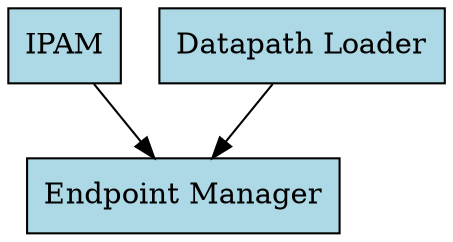

# Using Cilium Agent Hive Dot-Graph for Dependency Visualization

Author: [nawazdhandala](https://github.com/nawazdhandala)

Tags: Cilium, Hive, Graphviz, Kubernetes, Visualization, DevOps

Description: Learn how to use the cilium-agent hive dot-graph subcommand to generate and visualize the agent's internal dependency graph using Graphviz and other visualization tools.

---

## Introduction

The `cilium-agent hive dot-graph` command generates a DOT-format representation of the Cilium agent's internal dependency graph. This graph shows every registered component (cell) and the dependency relationships between them, giving you a complete picture of how the agent is wired together.

DOT is a standard graph description language used by Graphviz and many other tools. By piping the output through rendering tools, you can produce visual diagrams that make the complex web of agent dependencies comprehensible at a glance.

This guide walks through generating, rendering, and interpreting the hive dot-graph output.

## Prerequisites

- Kubernetes cluster with Cilium v1.14+
- `kubectl` configured with cluster access
- Graphviz installed (`dot` command available)
- A web browser for viewing SVG output

## Generating the Dot-Graph

Access the command from a running Cilium pod:

```bash
# Identify a Cilium pod
CILIUM_POD=$(kubectl -n kube-system get pods -l k8s-app=cilium \
  -o jsonpath='{.items[0].metadata.name}')

# Generate the dot-graph output
kubectl -n kube-system exec "$CILIUM_POD" -c cilium-agent -- \
  cilium-agent hive dot-graph > /tmp/cilium-hive.dot

# View the raw output
cat /tmp/cilium-hive.dot | head -30
```

The output follows standard DOT syntax:



## Rendering to Visual Formats

Convert the DOT file to various image formats using Graphviz:

```bash
# Render as PNG
dot -Tpng /tmp/cilium-hive.dot -o /tmp/cilium-hive.png

# Render as SVG (scalable, good for web)
dot -Tsvg /tmp/cilium-hive.dot -o /tmp/cilium-hive.svg

# Render as PDF
dot -Tpdf /tmp/cilium-hive.dot -o /tmp/cilium-hive.pdf

# Use different layout engines for different perspectives
# neato - spring model layout
neato -Tsvg /tmp/cilium-hive.dot -o /tmp/cilium-hive-neato.svg

# fdp - force-directed placement
fdp -Tsvg /tmp/cilium-hive.dot -o /tmp/cilium-hive-fdp.svg

# Open the SVG in your browser
open /tmp/cilium-hive.svg  # macOS
# xdg-open /tmp/cilium-hive.svg  # Linux
```

## Customizing the Graph Appearance

Enhance the generated graph with custom styling:

```bash
#!/bin/bash
# style-hive-graph.sh
# Add custom styling to the hive dot-graph

INPUT="/tmp/cilium-hive.dot"
OUTPUT="/tmp/cilium-hive-styled.dot"

# Add styling directives after the opening brace
sed '1,/^{/ {
  /^{/a\
    bgcolor="white";\
    node [fontname="Helvetica", fontsize=10, shape=box, style="filled,rounded"];\
    edge [color="gray40", arrowsize=0.7];\
    graph [ranksep=1.0, nodesep=0.5];
}' "$INPUT" > "$OUTPUT"

# Optionally highlight specific components
# Color IPAM-related nodes differently
sed -i.bak 's/\(.*ipam.*\)\[/\1[fillcolor="lightyellow", /' "$OUTPUT"
sed -i.bak 's/\(.*datapath.*\)\[/\1[fillcolor="lightcoral", /' "$OUTPUT"
sed -i.bak 's/\(.*policy.*\)\[/\1[fillcolor="lightgreen", /' "$OUTPUT"

dot -Tsvg "$OUTPUT" -o /tmp/cilium-hive-styled.svg
echo "Styled graph saved to /tmp/cilium-hive-styled.svg"
```

## Analyzing the Graph Structure

Use the DOT output to understand the agent architecture:

```bash
# Count total components
COMPONENTS=$(grep -c '\[label=' /tmp/cilium-hive.dot)
echo "Total components: $COMPONENTS"

# Count dependency edges
EDGES=$(grep -c '\->' /tmp/cilium-hive.dot)
echo "Total dependencies: $EDGES"

# Find the most-depended-on components (highest in-degree)
echo "Most depended-on components:"
grep -oP '-> "\K[^"]+' /tmp/cilium-hive.dot | \
  sort | uniq -c | sort -rn | head -10

# Find components with the most dependencies (highest out-degree)
echo "Components with most dependencies:"
grep -oP '^  "\K[^"]+(?=" ->)' /tmp/cilium-hive.dot | \
  sort | uniq -c | sort -rn | head -10
```

## Comparing Graphs Between Versions

Track how the dependency graph evolves:

```bash
#!/bin/bash
# diff-hive-graphs.sh
# Compare two hive dot-graph files

GRAPH_A="${1:-/tmp/hive-v1.15.dot}"
GRAPH_B="${2:-/tmp/hive-v1.16.dot}"

# Extract and compare nodes
NODES_A=$(grep '\[label=' "$GRAPH_A" | grep -oP 'label="\K[^"]+' | sort)
NODES_B=$(grep '\[label=' "$GRAPH_B" | grep -oP 'label="\K[^"]+' | sort)

echo "=== Components only in $GRAPH_A ==="
comm -23 <(echo "$NODES_A") <(echo "$NODES_B")

echo "=== Components only in $GRAPH_B ==="
comm -13 <(echo "$NODES_A") <(echo "$NODES_B")

echo "=== Edge count comparison ==="
echo "$GRAPH_A: $(grep -c '\->' "$GRAPH_A") edges"
echo "$GRAPH_B: $(grep -c '\->' "$GRAPH_B") edges"
```

## Verification

```bash
# Verify the DOT file is valid
dot -Tcanon /tmp/cilium-hive.dot > /dev/null 2>&1 && \
  echo "DOT file is valid" || echo "DOT file has syntax errors"

# Verify rendered output
test -s /tmp/cilium-hive.svg && echo "SVG generated successfully"
test -s /tmp/cilium-hive.png && echo "PNG generated successfully"

# Check graph is non-trivial
NODES=$(grep -c '\[label=' /tmp/cilium-hive.dot)
[ "$NODES" -gt 5 ] && echo "Graph has $NODES components (looks healthy)"
```

## Troubleshooting

- **"dot: command not found"**: Install Graphviz with `brew install graphviz` (macOS), `apt-get install graphviz` (Debian/Ubuntu), or `yum install graphviz` (RHEL/CentOS).
- **Graph is too large to read**: Use `fdp` or `sfdp` layout engine instead of `dot`. Or filter to specific subgraphs.
- **Empty or minimal output**: The agent may not be fully initialized. Ensure the pod is in Running state and healthy.
- **Overlapping labels**: Add `overlap=false` and increase `nodesep`/`ranksep` in the graph attributes.

## Conclusion

The `cilium-agent hive dot-graph` command provides a powerful window into the agent's architecture. By rendering the DOT output with Graphviz and analyzing the graph structure, you gain understanding of component relationships, can track architectural changes across versions, and produce visual documentation that helps teams navigate the complexity of the Cilium agent internals.
