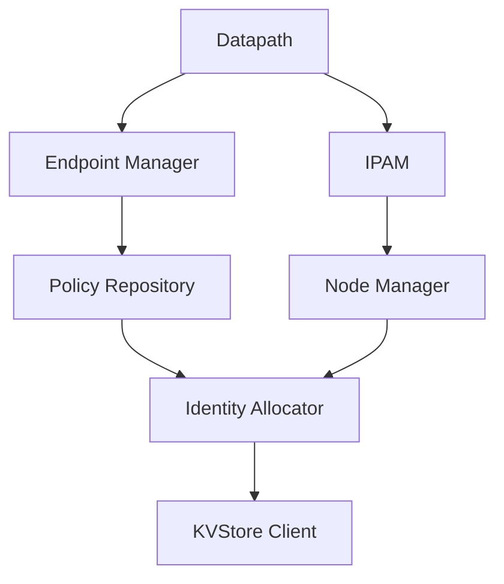

# Using the Cilium Agent Hive Dependency Injection Framework

Author: [nawazdhandala](https://github.com/nawazdhandala)

Tags: Cilium, Hive, Kubernetes, Dependency Injection, Networking, DevOps

Description: Learn how to use the cilium-agent hive command to inspect and debug the internal dependency injection framework that powers the Cilium agent's modular architecture.

---

## Introduction

Cilium uses an internal dependency injection framework called Hive to manage the lifecycle of its components. The `cilium-agent hive` command exposes tools for inspecting how the agent's modules are wired together, their provider dependencies, and their registered lifecycle hooks.

Understanding Hive is valuable when debugging agent startup failures, developing Cilium extensions, or trying to understand why a particular feature is or is not being initialized. The hive subsystem makes the agent's internal architecture observable.

This guide covers practical usage of the `cilium-agent hive` command to inspect the agent's dependency graph, understand component lifecycle, and diagnose initialization issues.

## Prerequisites

- Kubernetes cluster with Cilium v1.14+ installed
- `kubectl` with access to the cluster
- Access to a cilium-agent pod or local binary
- Basic understanding of dependency injection patterns

## Accessing the Hive Command

The `cilium-agent hive` command is available within the cilium-agent binary. Access it directly or via a running pod:

```bash
# Direct access if binary is available locally

cilium-agent hive --help

# Access via a running Cilium pod
CILIUM_POD=$(kubectl -n kube-system get pods -l k8s-app=cilium \
  -o jsonpath='{.items[0].metadata.name}')

kubectl -n kube-system exec "$CILIUM_POD" -c cilium-agent -- \
  cilium-agent hive --help
```

The hive command has subcommands for visualizing and inspecting the dependency graph:

```bash
# List available hive subcommands
kubectl -n kube-system exec "$CILIUM_POD" -c cilium-agent -- \
  cilium-agent hive
```

## Inspecting the Dependency Graph

The hive framework builds a dependency graph of the agent's providers. You can inspect this graph to understand how components relate:

```bash
# Print the dependency graph in Graphviz DOT format
kubectl -n kube-system exec "$CILIUM_POD" -c cilium-agent -- \
  cilium-agent hive dot-graph
```


```mermaid
flowchart TD
    A[Datapath] --> B[Endpoint Manager]
    A --> C[IPAM]
    B --> D[Policy Repository]
    C --> E[Node Manager]
    D --> F[Identity Allocator]
    E --> F
    F --> G[KVStore Client]
```

The DOT output shows which providers depend on which other providers, making it clear what needs to be constructed before a given feature can start. The diagram above is a simplified illustration; real output uses Cilium's cell and provider names.

## Understanding Component Lifecycle

Hive separates dependency construction from runtime lifecycle hooks:

```bash
# The hive framework manages:
# 1. Provide - Register constructors and their dependencies
# 2. Start hooks - Initialize runtime work after dependencies are constructed
# 3. Stop hooks - Gracefully shut down registered runtime work
```

When a dependency is not satisfied, Hive reports the missing type during construction. When a start hook fails, Hive reports the failing hook. These errors are visible in the agent logs:

```bash
# Check agent logs for hive initialization errors
kubectl -n kube-system logs "$CILIUM_POD" -c cilium-agent | \
  grep -i "hive\|cell\|lifecycle"
```

## Debugging Component Registration

To get a rough view of what cells and providers are registered in the agent:

```bash
# List all registered cells
kubectl -n kube-system exec "$CILIUM_POD" -c cilium-agent -- \
  cilium-agent hive dot-graph 2>/dev/null | \
  grep -oP '"[^"]*"' | sort -u | head -30
```

Each cell represents a functional unit of the agent. Names in the DOT graph are implementation details and can change between Cilium versions. Common areas represented by cells include:

- **IPAM**: IP Address Management
- **Datapath**: eBPF program management
- **Endpoint Manager**: Pod endpoint lifecycle
- **Policy**: Network policy computation
- **KVStore**: Distributed key-value store client
- **Health**: Agent health checking

## Using Hive Output for Custom Tooling

You can build lightweight checks around the hive graph, but treat them as version-specific diagnostics rather than a stable health API:

```bash
#!/bin/bash
# check-cilium-hive-health.sh
# Verify all expected Cilium components are registered

CILIUM_POD=$(kubectl -n kube-system get pods -l k8s-app=cilium \
  -o jsonpath='{.items[0].metadata.name}')

EXPECTED_COMPONENTS=("IPAM" "Datapath" "Endpoint" "Policy" "Health")

GRAPH=$(kubectl -n kube-system exec "$CILIUM_POD" -c cilium-agent -- \
  cilium-agent hive dot-graph 2>/dev/null)

MISSING=0
for comp in "${EXPECTED_COMPONENTS[@]}"; do
  if echo "$GRAPH" | grep -qi "$comp"; then
    echo "[OK] $comp found in hive graph"
  else
    echo "[MISSING] $comp not found in hive graph"
    MISSING=$((MISSING + 1))
  fi
done

if [ "$MISSING" -gt 0 ]; then
  echo "WARNING: $MISSING components not found"
  exit 1
else
  echo "All expected components present"
fi
```

## Verification

Confirm the hive subsystem is functioning correctly:

```bash
# Verify the hive command is available
kubectl -n kube-system exec "$CILIUM_POD" -c cilium-agent -- \
  cilium-agent hive dot-graph > /dev/null 2>&1 && \
  echo "Hive subsystem accessible" || echo "Hive command not available"

# Check that the graph has content
LINES=$(kubectl -n kube-system exec "$CILIUM_POD" -c cilium-agent -- \
  cilium-agent hive dot-graph 2>/dev/null | wc -l)
echo "Dependency graph has $LINES lines"
```

## Troubleshooting

- **"unknown command: hive"**: Your Cilium version may be too old. The hive command is available in v1.14+. Check with `cilium-agent version`.
- **Empty graph output**: Confirm the command did not fail and that you are using an image version with the hive command. Also make sure the pod is Running before using `kubectl exec`.
- **Circular dependency errors in logs**: This indicates a bug in component registration. Check Cilium GitHub issues for your version.
- **Timeout on exec commands**: The agent may be overloaded. Try with `--request-timeout=60s` on kubectl.

## Conclusion

The `cilium-agent hive` command provides visibility into the internal wiring of the Cilium agent. By understanding the dependency graph and component lifecycle, you can diagnose startup failures, verify that expected features are wired into the agent, and build diagnostics that check the agent's architecture at a specific Cilium version. This knowledge is especially valuable for operators managing large Cilium deployments and developers extending the platform.
