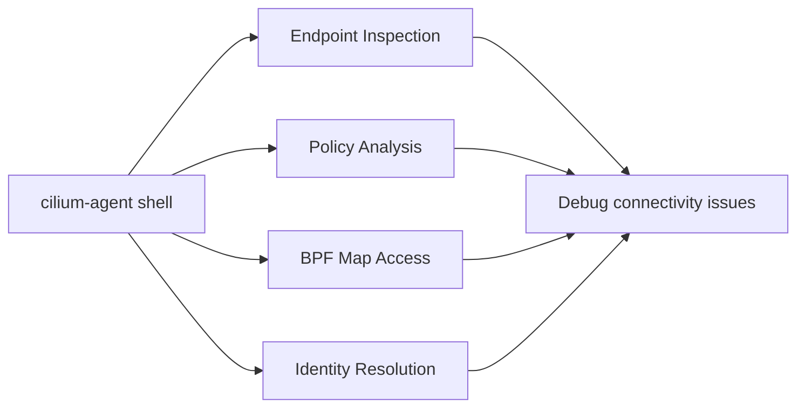

# Using the Cilium Agent Shell for Interactive Debugging

Author: [nawazdhandala](https://github.com/nawazdhandala)

Tags: Cilium, Debugging, Kubernetes, Shell, Networking, DevOps

Description: Learn how to use the cilium-agent shell command to interactively inspect and debug the Cilium agent's internal state, endpoints, and datapath configuration.

---

## Introduction

The `cilium-agent shell` command provides an interactive shell environment for inspecting the Cilium agent's internal state. This is a powerful debugging tool that gives you direct access to agent internals without relying solely on the CLI subcommands.

When standard debugging commands do not surface the information you need, the shell interface allows deeper exploration of the agent's runtime state, including endpoint details, policy computations, and datapath configurations.

This guide covers how to access and effectively use the cilium-agent shell for common debugging scenarios.

## Prerequisites

- Kubernetes cluster with Cilium v1.14+
- `kubectl` with cluster access
- Basic understanding of Cilium architecture (endpoints, identities, policies)

## Accessing the Shell

Connect to the cilium-agent shell through a running pod:

```bash
# Identify a Cilium pod
CILIUM_POD=$(kubectl -n kube-system get pods -l k8s-app=cilium \
  -o jsonpath='{.items[0].metadata.name}')

# Start the shell
kubectl -n kube-system exec -it "$CILIUM_POD" -c cilium-agent -- \
  cilium-agent shell
```

For non-interactive use (scripted commands):

```bash
# Execute a single command through the shell
kubectl -n kube-system exec "$CILIUM_POD" -c cilium-agent -- \
  cilium-agent shell -c "status"
```

## Common Shell Operations

### Inspecting Agent Status

```bash
# Inside the cilium-agent shell
# Check overall agent health
status

# View endpoint list
endpoint list

# Check identity allocations
identity list
```

### Examining Endpoints

```bash
# Get detailed endpoint information
endpoint get <endpoint-id>

# List endpoints with their security identities
endpoint list -o json
```

### Checking Policy State

```bash
# View active network policies
policy get

# Check policy selectors
policy selectors
```

## Scripted Shell Usage

You can pipe commands into the shell for automation:

```bash
#!/bin/bash
# cilium-shell-report.sh
# Generate a status report using cilium-agent shell commands

CILIUM_POD=$(kubectl -n kube-system get pods -l k8s-app=cilium \
  -o jsonpath='{.items[0].metadata.name}')

echo "=== Cilium Agent Status Report ==="
echo "Pod: $CILIUM_POD"
echo "Timestamp: $(date -u)"
echo ""

# Get status through the agent
echo "--- Agent Status ---"
kubectl -n kube-system exec "$CILIUM_POD" -c cilium-agent -- \
  cilium-dbg status --brief 2>/dev/null

echo ""
echo "--- Endpoint Count ---"
kubectl -n kube-system exec "$CILIUM_POD" -c cilium-agent -- \
  cilium-dbg endpoint list -o json 2>/dev/null | \
  python3 -c "import sys,json; data=json.load(sys.stdin); print(f'Total endpoints: {len(data)}')" 2>/dev/null

echo ""
echo "--- BPF Map Status ---"
kubectl -n kube-system exec "$CILIUM_POD" -c cilium-agent -- \
  cilium-dbg bpf ct list global 2>/dev/null | wc -l | \
  xargs -I{} echo "Connection tracking entries: {}"
```

## Advanced Debugging Scenarios

### Tracing Policy Decisions

```bash
# Trace a policy decision for specific traffic
kubectl -n kube-system exec "$CILIUM_POD" -c cilium-agent -- \
  cilium-dbg policy trace \
    --src-identity 12345 \
    --dst-identity 67890 \
    --dport 80 \
    --proto TCP
```

### Inspecting BPF Maps

```bash
# View connection tracking table
kubectl -n kube-system exec "$CILIUM_POD" -c cilium-agent -- \
  cilium-dbg bpf ct list global | head -20

# View NAT mappings
kubectl -n kube-system exec "$CILIUM_POD" -c cilium-agent -- \
  cilium-dbg bpf nat list | head -20
```



## Verification

Confirm the shell is accessible and functional:

```bash
# Verify shell access
kubectl -n kube-system exec "$CILIUM_POD" -c cilium-agent -- \
  cilium-dbg status --brief && echo "Shell access verified"

# Verify agent health endpoint
kubectl -n kube-system exec "$CILIUM_POD" -c cilium-agent -- \
  cilium-dbg status | grep "Overall Health"
```

## Troubleshooting

- **"error: unable to upgrade connection"**: Ensure your kubectl context has exec permissions and the pod is in Running state.
- **Shell hangs on start**: The agent may be under heavy load. Try with a shorter timeout: `--request-timeout=30s`.
- **"command not found" inside shell**: Not all cilium-dbg subcommands are available via the shell interface. Use `cilium-dbg` directly instead.
- **Interactive shell not working in CI**: Use the `-c` flag for non-interactive command execution instead.

## Conclusion

The cilium-agent shell provides a direct window into the agent's runtime state, complementing the standard CLI tools. Whether you need to inspect endpoints, trace policy decisions, or examine BPF maps, the shell interface gives you flexible access for both interactive debugging and scripted automation.
