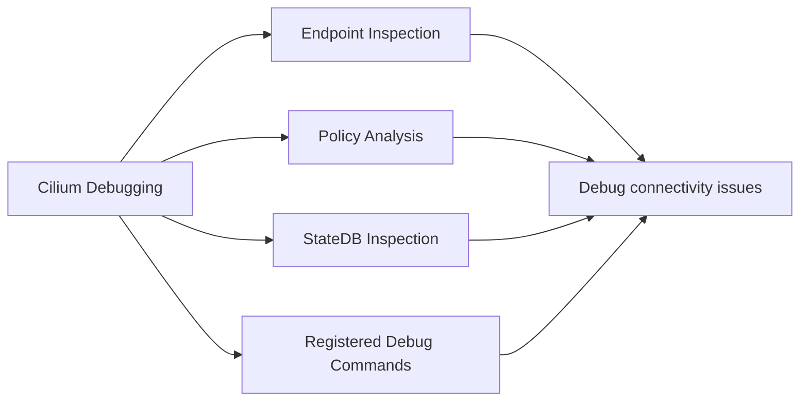

# Using the Cilium Agent Shell for Interactive Debugging

Author: [nawazdhandala](https://github.com/nawazdhandala)

Tags: Cilium, Debugging, Kubernetes, Shell, Networking, DevOps

Description: Learn how to use the cilium-agent shell command to interactively inspect and debug the Cilium agent's internal state, endpoints, and datapath configuration.

---

## Introduction

The `cilium-agent shell` command provides an interactive shell environment for inspecting the Cilium agent's registered debug commands and StateDB tables. This is a powerful debugging tool for exploring agent internals that are exposed through the shell socket.

When standard debugging commands do not surface the information you need, the shell interface allows deeper exploration of the agent's runtime state, including registered StateDB tables such as health, Kubernetes resources, and load-balancing state. Endpoint, policy, and BPF-map inspection still use `cilium-dbg` directly.

This guide covers how to access and effectively use the cilium-agent shell for common debugging scenarios.

## Prerequisites

- Kubernetes cluster with Cilium v1.18+ for `cilium-agent shell`
- `kubectl` with cluster access
- Basic understanding of Cilium architecture (endpoints, identities, policies)

## Accessing the Shell

Connect to the cilium-agent shell through a running pod:

```bash
# Identify a Cilium pod

CILIUM_POD=$(kubectl -n kube-system get pods -l k8s-app=cilium \
  -o jsonpath='{.items[0].metadata.name}')

# Start the shell
kubectl -n kube-system exec -it "$CILIUM_POD" -c cilium-agent -- \
  cilium-agent shell
```

For non-interactive use (scripted commands):

```bash
# Execute a single command through the shell
kubectl -n kube-system exec "$CILIUM_POD" -c cilium-agent -- \
  cilium-agent shell help
```

## Common Shell Operations

### Inspecting Agent Status

```bash
# Inside the cilium-agent shell
# Show available shell commands
help

# Show registered StateDB tables
db

# Show the health table
db/show health
```

### Examining Endpoints

```bash
# Get detailed endpoint information
kubectl -n kube-system exec "$CILIUM_POD" -c cilium-agent -- \
  cilium-dbg endpoint get <endpoint-id>

# List endpoints with their security identities
kubectl -n kube-system exec "$CILIUM_POD" -c cilium-agent -- \
  cilium-dbg endpoint list -o json
```

### Checking Policy State

```bash
# View active network policies
kubectl -n kube-system exec "$CILIUM_POD" -c cilium-agent -- \
  cilium-dbg policy get

# Check policy selectors
kubectl -n kube-system exec "$CILIUM_POD" -c cilium-agent -- \
  cilium-dbg policy selectors
```

## Scripted Shell Usage

You can pass a single shell command as arguments for automation:

```bash
#!/bin/bash
# cilium-shell-report.sh
# Generate a status report using cilium-agent shell commands

CILIUM_POD=$(kubectl -n kube-system get pods -l k8s-app=cilium \
  -o jsonpath='{.items[0].metadata.name}')

echo "=== Cilium Agent Status Report ==="
echo "Pod: $CILIUM_POD"
echo "Timestamp: $(date -u)"
echo ""

# Get registered StateDB tables through the agent shell
echo "--- StateDB Tables ---"
kubectl -n kube-system exec "$CILIUM_POD" -c cilium-agent -- \
  cilium-agent shell db 2>/dev/null

echo ""
echo "--- Health Table ---"
kubectl -n kube-system exec "$CILIUM_POD" -c cilium-agent -- \
  cilium-agent shell -- db/show --format=json health 2>/dev/null

echo ""
echo "--- Endpoint Count ---"
kubectl -n kube-system exec "$CILIUM_POD" -c cilium-agent -- \
  cilium-dbg endpoint list -o json 2>/dev/null | \
  python3 -c "import sys,json; data=json.load(sys.stdin); print(f'Total endpoints: {len(data)}')" 2>/dev/null
```

## Advanced Debugging Scenarios

### Inspecting StateDB Tables

```bash
# List available StateDB tables
kubectl -n kube-system exec "$CILIUM_POD" -c cilium-agent -- \
  cilium-agent shell db

# Show a table in JSON format
kubectl -n kube-system exec "$CILIUM_POD" -c cilium-agent -- \
  cilium-agent shell -- db/show --format=json health
```

### Inspecting BPF Maps

```bash
# View connection tracking table
kubectl -n kube-system exec "$CILIUM_POD" -c cilium-agent -- \
  cilium-dbg bpf ct list global | head -20

# View NAT mappings
kubectl -n kube-system exec "$CILIUM_POD" -c cilium-agent -- \
  cilium-dbg bpf nat list | head -20
```


```mermaid
flowchart LR
    A[Cilium Debugging] --> B[Endpoint Inspection]
    A --> C[Policy Analysis]
    A --> D[StateDB Inspection]
    A --> E[Registered Debug Commands]
    B --> F[Debug connectivity issues]
    C --> F
    D --> F
    E --> F
```

## Verification

Confirm the shell is accessible and functional:

```bash
# Verify shell access
kubectl -n kube-system exec "$CILIUM_POD" -c cilium-agent -- \
  cilium-agent shell help && echo "Shell access verified"

# Verify agent health through cilium-dbg
kubectl -n kube-system exec "$CILIUM_POD" -c cilium-agent -- \
  cilium-dbg status --brief
```

## Troubleshooting

- **"error: unable to upgrade connection"**: Ensure your kubectl context has exec permissions and the pod is in Running state.
- **Shell hangs on start**: The agent may be under heavy load. Try with a shorter timeout: `--request-timeout=30s`.
- **"unknown command" inside shell**: `cilium-dbg` subcommands are not shell commands. Use `cilium-dbg` directly instead.
- **Interactive shell not working in CI**: Pass the shell command as arguments, for example `cilium-agent shell help`, instead of starting an interactive session.

## Conclusion

The cilium-agent shell provides a direct window into the agent's registered debug commands and StateDB tables, complementing the standard CLI tools. Use it for interactive inspection of shell-exposed runtime state, and use `cilium-dbg` directly when you need endpoint, policy, or BPF-map commands.
