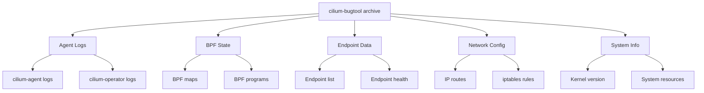

# Using Cilium Bugtool for Comprehensive Cluster Diagnostics

Author: [nawazdhandala](https://github.com/nawazdhandala)

Tags: Cilium, Bugtool, Kubernetes, Diagnostics, Debugging, Networking

Description: Learn how to use cilium-bugtool to collect comprehensive diagnostic data from Cilium agents, including logs, BPF maps, network state, and system configuration for effective troubleshooting.

---

## Introduction

When troubleshooting complex Cilium networking issues, you often need more than just agent logs. The `cilium-bugtool` utility collects a comprehensive snapshot of the Cilium agent's state, including BPF program details, endpoint configurations, policy state, kernel parameters, and system information -- all packaged into a single archive.

This tool is the standard way to gather diagnostic information for Cilium support cases and bug reports. It automates the collection of dozens of data points that would otherwise require running many individual commands.

This guide covers how to use cilium-bugtool effectively, what data it collects, and how to interpret the output.

## Prerequisites

- Kubernetes cluster with Cilium installed
- `kubectl` with access to cilium pods
- Sufficient disk space for the diagnostic archive (can be 50MB+)
- `tar` for extracting the archive

## Running Cilium Bugtool

Execute cilium-bugtool inside a Cilium pod:

```bash
# Identify a Cilium agent pod
CILIUM_POD=$(kubectl -n kube-system get pods -l k8s-app=cilium \
  -o jsonpath='{.items[0].metadata.name}')

# Run bugtool and create a diagnostic archive
kubectl -n kube-system exec "$CILIUM_POD" -c cilium-agent -- \
  cilium-bugtool

# The archive is created inside the container. Copy it out:
ARCHIVE=$(kubectl -n kube-system exec "$CILIUM_POD" -c cilium-agent -- \
  ls -t /tmp/cilium-bugtool-*.tar.gz 2>/dev/null | head -1)

kubectl -n kube-system cp \
  "$CILIUM_POD:$ARCHIVE" /tmp/cilium-bugtool.tar.gz \
  -c cilium-agent

echo "Archive saved to /tmp/cilium-bugtool.tar.gz"
ls -lh /tmp/cilium-bugtool.tar.gz
```

## Understanding Collected Data

Extract and explore the archive:

```bash
# Extract the archive
mkdir -p /tmp/cilium-bugtool-output
tar xzf /tmp/cilium-bugtool.tar.gz -C /tmp/cilium-bugtool-output

# List the collected files
find /tmp/cilium-bugtool-output -type f | head -30
```

The archive typically contains:



## Selective Data Collection

Collect only specific categories of data:

```bash
# Collect only cilium-agent state (faster, smaller archive)
kubectl -n kube-system exec "$CILIUM_POD" -c cilium-agent -- \
  cilium-bugtool --commands="cilium-dbg status,cilium-dbg endpoint list"

# List available collection commands
kubectl -n kube-system exec "$CILIUM_POD" -c cilium-agent -- \
  cilium-bugtool --list
```

## Analyzing the Output

Key files to examine in the archive:

```bash
BUGDIR="/tmp/cilium-bugtool-output"

# Find the extracted directory
BUGDIR=$(find /tmp/cilium-bugtool-output -maxdepth 1 -type d | tail -1)

# Check agent status
cat "$BUGDIR"/cmd-output/cilium-dbg-status* 2>/dev/null | head -30

# Review endpoint list
cat "$BUGDIR"/cmd-output/cilium-dbg-endpoint-list* 2>/dev/null | head -30

# Check BPF map entries
ls "$BUGDIR"/cmd-output/cilium-dbg-bpf* 2>/dev/null

# Review system info
cat "$BUGDIR"/cmd-output/uname* 2>/dev/null
cat "$BUGDIR"/cmd-output/ip-route* 2>/dev/null | head -20

# Check kernel parameters
cat "$BUGDIR"/cmd-output/sysctl* 2>/dev/null | \
  grep -E "net.core|net.ipv4.conf" | head -20
```

## Using Bugtool for Support Cases

When filing a Cilium issue or support request:

```bash
#!/bin/bash
# collect-cilium-support-data.sh
# Collect full support bundle from all Cilium pods

set -euo pipefail

OUTPUT_DIR="/tmp/cilium-support-$(date +%Y%m%d-%H%M%S)"
mkdir -p "$OUTPUT_DIR"

PODS=$(kubectl -n kube-system get pods -l k8s-app=cilium \
  -o jsonpath='{range .items[*]}{.metadata.name},{.spec.nodeName}{"\n"}{end}')

while IFS=',' read -r pod node; do
  [ -z "$pod" ] && continue
  echo "Collecting from $pod ($node)..."

  # Run bugtool
  kubectl -n kube-system exec "$pod" -c cilium-agent -- \
    cilium-bugtool 2>/dev/null

  # Copy archive
  ARCHIVE=$(kubectl -n kube-system exec "$pod" -c cilium-agent -- \
    ls -t /tmp/cilium-bugtool-*.tar.gz 2>/dev/null | head -1)

  if [ -n "$ARCHIVE" ]; then
    kubectl -n kube-system cp \
      "$pod:$ARCHIVE" "$OUTPUT_DIR/${node}-bugtool.tar.gz" \
      -c cilium-agent
    echo "  Saved to $OUTPUT_DIR/${node}-bugtool.tar.gz"
  fi
done <<< "$PODS"

# Also collect cluster-level info
kubectl get nodes -o yaml > "$OUTPUT_DIR/nodes.yaml"
kubectl -n kube-system get pods -o yaml > "$OUTPUT_DIR/kube-system-pods.yaml"

echo "Support bundle at: $OUTPUT_DIR"
ls -lh "$OUTPUT_DIR"
```

## Verification

```bash
# Verify the archive is not corrupted
tar tzf /tmp/cilium-bugtool.tar.gz > /dev/null && \
  echo "Archive is valid"

# Verify expected files are present
tar tzf /tmp/cilium-bugtool.tar.gz | grep -c "cmd-output"
# Should be > 0

# Check archive size is reasonable
SIZE=$(stat -f%z /tmp/cilium-bugtool.tar.gz 2>/dev/null || \
       stat -c%s /tmp/cilium-bugtool.tar.gz 2>/dev/null)
echo "Archive size: $((SIZE / 1024))KB"
```

## Troubleshooting

- **"No space left on device"**: The bugtool writes to /tmp inside the container. Check available space with `df -h` inside the container.
- **Archive is very small**: Some commands may have failed. Run with verbose output to see which commands succeeded.
- **Copy fails with "tar: Removing leading '/'"**: This warning is harmless. The copy should still succeed.
- **Bugtool takes very long**: Large clusters with many endpoints generate more data. Use `--commands` to limit collection scope.

## Conclusion

The cilium-bugtool is an indispensable utility for Cilium troubleshooting. It automates the collection of the comprehensive diagnostic data needed to resolve networking issues, file bug reports, and work with Cilium support. By understanding what data is collected and how to analyze it, you can accelerate your diagnostic workflow significantly.
