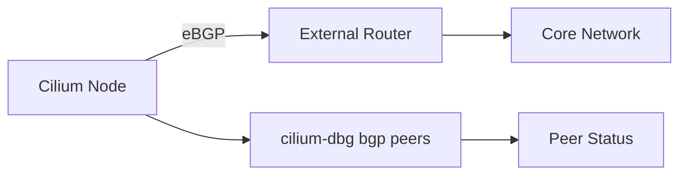

# Using Cilium Debug BGP Peers Command

Author: [nawazdhandala](https://github.com/nawazdhandala)

Tags: Cilium, BGP, Peers, Kubernetes, Networking

Description: Inspect BGP peer status and session details using cilium-dbg bgp peers to diagnose peering issues and validate BGP configuration.

---

## Introduction

Cilium supports BGP for advertising pod and service CIDRs to external network infrastructure. The `cilium-dbg bgp peers` command provides visibility into BGP peer session information on each Cilium node.

Understanding peer state is essential for diagnosing BGP connectivity issues. The peers command shows session status, timers, and message counters for each configured BGP neighbor.

This guide covers using cilium-dbg bgp peers for inspection and validation.

## Prerequisites

- Kubernetes cluster with Cilium and BGP enabled
- BGP peering configured via CiliumBGPPeeringPolicy
- `kubectl` access to cilium pods
- 
- 

## Inspecting Peers State

```bash
CILIUM_POD=$(kubectl -n kube-system get pods -l k8s-app=cilium \
  -o jsonpath='{.items[0].metadata.name}')

# Run the command
kubectl -n kube-system exec "$CILIUM_POD" -c cilium-agent -- \
  cilium-dbg bgp peers
```

### Understanding the Output

The `cilium-dbg bgp peers` command displays peer session information including addresses, ASN, state, and timers.

### Multi-Node Inspection

```bash
#!/bin/bash
# check-bgp-peers-all-nodes.sh

NAMESPACE="kube-system"
PODS=$(kubectl -n "$NAMESPACE" get pods -l k8s-app=cilium \
  -o jsonpath='{range .items[*]}{.metadata.name},{.spec.nodeName}{"\n"}{end}')

while IFS=',' read -r pod node; do
  [ -z "$pod" ] && continue
  echo "=== $node ==="
  kubectl -n "$NAMESPACE" exec "$pod" -c cilium-agent -- \
    cilium-dbg bgp peers 2>/dev/null || echo "  Failed"
  echo ""
done <<< "$PODS"
```

### BGP Configuration Reference

```yaml
apiVersion: cilium.io/v2alpha1
kind: CiliumBGPPeeringPolicy
metadata:
  name: bgp-peering
spec:
  virtualRouters:
  - localASN: 65001
    exportPodCIDR: true
    neighbors:
    - peerAddress: "10.0.0.1/32"
      peerASN: 65000
```



## Verification

```bash
CILIUM_POD=$(kubectl -n kube-system get pods -l k8s-app=cilium \
  -o jsonpath='{.items[0].metadata.name}')

# Verify command works
kubectl -n kube-system exec "$CILIUM_POD" -c cilium-agent -- \
  cilium-dbg bgp peers 2>/dev/null && echo "Command succeeded"

```

## Troubleshooting

- **"BGP is not enabled"**: Set `enable-bgp-control-plane: "true"` in cilium-config.
- **Empty output**: No BGP peering policy may be configured. Check `kubectl get ciliumbgppeeringpolicies`.
- **Peers not establishing**: Verify network connectivity to peer on TCP/179 and ASN configuration.
- **Timeout on large clusters**: Add `--request-timeout=120s` to kubectl commands.

## Conclusion

The `cilium-dbg bgp peers` provides essential visibility into BGP peer sessions on Cilium nodes. This is essential for validating BGP configuration and diagnosing connectivity issues.
