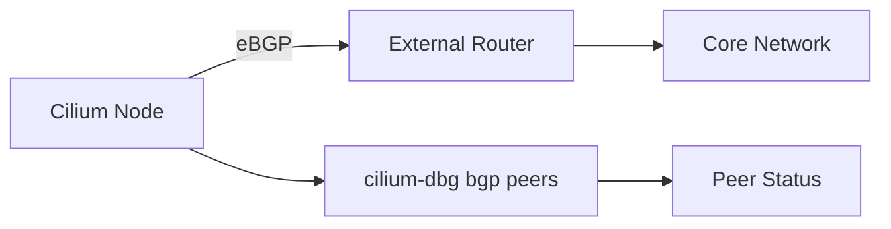

# Using Cilium Debug BGP Peers Command

Author: [nawazdhandala](https://github.com/nawazdhandala)

Tags: Cilium, BGP, Peer, Kubernetes, Networking

Description: Inspect BGP peer status and session details using cilium-dbg bgp peers to diagnose peering issues and validate BGP configuration.

---

## Introduction

Cilium supports BGP for advertising pod CIDRs and Service VIPs to external network infrastructure. The `cilium-dbg bgp peers` command provides visibility into BGP peer session information on each Cilium node.

Understanding peer state is essential for diagnosing BGP connectivity issues. The peers command shows session status, uptime, address families, and received and advertised route counts for each configured BGP neighbor.

This guide covers using cilium-dbg bgp peers for inspection and validation.

## Prerequisites

- Kubernetes cluster with Cilium and BGP enabled
- BGP peering configured via CiliumBGPClusterConfig, CiliumBGPPeerConfig, and CiliumBGPAdvertisement
- `kubectl` access to cilium pods

## Inspecting Peers State

```bash
CILIUM_POD=$(kubectl -n kube-system get pods -l k8s-app=cilium \
  -o jsonpath='{.items[0].metadata.name}')

# Run the command

kubectl -n kube-system exec "$CILIUM_POD" -c cilium-agent -- \
  cilium-dbg bgp peers
```

### Understanding the Output

The `cilium-dbg bgp peers` command displays peer session information including addresses, ASN, session state, uptime, address families, and received and advertised route counts.

### Multi-Node Inspection

```bash
#!/bin/bash
# check-bgp-peers-all-nodes.sh

NAMESPACE="kube-system"
PODS=$(kubectl -n "$NAMESPACE" get pods -l k8s-app=cilium \
  -o jsonpath='{range .items[*]}{.metadata.name},{.spec.nodeName}{"\n"}{end}')

while IFS=',' read -r pod node; do
  [ -z "$pod" ] && continue
  echo "=== $node ==="
  kubectl -n "$NAMESPACE" exec "$pod" -c cilium-agent -- \
    cilium-dbg bgp peers 2>/dev/null || echo "  Failed"
  echo ""
done <<< "$PODS"
```

### BGP Configuration Reference

```yaml
apiVersion: cilium.io/v2
kind: CiliumBGPClusterConfig
metadata:
  name: cilium-bgp
spec:
  nodeSelector:
    matchLabels:
      bgp: "enabled"
  bgpInstances:
  - name: "instance-65001"
    localASN: 65001
    peers:
    - name: "peer-65000"
      peerASN: 65000
      peerAddress: "10.0.0.1"
      peerConfigRef:
        name: "cilium-peer"
---
apiVersion: cilium.io/v2
kind: CiliumBGPPeerConfig
metadata:
  name: cilium-peer
spec:
  families:
  - afi: ipv4
    safi: unicast
    advertisements:
      matchLabels:
        advertise: "bgp"
---
apiVersion: cilium.io/v2
kind: CiliumBGPAdvertisement
metadata:
  name: bgp-advertisements
  labels:
    advertise: bgp
spec:
  advertisements:
  - advertisementType: "PodCIDR"
```


```mermaid
flowchart LR
    A[Cilium Node] -->|eBGP| B[External Router]
    B --> C[Core Network]
    A --> D[cilium-dbg bgp peers]
    D --> E[Peer Status]
```

## Verification

```bash
CILIUM_POD=$(kubectl -n kube-system get pods -l k8s-app=cilium \
  -o jsonpath='{.items[0].metadata.name}')

# Verify command works
kubectl -n kube-system exec "$CILIUM_POD" -c cilium-agent -- \
  cilium-dbg bgp peers 2>/dev/null && echo "Command succeeded"

```

## Troubleshooting

- **"BGP is not enabled"**: Enable the BGP control plane with the Helm value `bgpControlPlane.enabled=true`.
- **Empty output**: No BGP control plane resources may be configured. Check `kubectl get ciliumbgpclusterconfigs,ciliumbgppeerconfigs,ciliumbgpadvertisements`.
- **Peers not establishing**: Verify network connectivity to peer on TCP/179 and ASN configuration.
- **Timeout on large clusters**: Add `--request-timeout=120s` to kubectl commands.

## Conclusion

The `cilium-dbg bgp peers` provides essential visibility into BGP peer sessions on Cilium nodes. This is essential for validating BGP configuration and diagnosing connectivity issues.
