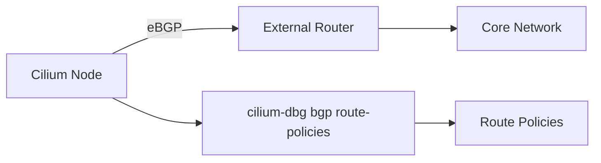

# Using Cilium Debug BGP Route Policies

Author: [nawazdhandala](https://github.com/nawazdhandala)

Tags: Cilium, BGP, Route Policies, Kubernetes, Networking

Description: Inspect BGP route policies with cilium-dbg bgp route-policies to understand how routes are filtered and advertised.

---

## Introduction

Cilium supports BGP for advertising pod and service CIDRs to external network infrastructure. The `cilium-dbg bgp route-policies` command provides visibility into BGP route policy configuration on each Cilium node.

Route policies control which prefixes are advertised to BGP peers and how route attributes are modified. Inspecting these policies helps verify that your routing configuration matches your intent.

This guide covers using cilium-dbg bgp route-policies for inspection and validation.

## Prerequisites

- Kubernetes cluster with Cilium and BGP enabled
- BGP peering configured via CiliumBGPPeeringPolicy
- `kubectl` access to cilium pods
- 
- 

## Inspecting Route-Policies State

```bash
CILIUM_POD=$(kubectl -n kube-system get pods -l k8s-app=cilium \
  -o jsonpath='{.items[0].metadata.name}')

# Run the command
kubectl -n kube-system exec "$CILIUM_POD" -c cilium-agent -- \
  cilium-dbg bgp route-policies
```

### Understanding the Output

The `cilium-dbg bgp route-policies` command displays route policy definitions including match conditions and actions.

### Multi-Node Inspection

```bash
#!/bin/bash
# check-bgp-route-policies-all-nodes.sh

NAMESPACE="kube-system"
PODS=$(kubectl -n "$NAMESPACE" get pods -l k8s-app=cilium \
  -o jsonpath='{range .items[*]}{.metadata.name},{.spec.nodeName}{"\n"}{end}')

while IFS=',' read -r pod node; do
  [ -z "$pod" ] && continue
  echo "=== $node ==="
  kubectl -n "$NAMESPACE" exec "$pod" -c cilium-agent -- \
    cilium-dbg bgp route-policies 2>/dev/null || echo "  Failed"
  echo ""
done <<< "$PODS"
```

### BGP Configuration Reference

```yaml
apiVersion: cilium.io/v2alpha1
kind: CiliumBGPPeeringPolicy
metadata:
  name: bgp-peering
spec:
  virtualRouters:
  - localASN: 65001
    exportPodCIDR: true
    neighbors:
    - peerAddress: "10.0.0.1/32"
      peerASN: 65000
```



## Verification

```bash
CILIUM_POD=$(kubectl -n kube-system get pods -l k8s-app=cilium \
  -o jsonpath='{.items[0].metadata.name}')

# Verify command works
kubectl -n kube-system exec "$CILIUM_POD" -c cilium-agent -- \
  cilium-dbg bgp route-policies 2>/dev/null && echo "Command succeeded"

```

## Troubleshooting

- **"BGP is not enabled"**: Set `enable-bgp-control-plane: "true"` in cilium-config.
- **Empty output**: No BGP peering policy may be configured. Check `kubectl get ciliumbgppeeringpolicies`.
- **No policies displayed**: Ensure route policy is defined in the CiliumBGPPeeringPolicy.
- **Timeout on large clusters**: Add `--request-timeout=120s` to kubectl commands.

## Conclusion

The `cilium-dbg bgp route-policies` provides essential visibility into BGP route policies on Cilium nodes. This is essential for validating BGP configuration and diagnosing connectivity issues.
