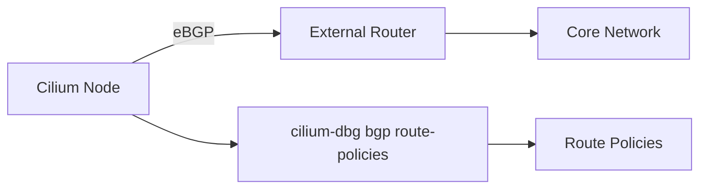

# Using Cilium Debug BGP Route Policies

Author: [nawazdhandala](https://github.com/nawazdhandala)

Tags: Cilium, BGP, Route Policies, Kubernetes, Networking

Description: Inspect BGP route policies with cilium-dbg bgp route-policies to understand how routes are filtered and advertised.

---

## Introduction

Cilium supports BGP for advertising Pod CIDRs and service virtual IPs to external network infrastructure. The `cilium-dbg bgp route-policies` command provides visibility into BGP route policy configuration on each Cilium node.

Route policies control which prefixes are advertised to BGP peers and how route attributes are modified. Inspecting these policies helps verify that your routing configuration matches your intent.

This guide covers using cilium-dbg bgp route-policies for inspection and validation.

## Prerequisites

- Kubernetes cluster with Cilium and BGP enabled
- BGP peering configured via CiliumBGPClusterConfig and CiliumBGPPeerConfig
- `kubectl` access to cilium pods

## Inspecting Route-Policies State

```bash
CILIUM_POD=$(kubectl -n kube-system get pods -l k8s-app=cilium \
  -o jsonpath='{.items[0].metadata.name}')

# Run the command

kubectl -n kube-system exec "$CILIUM_POD" -c cilium-agent -- \
  cilium-dbg bgp route-policies
```

### Understanding the Output

The `cilium-dbg bgp route-policies` command displays route policy definitions including match conditions and actions.

### Multi-Node Inspection

```bash
#!/bin/bash
# check-bgp-route-policies-all-nodes.sh

NAMESPACE="kube-system"
PODS=$(kubectl -n "$NAMESPACE" get pods -l k8s-app=cilium \
  -o jsonpath='{range .items[*]}{.metadata.name},{.spec.nodeName}{"\n"}{end}')

while IFS=',' read -r pod node; do
  [ -z "$pod" ] && continue
  echo "=== $node ==="
  kubectl -n "$NAMESPACE" exec "$pod" -c cilium-agent -- \
    cilium-dbg bgp route-policies 2>/dev/null || echo "  Failed"
  echo ""
done <<< "$PODS"
```

### BGP Configuration Reference

```yaml
apiVersion: cilium.io/v2
kind: CiliumBGPClusterConfig
metadata:
  name: cilium-bgp
spec:
  nodeSelector:
    matchLabels:
      bgp: enabled
  bgpInstances:
  - name: "instance-65001"
    localASN: 65001
    peers:
    - name: "peer-65000"
      peerASN: 65000
      peerAddress: 10.0.0.1
      peerConfigRef:
        name: cilium-peer
---
apiVersion: cilium.io/v2
kind: CiliumBGPPeerConfig
metadata:
  name: cilium-peer
spec:
  families:
  - afi: ipv4
    safi: unicast
    advertisements:
      matchLabels:
        advertise: bgp
---
apiVersion: cilium.io/v2
kind: CiliumBGPAdvertisement
metadata:
  name: bgp-advertisements
  labels:
    advertise: bgp
spec:
  advertisements:
  - advertisementType: "PodCIDR"
```


```mermaid
flowchart LR
    A[Cilium Node] -->|eBGP| B[External Router]
    B --> C[Core Network]
    A --> D[cilium-dbg bgp route-policies]
    D --> E[Route Policies]
```

## Verification

```bash
CILIUM_POD=$(kubectl -n kube-system get pods -l k8s-app=cilium \
  -o jsonpath='{.items[0].metadata.name}')

# Verify command works
kubectl -n kube-system exec "$CILIUM_POD" -c cilium-agent -- \
  cilium-dbg bgp route-policies 2>/dev/null && echo "Command succeeded"

```

## Troubleshooting

- **"BGP is not enabled"**: Enable BGP with the Helm value `bgpControlPlane.enabled=true` and restart the Cilium DaemonSet.
- **Empty output**: No BGP configuration may exist. Check `kubectl get ciliumbgpclusterconfigs,ciliumbgppeerconfigs,ciliumbgpadvertisements`.
- **No policies displayed**: Ensure the `CiliumBGPPeerConfig` advertisement selector matches a `CiliumBGPAdvertisement`.
- **Timeout on large clusters**: Add `--request-timeout=120s` to kubectl commands.

## Conclusion

The `cilium-dbg bgp route-policies` provides essential visibility into BGP route policies on Cilium nodes. This is essential for validating BGP configuration and diagnosing connectivity issues.
