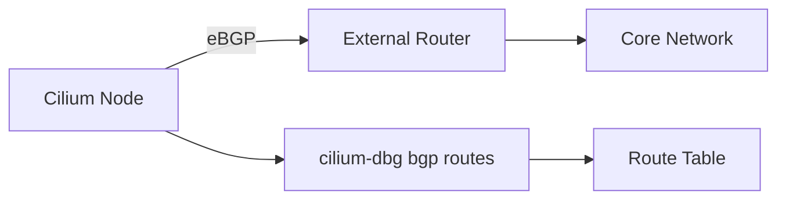

# Using Cilium Debug BGP Routes Command

Author: [nawazdhandala](https://github.com/nawazdhandala)

Tags: Cilium, BGP, Routes, Kubernetes, Networking

Description: Inspect BGP routing tables with cilium-dbg bgp routes to view advertised and received routes on Cilium nodes.

---

## Introduction

Cilium supports BGP for advertising pod and service CIDRs to external network infrastructure. The `cilium-dbg bgp routes` command provides visibility into the BGP routing table on each Cilium node.

The routes command shows the BGP routing information base (RIB), including advertised prefixes, next hops, and AS path attributes. This is essential for verifying that the correct routes are being announced.

This guide covers using cilium-dbg bgp routes for inspection and validation.

## Prerequisites

- Kubernetes cluster with Cilium and BGP enabled
- BGP peering configured via CiliumBGPPeeringPolicy
- `kubectl` access to cilium pods
- 
- 

## Inspecting Routes State

```bash
CILIUM_POD=$(kubectl -n kube-system get pods -l k8s-app=cilium \
  -o jsonpath='{.items[0].metadata.name}')

# Run the command
kubectl -n kube-system exec "$CILIUM_POD" -c cilium-agent -- \
  cilium-dbg bgp routes
```

### Understanding the Output

The `cilium-dbg bgp routes` command displays the BGP routing information base with prefixes, next hops, and path attributes.

### Multi-Node Inspection

```bash
#!/bin/bash
# check-bgp-routes-all-nodes.sh

NAMESPACE="kube-system"
PODS=$(kubectl -n "$NAMESPACE" get pods -l k8s-app=cilium \
  -o jsonpath='{range .items[*]}{.metadata.name},{.spec.nodeName}{"\n"}{end}')

while IFS=',' read -r pod node; do
  [ -z "$pod" ] && continue
  echo "=== $node ==="
  kubectl -n "$NAMESPACE" exec "$pod" -c cilium-agent -- \
    cilium-dbg bgp routes 2>/dev/null || echo "  Failed"
  echo ""
done <<< "$PODS"
```

### BGP Configuration Reference

```yaml
apiVersion: cilium.io/v2alpha1
kind: CiliumBGPPeeringPolicy
metadata:
  name: bgp-peering
spec:
  virtualRouters:
  - localASN: 65001
    exportPodCIDR: true
    neighbors:
    - peerAddress: "10.0.0.1/32"
      peerASN: 65000
```



## Verification

```bash
CILIUM_POD=$(kubectl -n kube-system get pods -l k8s-app=cilium \
  -o jsonpath='{.items[0].metadata.name}')

# Verify command works
kubectl -n kube-system exec "$CILIUM_POD" -c cilium-agent -- \
  cilium-dbg bgp routes 2>/dev/null && echo "Command succeeded"

```

## Troubleshooting

- **"BGP is not enabled"**: Set `enable-bgp-control-plane: "true"` in cilium-config.
- **Empty output**: No BGP peering policy may be configured. Check `kubectl get ciliumbgppeeringpolicies`.
- **No routes shown**: Check exportPodCIDR and service selector in the peering policy.
- **Timeout on large clusters**: Add `--request-timeout=120s` to kubectl commands.

## Conclusion

The `cilium-dbg bgp routes` provides essential visibility into the BGP routing table on Cilium nodes. This is essential for validating BGP configuration and diagnosing connectivity issues.
