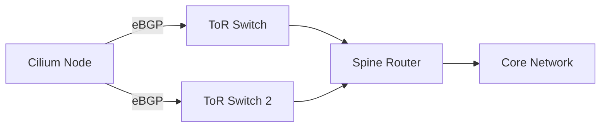

# Using Cilium Debug BGP Commands

Author: [nawazdhandala](https://github.com/nawazdhandala)

Tags: Cilium, BGP, Kubernetes, Networking, Routing

Description: Use cilium-dbg bgp commands to inspect BGP peering state, route advertisements, and routing policy on Cilium nodes with BGP enabled.

---

## Introduction

Cilium supports BGP for advertising pod and service CIDRs to external network infrastructure. The `cilium-dbg bgp` command provides visibility into the BGP state on each node, helping you verify peering, inspect routes, and diagnose connectivity issues.

BGP integration is critical for production Kubernetes clusters that need to advertise pod networks to external routers. The cilium-dbg bgp command gives you real-time visibility into BGP state without connecting to external router consoles.

This guide covers using cilium-dbg bgp to inspect and validate your BGP configuration.

## Prerequisites

- Kubernetes cluster with Cilium and BGP enabled
- BGP peering configured via CiliumBGPPeeringPolicy
- `kubectl` access to cilium pods
- `jq` for JSON processing

## Configuring BGP in Cilium

Cilium BGP is configured through CiliumBGPPeeringPolicy resources:

```yaml
apiVersion: cilium.io/v2alpha1
kind: CiliumBGPPeeringPolicy
metadata:
  name: bgp-peering
spec:
  virtualRouters:
  - localASN: 65001
    exportPodCIDR: true
    neighbors:
    - peerAddress: "10.0.0.1/32"
      peerASN: 65000
```

Ensure BGP is enabled in the Cilium configuration:

```bash
kubectl -n kube-system get configmap cilium-config -o yaml | grep bgp
# Should show: enable-bgp-control-plane: "true"
```

## Inspecting BGP State

```bash
CILIUM_POD=$(kubectl -n kube-system get pods -l k8s-app=cilium \
  -o jsonpath='{.items[0].metadata.name}')

# View available BGP subcommands
kubectl -n kube-system exec "$CILIUM_POD" -c cilium-agent -- \
  cilium-dbg bgp --help

# Check BGP peers
kubectl -n kube-system exec "$CILIUM_POD" -c cilium-agent -- \
  cilium-dbg bgp peers

# View BGP routes
kubectl -n kube-system exec "$CILIUM_POD" -c cilium-agent -- \
  cilium-dbg bgp routes

# Check route policies
kubectl -n kube-system exec "$CILIUM_POD" -c cilium-agent -- \
  cilium-dbg bgp route-policies
```



## Multi-Node BGP Inspection

Check BGP state across all nodes:

```bash
#!/bin/bash
# check-bgp-all-nodes.sh

NAMESPACE="kube-system"
PODS=$(kubectl -n "$NAMESPACE" get pods -l k8s-app=cilium \
  -o jsonpath='{range .items[*]}{.metadata.name},{.spec.nodeName}{"\n"}{end}')

while IFS=',' read -r pod node; do
  [ -z "$pod" ] && continue
  echo "=== $node ==="
  
  echo "-- Peers --"
  kubectl -n "$NAMESPACE" exec "$pod" -c cilium-agent -- \
    cilium-dbg bgp peers 2>/dev/null || echo "  Failed"
  
  echo "-- Routes --"
  kubectl -n "$NAMESPACE" exec "$pod" -c cilium-agent -- \
    cilium-dbg bgp routes 2>/dev/null | head -10 || echo "  Failed"
  
  echo ""
done <<< "$PODS"
```

## Validating BGP Peering

Verify that all expected peers are in established state:

```bash
# Quick health check
kubectl -n kube-system exec "$CILIUM_POD" -c cilium-agent -- \
  cilium-dbg bgp peers 2>/dev/null | grep -i "established" && \
  echo "BGP peering is healthy" || echo "WARNING: No established peers"
```

## Understanding BGP Route Types

Cilium can advertise several types of routes:

- **Pod CIDR**: The pod network range allocated to the node
- **Service VIP**: LoadBalancer and ClusterIP service addresses
- **Custom routes**: Routes defined through BGP advertisements

```bash
# Check what is being advertised
kubectl -n kube-system exec "$CILIUM_POD" -c cilium-agent -- \
  cilium-dbg bgp routes

# Compare with pod CIDR allocation
kubectl get node $(kubectl -n kube-system get pod "$CILIUM_POD" \
  -o jsonpath='{.spec.nodeName}') -o jsonpath='{.spec.podCIDR}'
```

## Verification

```bash
# Verify BGP is enabled
kubectl -n kube-system get configmap cilium-config -o yaml | grep "enable-bgp"

# Verify peering policy exists
kubectl get ciliumbgppeeringpolicies

# Verify peers are established
kubectl -n kube-system exec "$CILIUM_POD" -c cilium-agent -- \
  cilium-dbg bgp peers

# Verify routes are advertised
kubectl -n kube-system exec "$CILIUM_POD" -c cilium-agent -- \
  cilium-dbg bgp routes
```

## Troubleshooting

- **"BGP is not enabled"**: Set `enable-bgp-control-plane: "true"` in cilium-config and restart the agent.
- **No peers shown**: Ensure a CiliumBGPPeeringPolicy exists and matches the node labels.
- **Peers not establishing**: Check network connectivity to the peer address on TCP port 179 and verify ASN configuration.
- **Routes not advertised**: Verify `exportPodCIDR: true` in the peering policy and check service selectors.

## Conclusion

The cilium-dbg bgp command suite provides essential visibility into BGP state on Cilium nodes. Regular inspection helps verify that BGP configuration is working correctly, peers are established, and routes are being advertised as expected.
