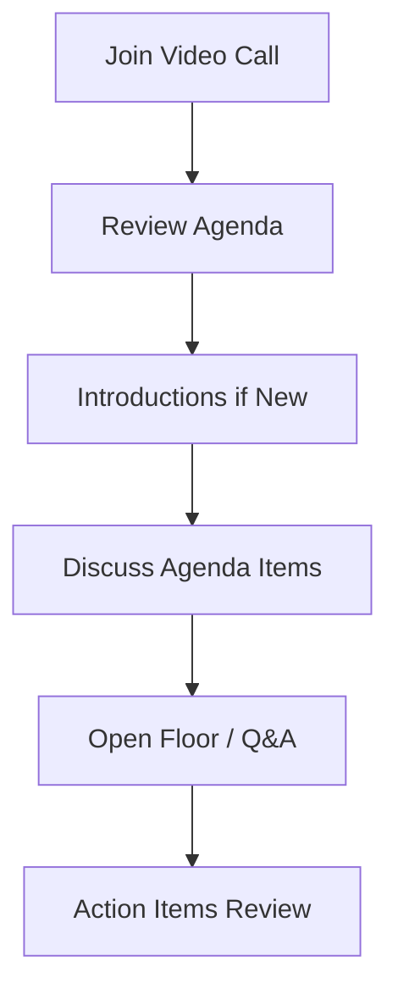

# Using Cilium Community Meetings

Author: [nawazdhandala](https://github.com/nawazdhandala)

Tags: Cilium, Community, Meetings, Open Source, Collaboration

Description: Participate effectively in Cilium community meetings to stay informed, contribute ideas, and connect with other Cilium users and developers.

---

## Introduction

Effective participation in open source projects requires understanding the available resources and processes. Cilium community meetings provides essential information and collaboration opportunities for users and contributors alike.

Knowing how to navigate and community meetings effectively helps you get the most out of the Cilium ecosystem, whether you are troubleshooting an issue, planning a deployment, or contributing code.

This guide covers practical steps for using Cilium community meetings in your daily workflow.

## Prerequisites

- Familiarity with the Cilium project and its ecosystem
- Internet access and a calendar application
- Willingness to participate in community discussions

## Joining Community Meetings

### Finding Meeting Information

Community meeting details are published on:

- **Cilium GitHub**: Check the community repository
- **Cilium Slack**: The #community channel posts meeting reminders
- **Cilium Website**: Community page lists upcoming meetings

### Meeting Schedule

```
Weekly Community Meeting: Every Wednesday
Monthly APAC Meeting: First Thursday of each month
SIG Meetings: Varies by SIG
```

### Preparing for a Meeting

1. **Check the agenda**: Review the meeting agenda document (usually a shared Google Doc)
2. **Add topics**: If you have something to discuss, add it to the agenda before the meeting
3. **Join on time**: Meetings start promptly; joining late may mean missing context
4. **Follow the code of conduct**: Be respectful and constructive

### During the Meeting



### After the Meeting

- Meeting recordings are posted to YouTube
- Notes are shared in Slack and on the mailing list
- Action items are tracked in GitHub issues

## Verification

Verify meeting links work, agendas are accessible, and recordings are available.

## Troubleshooting

- **Cannot find meeting links**: Check the Cilium community calendar and #community Slack channel.
- **Slack workspace access**: Request an invite through the Cilium website.
- **GitHub permissions**: Ensure your account has the necessary access for the repositories you need.
- **Timezone confusion**: All official times are in UTC. Use a timezone converter for your local time.

## Conclusion

Community meetings provide opportunities to engaging with the Cilium community. Active participation strengthens both your own Cilium practice and the broader community.
