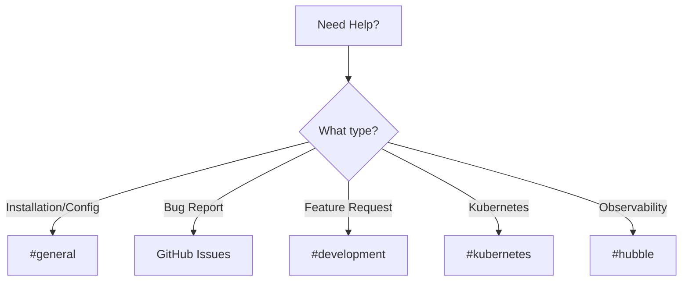

# Using Slack Channels in the Cilium Project

Author: [nawazdhandala](https://github.com/nawazdhandala)

Tags: Cilium, Slack, Community, Communication, Support

Description: Navigate and use Cilium Slack channels effectively to get help, share knowledge, and collaborate with the community.

---

## Introduction

Effective participation in open source projects requires understanding the available resources and processes. Cilium project slack channels provides essential information and collaboration opportunities for users and contributors alike.

Knowing how to navigate and slack channels effectively helps you get the most out of the Cilium ecosystem, whether you are troubleshooting an issue, planning a deployment, or contributing code.

This guide covers practical steps for using Cilium project Slack channels in your daily workflow.

## Prerequisites

- Familiarity with the Cilium project and its ecosystem
- Access to the Cilium & eBPF Slack workspace (join via slack.cilium.io)
- Willingness to participate in community discussions

## Navigating Cilium Slack Channels

### Key Channels

The Cilium Slack workspace includes these essential channels:

```text
#general           - General Cilium discussion
#kubernetes        - Kubernetes-specific questions
#networkpolicy     - Questions on network policies
#development       - Development discussion
#hubble            - Hubble observability
#release           - Release announcements
#service-mesh      - Cilium Service Mesh questions
#tetragon          - Tetragon questions
```

### Getting Help

When asking for help:
1. Search existing messages first
2. Post in the most relevant channel
3. Include: Cilium version, cluster type, error messages, and what you have tried
4. Use threads for extended discussions
5. Share relevant logs and configuration (redact sensitive data)

### Staying Informed

- Star channels you monitor regularly
- Set notification preferences per channel
- Check #release for release announcements
- Follow #development for upcoming changes


```mermaid
flowchart TD
    A[Need Help?] --> B{What type?}
    B -->|Installation/Config| C[#general]
    B -->|Bug Report| D[GitHub Issues]
    B -->|Feature Request| E[#development]
    B -->|Kubernetes| F[#kubernetes]
    B -->|Observability| G[#hubble]
```

## Verification

Confirm Slack channels are accessible and active.

## Troubleshooting

- **Cannot find meeting links**: Check the Cilium community meeting notes and #development Slack channel.
- **Slack workspace access**: Join through slack.cilium.io.
- **GitHub permissions**: Ensure your account has the necessary access for the repositories you need.
- **Timezone confusion**: Check each meeting's listed timezone and use a timezone converter for your local time.

## Conclusion

Slack channels provide opportunities to engaging with the Cilium community. Active participation strengthens both your own Cilium practice and the broader community.
