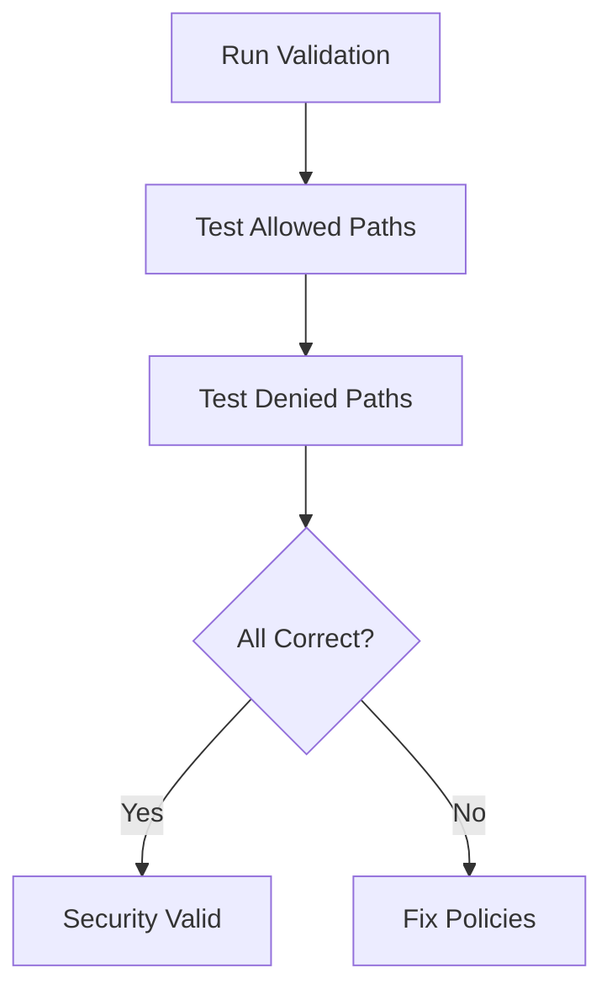

# Validating a Demo Application Secured with Cilium

Author: [nawazdhandala](https://github.com/nawazdhandala)

Tags: Cilium, Kubernetes, Validation, Demo Application, Security

Description: How to validate that a demo application secured with CiliumNetworkPolicy correctly allows intended traffic and blocks unauthorized access.

---

## Introduction

Validating a secured demo application confirms both positive (allowed traffic works) and negative (blocked traffic fails) test cases. This ensures your security policies are effective.

## Prerequisites

- Kubernetes cluster with Cilium and secured demo application
- kubectl configured

## Validation Test Suite

```bash
#!/bin/bash
echo "=== Demo App Security Validation ==="
PASS=0
FAIL=0

# Test 1: Frontend reachable from outside
echo -n "Test 1 - Frontend accessible: "
RESULT=$(kubectl exec -n demo deploy/frontend -- curl -s -o /dev/null -w "%{http_code}" http://localhost:80 --max-time 5)
if [ "$RESULT" = "200" ]; then echo "PASS"; PASS=$((PASS+1)); else echo "FAIL ($RESULT)"; FAIL=$((FAIL+1)); fi

# Test 2: Frontend can reach API
echo -n "Test 2 - Frontend->API: "
RESULT=$(kubectl exec -n demo deploy/frontend -- curl -s -o /dev/null -w "%{http_code}" http://api:8080/ --max-time 5)
if [ "$RESULT" = "200" ]; then echo "PASS"; PASS=$((PASS+1)); else echo "FAIL ($RESULT)"; FAIL=$((FAIL+1)); fi

# Test 3: Frontend cannot reach database
echo -n "Test 3 - Frontend->DB blocked: "
RESULT=$(kubectl exec -n demo deploy/frontend -- curl -s -o /dev/null -w "%{http_code}" http://database:5432/ --max-time 3 2>&1)
if echo "$RESULT" | grep -qE "000|timeout"; then echo "PASS (blocked)"; PASS=$((PASS+1)); else echo "FAIL (not blocked: $RESULT)"; FAIL=$((FAIL+1)); fi

# Test 4: API can reach database
echo -n "Test 4 - API->DB: "
RESULT=$(kubectl exec -n demo deploy/api -- curl -s -o /dev/null -w "%{http_code}" http://database:5432/ --max-time 5 2>&1)
# PostgreSQL will not respond to HTTP, but connection should not be refused
echo "CHECK MANUALLY"

echo ""
echo "Results: $PASS passed, $FAIL failed"
```



## Verification

```bash
kubectl get ciliumnetworkpolicies -n demo
hubble observe -n demo --last 10
```

## Troubleshooting

- **Allowed path fails**: Check policy selectors and service endpoints.
- **Denied path succeeds**: Check for conflicting allow policies.

## Conclusion

Validate secured applications by testing both allowed and denied paths. Automate these tests in CI/CD to catch regressions.