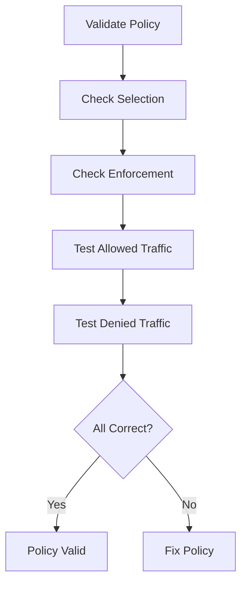

# Validating Sample Network Policies in Cilium

Author: [nawazdhandala](https://github.com/nawazdhandala)

Tags: Cilium, Kubernetes, Network Policy, Validation, Security

Description: How to validate that CiliumNetworkPolicy rules are correctly applied and enforcing the intended access control.

---

## Introduction

Validating network policies means confirming they select the right endpoints, enforce the intended rules, and do not have gaps that allow unauthorized traffic. This is a security-critical validation that should be part of every deployment.

## Prerequisites

- Kubernetes cluster with Cilium and policies applied
- kubectl and Hubble configured

## Validating Policy Selection

```bash
#!/bin/bash
echo "=== Policy Validation ==="

for policy in $(kubectl get ciliumnetworkpolicies -n default -o jsonpath='{.items[*].metadata.name}'); do
  SELECTOR=$(kubectl get ciliumnetworkpolicy "$policy" -n default -o jsonpath='{.spec.endpointSelector.matchLabels}')
  MATCHING=$(kubectl get pods -n default -l "$(echo "$SELECTOR" | jq -r 'to_entries | map("\(.key)=\(.value)") | join(",")')" --no-headers 2>/dev/null | wc -l)
  echo "Policy '$policy' selects $MATCHING pods (selector: $SELECTOR)"
done
```

## Validating Enforcement

```bash
# Check all selected endpoints enforce the policy
kubectl get ciliumendpoints -n default -o json | jq '.items[] | {
  name: .metadata.name,
  ingress: .status.policy.ingress.enforcing,
  egress: .status.policy.egress.enforcing
}'
```

## Testing with Traffic Probes

```bash
# Test allowed traffic
kubectl exec deploy/web-frontend -- \
  curl -s -o /dev/null -w "%{http_code}" http://api-backend:8080/api/v1/test
# Expected: 200

# Test denied traffic
kubectl exec deploy/unauthorized-pod -- \
  curl -s -o /dev/null -w "%{http_code}" --connect-timeout 3 http://api-backend:8080/
# Expected: timeout or connection refused
```



## Verification

```bash
kubectl get ciliumnetworkpolicies -n default
hubble observe -n default --last 10
```

## Troubleshooting

- **No pods selected**: Label mismatch between policy selector and pod labels.
- **Enforcement shows false**: Cilium agent may need restart.
- **Denied traffic still passes**: Check for conflicting allow policies.

## Conclusion

Validate policies by checking selection, enforcement status, and testing with actual traffic. Both allowed and denied paths must be verified.