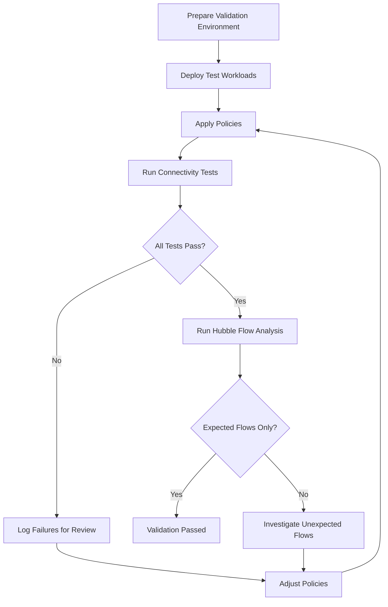

# Validating Node Label Attachment in Cilium

Author: [nawazdhandala](https://github.com/nawazdhandala)

Tags: Cilium, Kubernetes, Network Security, Validation, Node Management

Description: Learn how to validate node labeling in Cilium for Kubernetes. This guide covers practical testing procedures with real examples and commands.

---

## Introduction

Validating node labeling in Cilium ensures that your security policies are enforced correctly and that your cluster behaves as expected. Without proper validation, policy gaps may go undetected until they are exploited.

A robust validation strategy combines automated testing, flow observation, and policy state inspection. This guide provides a structured approach to validating your label-based node policies across different scenarios.

By integrating these validation steps into your deployment workflow, you can catch misconfigurations early and maintain confidence in your security posture.

## Prerequisites

- Kubernetes cluster with Cilium (v1.14+) installed
- Cilium host firewall enabled when validating `nodeSelector` host policies
- `cilium` CLI and Hubble CLI available
- `kubectl` access to the cluster
- A staging or test namespace for validation
- Familiarity with CiliumClusterwideNetworkPolicy syntax

## Setting Up Validation Tests

Create a dedicated test environment for policy validation:

```bash
# Create a validation namespace

kubectl create namespace cilium-validate

# Deploy test workloads
kubectl -n cilium-validate run server \
  --image=nginx:1.25 --labels="app=server" --port=80
kubectl -n cilium-validate expose pod server --port=80

kubectl -n cilium-validate run client \
  --image=busybox:1.36 --labels="app=client" \
  --command -- sleep 3600

# Label the node selected by the host policy
export NODE_NAME=$(kubectl get nodes -o jsonpath='{.items[0].metadata.name}')
kubectl label node "$NODE_NAME" node-access=ssh --overwrite

# Find the Cilium pod running on the selected node
export CILIUM_NAMESPACE=kube-system
export CILIUM_POD_NAME=$(kubectl -n "$CILIUM_NAMESPACE" get pods \
  -l k8s-app=cilium \
  -o jsonpath="{.items[?(@.spec.nodeName=='$NODE_NAME')].metadata.name}")
```



## Validating Policy Enforcement

Apply the host policy and verify it is enforced. In Cilium, a `nodeSelector` in a `CiliumClusterwideNetworkPolicy` selects node host endpoints, not regular pod endpoints:

```yaml
# Test policy for validation
apiVersion: "cilium.io/v2"
kind: CiliumClusterwideNetworkPolicy
metadata:
  name: node-label-policy
spec:
  nodeSelector:
    matchLabels:
      node-access: ssh
  ingress:
    - fromEntities:
        - cluster
    - fromCIDR:
        - 10.0.0.0/8
  egress:
    - toEntities:
        - cluster
    - toCIDR:
        - 10.0.0.0/8
```

```bash
# Validate the selected host endpoint has the node label and policy state
kubectl -n "$CILIUM_NAMESPACE" exec "$CILIUM_POD_NAME" -- \
  cilium-dbg endpoint list
```

### Running Connectivity Tests

```bash
# Run Cilium connectivity test suite
cilium connectivity test
```

### Observing Flows with Hubble

```bash
# Monitor all flows in the validation namespace
hubble observe --namespace cilium-validate --output compact --last 50

# Verify allowed traffic succeeds
kubectl -n cilium-validate exec client -- \
  wget --timeout=5 -q -O - http://server

# Watch host policy verdicts for the selected host endpoint
HOST_EP_ID=$(kubectl -n "$CILIUM_NAMESPACE" exec "$CILIUM_POD_NAME" -- \
  cilium-dbg endpoint get -l reserved:host -o 'jsonpath={$[0].id}')
kubectl -n "$CILIUM_NAMESPACE" exec "$CILIUM_POD_NAME" -- \
  cilium-dbg monitor -t policy-verdict --related-to "$HOST_EP_ID"
```

## Automated Validation Script

```bash
#!/bin/bash
# validate-cilium.sh
# Automated validation script for Cilium policies

set -euo pipefail

NAMESPACE="cilium-validate"
PASS=0
FAIL=0

echo "=== Cilium Policy Validation ==="

# Test 1: Cilium agent health
echo -n "Test 1: Cilium agent health... "
if cilium status > /dev/null 2>&1; then
  echo "PASS"; ((PASS+=1))
else
  echo "FAIL"; ((FAIL+=1))
fi

# Test 2: All CiliumEndpoints ready
echo -n "Test 2: All endpoints ready... "
NOT_READY=$(kubectl get ciliumendpoints -A -o json | \
  jq '[.items[] | select(.status.state != "ready")] | length')
if [ "$NOT_READY" -eq 0 ]; then
  echo "PASS"; ((PASS+=1))
else
  echo "FAIL ($NOT_READY not ready)"; ((FAIL+=1))
fi

# Test 3: Policies applied
echo -n "Test 3: Policies applied... "
CNP_COUNT=$(kubectl get ciliumnetworkpolicies -A --no-headers 2>/dev/null | wc -l)
CCNP_COUNT=$(kubectl get ciliumclusterwidenetworkpolicies --no-headers 2>/dev/null | wc -l)
POLICY_COUNT=$((CNP_COUNT + CCNP_COUNT))
if [ "$POLICY_COUNT" -gt 0 ]; then
  echo "PASS ($POLICY_COUNT policies)"; ((PASS+=1))
else
  echo "FAIL (no policies)"; ((FAIL+=1))
fi

echo ""
echo "Results: $PASS passed, $FAIL failed"
exit $FAIL
```


### Network Segmentation Best Practices

Effective network segmentation goes beyond individual policies. Consider organizing your workloads into security zones based on their sensitivity level and communication requirements.

```bash
# Review all namespace labels for security zone classification
kubectl get namespaces --show-labels

# Identify cross-namespace communication patterns
hubble observe --output json --last 500 | \
  jq -r '.flow | select(.source.namespace != .destination.namespace) |
    "\(.source.namespace)\t\(.destination.namespace)\t\(.l4.TCP.destination_port // .l4.UDP.destination_port // "-")"' | \
  sort | uniq -c | sort -rn

# Ensure each namespace has appropriate policy coverage
for ns in $(kubectl get ns -o jsonpath='{.items[*].metadata.name}'); do
  count=$(kubectl get cnp -n "$ns" --no-headers 2>/dev/null | wc -l)
  echo "Namespace $ns: $count policies"
done
```

When designing your segmentation strategy, ensure that each security zone has explicit ingress and egress policies. This defense-in-depth approach ensures that even if one layer of security is compromised, other layers continue to protect your workloads.

## Verification

```bash
# Final validation check
cilium status
```

```bash
# Confirm all CiliumEndpoints are ready
kubectl get ciliumendpoints -A
```

```bash
# Verify no policy violations
hubble observe --verdict DROPPED --last 20 --output compact
```

## Troubleshooting

- **Connectivity test failures**: Check if Hubble relay is running and if test pods have correct labels.
- **Validation namespace conflicts**: Ensure no pre-existing policies in the validation namespace interfere with tests.
- **Inconsistent test results**: Run tests multiple times to rule out timing issues with policy propagation.
- **Test pods stuck in Pending**: Verify cluster has sufficient resources and the test images are accessible.

## Conclusion

Validating node labeling in Cilium is an ongoing practice that should be embedded in your CI/CD pipeline. The combination of Cilium's connectivity tests, Hubble flow observation, and custom validation scripts provides comprehensive coverage. Regular validation catches configuration drift, policy regressions, and enforcement gaps before they impact production. Always maintain your validation test suite alongside your policy definitions.
