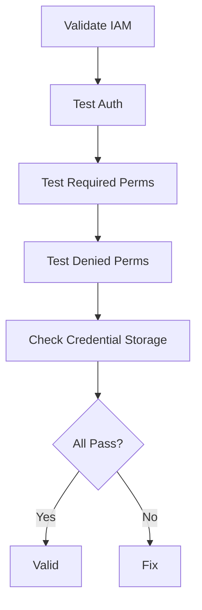

# Validating AWS Access Keys and IAM Roles in Cilium

Author: [nawazdhandala](https://github.com/nawazdhandala)

Tags: Cilium, Kubernetes, AWS, IAM, Validation

Description: How to validate AWS IAM configuration for Cilium to ensure correct authentication, minimal permissions, and secure credential handling.

---

## Introduction

Validating AWS IAM configuration for Cilium ensures authentication works, permissions are minimal, and credentials are handled securely. Run these checks after initial setup, after IAM changes, and during security audits.

## Prerequisites

- EKS cluster with Cilium
- kubectl and AWS CLI configured

## Validating Authentication

```bash
#!/bin/bash
echo "=== AWS IAM Validation for Cilium ==="

# Test authentication
IDENTITY=$(kubectl exec -n kube-system -l k8s-app=cilium -- \
  aws sts get-caller-identity 2>&1)
if echo "$IDENTITY" | jq -e '.Arn' &>/dev/null; then
  echo "PASS: Authentication works"
  echo "  Role: $(echo "$IDENTITY" | jq -r '.Arn')"
else
  echo "FAIL: Authentication failed"
  echo "  Error: $IDENTITY"
fi

# Test ENI operations
ENIS=$(kubectl exec -n kube-system -l k8s-app=cilium -- \
  aws ec2 describe-network-interfaces --max-items 1 2>&1)
if echo "$ENIS" | jq -e '.NetworkInterfaces' &>/dev/null; then
  echo "PASS: ENI API access works"
else
  echo "FAIL: ENI API access denied"
fi
```

## Validating Least Privilege

```bash
# Test actions that should be denied
for action in s3:ListBuckets iam:CreateUser ec2:TerminateInstances; do
  RESULT=$(aws iam simulate-principal-policy \
    --policy-source-arn arn:aws:iam::123456789012:role/cilium-role \
    --action-names "$action" --query 'EvaluationResults[0].EvalDecision' --output text)
  if [ "$RESULT" = "implicitDeny" ] || [ "$RESULT" = "explicitDeny" ]; then
    echo "PASS: $action is denied"
  else
    echo "FAIL: $action is allowed (should be denied)"
  fi
done
```



## Verification

```bash
cilium status | grep IPAM
kubectl get sa cilium -n kube-system -o yaml
```

## Troubleshooting

- **Auth validation fails**: Check IRSA setup and role trust policy.
- **Overly broad permissions**: Tighten IAM policy immediately.
- **Cannot simulate policies**: Ensure you have iam:SimulatePrincipalPolicy permission.

## Conclusion

Validate AWS IAM for Cilium by testing authentication, verifying required permissions work, and confirming unnecessary permissions are denied. This ensures both functionality and security.