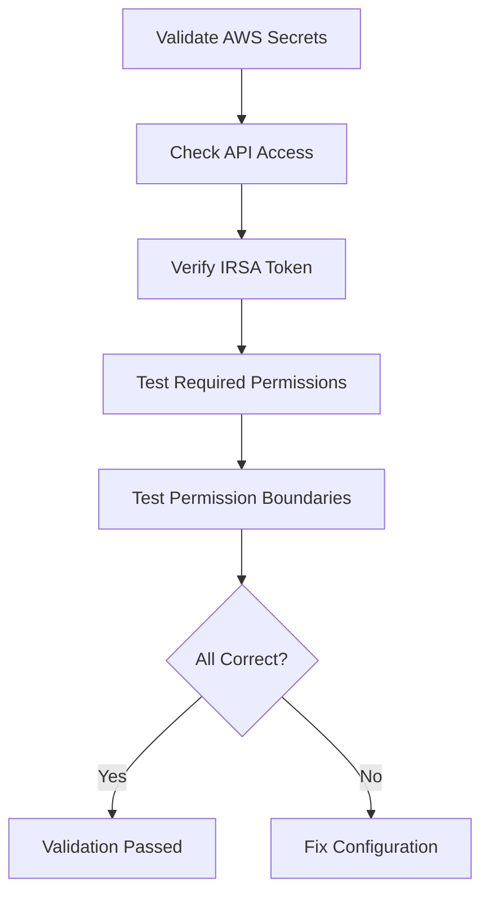

# Validating AWS Secrets Configuration in Cilium Security

Author: [nawazdhandala](https://github.com/nawazdhandala)

Tags: Cilium, Kubernetes, AWS, Validation, Security

Description: How to validate that AWS credentials are correctly configured and secured for Cilium, including permission tests and security audits.

---

## Introduction

Validating AWS secrets configuration in Cilium ensures that credentials work correctly, have minimal permissions, and are stored securely. This validation is important for security compliance and operational reliability.

## Prerequisites

- EKS or AWS Kubernetes cluster with Cilium
- kubectl and AWS CLI configured

## Validating Credential Access

```bash
#!/bin/bash
echo "=== AWS Credential Validation ==="

# Test API access from Cilium pod
IDENTITY=$(kubectl exec -n kube-system -l k8s-app=cilium -- \
  aws sts get-caller-identity 2>/dev/null)
if [ $? -eq 0 ]; then
  echo "PASS: AWS credentials working"
  echo "$IDENTITY" | jq .
else
  echo "FAIL: Cannot access AWS API"
fi

# Verify IRSA token exists
TOKEN=$(kubectl exec -n kube-system -l k8s-app=cilium -- \
  cat /var/run/secrets/eks.amazonaws.com/serviceaccount/token 2>/dev/null | head -c 20)
if [ -n "$TOKEN" ]; then
  echo "PASS: IRSA token mounted"
else
  echo "WARN: No IRSA token found (may use instance profile)"
fi
```

## Validating Least Privilege

```bash
# Test that Cilium can perform required operations
kubectl exec -n kube-system -l k8s-app=cilium -- \
  aws ec2 describe-network-interfaces --max-items 1

# Test that overly broad permissions are denied
kubectl exec -n kube-system -l k8s-app=cilium -- \
  aws s3 ls 2>&1 | head -3
# Should show AccessDenied
```



## Validating Secret Storage

```bash
# Check no static credentials in ConfigMaps
kubectl get configmap cilium-config -n kube-system -o json | \
  jq '.data | keys[] | select(test("aws|key|secret"; "i"))'

# Verify secrets have appropriate RBAC
kubectl get rolebindings -n kube-system | grep secret
```

## Verification

```bash
cilium status | grep IPAM
kubectl exec -n kube-system -l k8s-app=cilium -- aws sts get-caller-identity
```

## Troubleshooting

- **API access fails**: Check IRSA setup and IAM role.
- **Overly broad permissions**: Tighten IAM policy to only required EC2 actions.
- **Secrets found in ConfigMap**: Migrate to IRSA immediately.

## Conclusion

Validate AWS secrets by testing API access, confirming least-privilege permissions, and auditing secret storage. IRSA should be used instead of static credentials for production Cilium deployments.