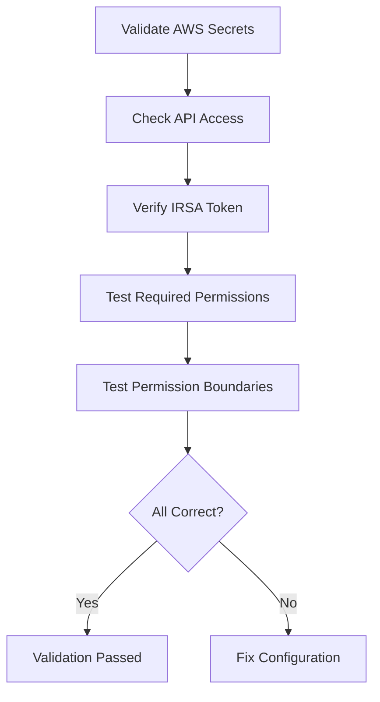

# Validating AWS Secrets Configuration in Cilium Security

Author: [nawazdhandala](https://github.com/nawazdhandala)

Tags: Cilium, Kubernetes, AWS, Validation, Security

Description: How to validate that AWS credentials are correctly configured and secured for Cilium, including permission tests and security audits.

---

## Introduction

Validating AWS secrets configuration in Cilium ensures that credentials work correctly, have minimal permissions, and are stored securely. This validation is important for security compliance and operational reliability.

## Prerequisites

- EKS or AWS Kubernetes cluster with Cilium
- kubectl and AWS CLI configured
- Permission to run a temporary AWS CLI pod in the `kube-system` namespace

## Validating Credential Access

```bash
#!/bin/bash
echo "=== AWS Credential Validation ==="

# Test API access using the Cilium operator service account
OPERATOR_SA=$(kubectl get deployment cilium-operator -n kube-system \
  -o jsonpath='{.spec.template.spec.serviceAccountName}')

IDENTITY=$(kubectl run aws-credential-check -n kube-system \
  --rm -i --quiet --restart=Never \
  --image=public.ecr.aws/aws-cli/aws-cli:2 \
  --overrides="{\"spec\":{\"serviceAccountName\":\"${OPERATOR_SA}\"}}" \
  -- sts get-caller-identity 2>/dev/null)
if [ $? -eq 0 ]; then
  echo "PASS: AWS credentials working"
  echo "$IDENTITY" | jq .
else
  echo "FAIL: Cannot access AWS API"
fi

# Verify IRSA role annotation exists
ROLE_ARN=$(kubectl get serviceaccount "$OPERATOR_SA" -n kube-system \
  -o jsonpath='{.metadata.annotations.eks\.amazonaws\.com/role-arn}')
if [ -n "$ROLE_ARN" ]; then
  echo "PASS: IRSA role annotated: $ROLE_ARN"
else
  echo "WARN: No IRSA role annotation found (may use instance profile or EKS Pod Identity)"
fi
```

## Validating Least Privilege

```bash
# Test that the Cilium operator can perform a required ENI operation
OPERATOR_SA=$(kubectl get deployment cilium-operator -n kube-system \
  -o jsonpath='{.spec.template.spec.serviceAccountName}')

kubectl run aws-permission-check -n kube-system \
  --rm -i --quiet --restart=Never \
  --image=public.ecr.aws/aws-cli/aws-cli:2 \
  --overrides="{\"spec\":{\"serviceAccountName\":\"${OPERATOR_SA}\"}}" \
  -- \
  ec2 describe-network-interfaces --max-items 1

# Test that overly broad permissions are denied
kubectl run aws-s3-deny-check -n kube-system \
  --rm -i --quiet --restart=Never \
  --image=public.ecr.aws/aws-cli/aws-cli:2 \
  --overrides="{\"spec\":{\"serviceAccountName\":\"${OPERATOR_SA}\"}}" \
  -- \
  s3 ls 2>&1 | head -3
# Should show AccessDenied
```


```mermaid
graph TD
    A[Validate AWS Secrets] --> B[Check API Access]
    B --> C[Verify IRSA Token]
    C --> D[Test Required Permissions]
    D --> E[Test Permission Boundaries]
    E --> F{All Correct?}
    F -->|Yes| G[Validation Passed]
    F -->|No| H[Fix Configuration]
```

## Validating Secret Storage

```bash
# Check no static credentials in ConfigMaps
kubectl get configmap cilium-config -n kube-system -o json | \
  jq -r '.data // {} | to_entries[] |
    select((.key | test("aws|access|key|secret"; "i")) or
           (.value | test("AKIA|aws_access_key_id|aws_secret_access_key"; "i"))) |
    .key'

# Verify whether the Cilium operator service account can read Kubernetes secrets
OPERATOR_SA=$(kubectl get deployment cilium-operator -n kube-system \
  -o jsonpath='{.spec.template.spec.serviceAccountName}')
kubectl auth can-i get secrets \
  --as="system:serviceaccount:kube-system:${OPERATOR_SA}" \
  -n kube-system
```

## Verification

```bash
cilium status | grep IPAM
OPERATOR_SA=$(kubectl get deployment cilium-operator -n kube-system \
  -o jsonpath='{.spec.template.spec.serviceAccountName}')
kubectl run aws-final-check -n kube-system \
  --rm -i --quiet --restart=Never \
  --image=public.ecr.aws/aws-cli/aws-cli:2 \
  --overrides="{\"spec\":{\"serviceAccountName\":\"${OPERATOR_SA}\"}}" \
  -- sts get-caller-identity
```

## Troubleshooting

- **API access fails**: Check IRSA or EKS Pod Identity setup and IAM role.
- **Overly broad permissions**: Tighten IAM policy to only required EC2 actions.
- **Secrets found in ConfigMap**: Migrate to IRSA immediately.

## Conclusion

Validate AWS secrets by testing API access, confirming least-privilege permissions, and auditing secret storage. IRSA or EKS Pod Identity should be used instead of static credentials for production Cilium deployments.
