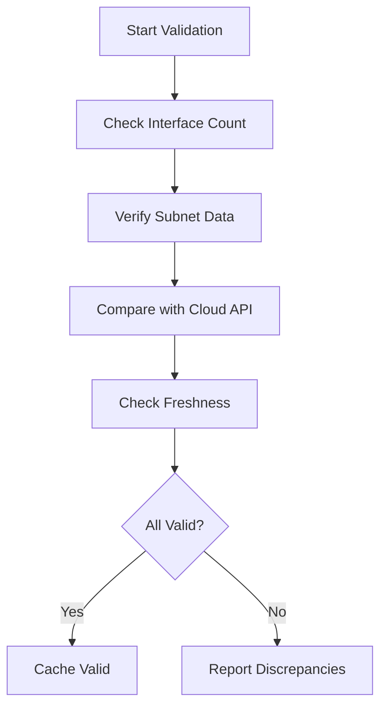

# Validating Interface and Subnet Cache in Cilium IPAM

Author: [nawazdhandala](https://github.com/nawazdhandala)

Tags: Cilium, Kubernetes, IPAM, Validation, Cloud Networking

Description: How to validate that Cilium IPAM correctly caches interface, subnet, and virtual network information in cloud-provider deployments.

---

## Introduction

Validating the IPAM cache means confirming that Cilium has an accurate and current view of your cloud networking resources. This includes verifying that every node has its interfaces listed, that subnet capacity matches the cloud provider view, and that virtual network topology is correctly reflected in CiliumNode resources.

Cache validation catches issues where the operator has stale data, where new subnets are not discovered, or where interface changes after node scaling are not reflected.

## Prerequisites

- Kubernetes cluster on a cloud provider with Cilium
- kubectl and Cilium CLI configured
- Cloud provider CLI (az, aws, or gcloud) for comparison

## Validating Interface Discovery

```bash
#!/bin/bash
# validate-interface-cache.sh

echo "=== Interface Cache Validation ==="

NODES=$(kubectl get nodes -o jsonpath='{.items[*].metadata.name}')
for node in $NODES; do
  # Check CiliumNode has interface data
  IFACE_COUNT=$(kubectl get ciliumnode "$node" -o json | \
    jq '.spec.azure.interfaces // .spec.eni.enis // {} | length')

  if [ "$IFACE_COUNT" -eq 0 ]; then
    echo "FAIL: Node $node has no cached interfaces"
  else
    echo "OK: Node $node has $IFACE_COUNT interfaces cached"
  fi
done
```

## Validating Subnet Capacity

```bash
# Compare IPAM view with actual usage
kubectl get ciliumnodes -o json | jq '.items[] | {
  node: .metadata.name,
  allocated: (.status.ipam.used // {} | length),
  pool_size: (.spec.ipam.pool // {} | length)
}'
```



## Cross-Referencing with Cloud API

### Azure Example

```bash
# Get actual interfaces from Azure
az network nic list --resource-group my-rg -o table

# Compare with Cilium cache
kubectl get ciliumnodes -o json | jq '.items[] | {
  name: .metadata.name,
  cached_interfaces: (.spec.azure.interfaces // [] | length)
}'
```

### AWS Example

```bash
# Get actual ENIs from AWS
aws ec2 describe-network-interfaces \
  --filters Name=tag:cluster,Values=my-cluster --query 'NetworkInterfaces[].NetworkInterfaceId'

# Compare with Cilium cache
kubectl get ciliumnodes -o json | jq '.items[] | {
  name: .metadata.name,
  cached_enis: (.spec.eni.enis // {} | length)
}'
```

## Validating Cache Freshness

```bash
# Check when CiliumNode was last updated
kubectl get ciliumnodes -o json | jq '.items[] | {
  name: .metadata.name,
  last_update: .metadata.managedFields[-1].time
}'

# Check operator last sync time
kubectl logs -n kube-system -l name=cilium-operator --tail=100 | \
  grep "resync" | tail -5
```

## Verification

```bash
cilium status | grep IPAM
kubectl get ciliumnodes --no-headers | wc -l
kubectl get nodes --no-headers | wc -l
```

## Troubleshooting

- **Interface count mismatch**: Restart operator to force resync with cloud API.
- **Subnet data missing**: Check operator permissions in cloud IAM.
- **Cache freshness too old**: Operator may be stuck. Check logs and restart if needed.
- **Cloud CLI shows different data**: May be a permissions or region mismatch.

## Conclusion

Regular validation of the IPAM cache ensures Cilium has accurate cloud networking data. Cross-reference cached data with cloud provider APIs, check freshness timestamps, and run validation after any cloud infrastructure changes.