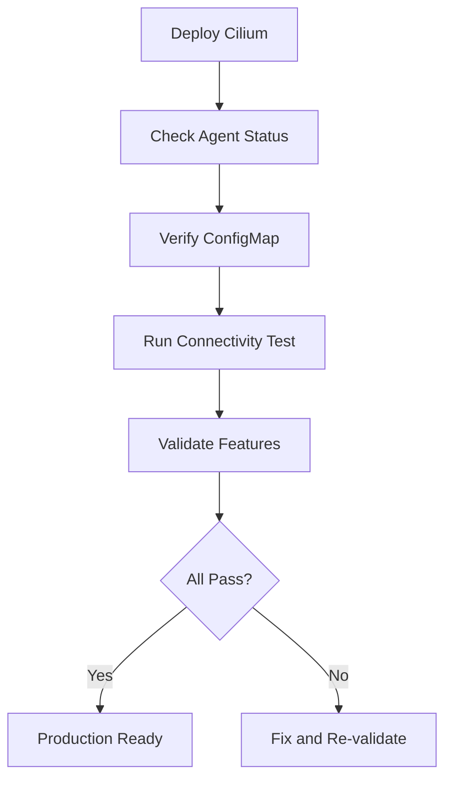

# Validating Cilium Configuration for Production Readiness

Author: [nawazdhandala](https://github.com/nawazdhandala)

Tags: Cilium, Kubernetes, Validation, Configuration, Best Practices

Description: How to validate Cilium configuration before and after deployment to ensure correct networking, security, and observability settings for production.

---

## Introduction

Validating Cilium configuration means verifying settings are internally consistent, compatible with your cluster environment, and aligned with requirements. A misconfigured installation can run without errors while silently dropping traffic or leaving encryption disabled.

Validation should happen at three points: before deployment (linting Helm values), after deployment (verifying agent state), and periodically (drift detection).

This guide provides validation checks for each stage.

## Prerequisites

- Kubernetes cluster with Cilium installed or ready to install
- Helm v3 and kubectl configured
- Cilium CLI installed
- jq for JSON processing

## Pre-Deployment Validation

```bash
# Dry-run Helm to catch template errors
helm template cilium cilium/cilium \
  --namespace kube-system \
  -f cilium-values.yaml > /tmp/cilium-rendered.yaml

# Check for common misconfigurations
grep "tunnel:" /tmp/cilium-rendered.yaml
grep "ipam:" -A5 /tmp/cilium-rendered.yaml
grep "resources:" -A10 /tmp/cilium-rendered.yaml
```

### Configuration Checklist Script

```bash
#!/bin/bash
# validate-cilium-config.sh
VALUES_FILE="${1:-cilium-values.yaml}"
ERRORS=0

echo "=== Cilium Configuration Validation ==="

if ! grep -q "ipam:" "$VALUES_FILE"; then
  echo "FAIL: No IPAM configuration found"
  ERRORS=$((ERRORS + 1))
fi

if ! grep -q "enabled: true" <(grep -A1 "hubble:" "$VALUES_FILE"); then
  echo "WARN: Hubble not enabled (recommended)"
fi

echo "Validation complete. Errors: $ERRORS"
exit $ERRORS
```

## Post-Deployment Validation



### Agent State Validation

```bash
kubectl get daemonset cilium -n kube-system

NODES=$(kubectl get nodes --no-headers | wc -l)
AGENTS=$(kubectl get pods -n kube-system -l k8s-app=cilium --no-headers | wc -l)
if [ "$NODES" -ne "$AGENTS" ]; then
  echo "FAIL: Node count ($NODES) != Agent count ($AGENTS)"
fi

cilium status
cilium status --verbose | grep -E "Encryption|Hubble|BandwidthManager"
```

### Connectivity Validation

```bash
cilium connectivity test
cilium connectivity test --test pod-to-pod
cilium connectivity test --test pod-to-service
```

## Configuration Drift Detection

```bash
#!/bin/bash
# detect-config-drift.sh
EXPECTED_TUNNEL=$(helm get values cilium -n kube-system \
  -o json | jq -r '.tunnel // "vxlan"')
ACTUAL_TUNNEL=$(kubectl get configmap cilium-config -n kube-system \
  -o jsonpath='{.data.tunnel}')

if [ "$EXPECTED_TUNNEL" != "$ACTUAL_TUNNEL" ]; then
  echo "DRIFT: tunnel expected=$EXPECTED_TUNNEL actual=$ACTUAL_TUNNEL"
fi
```

## Verification

```bash
cilium status
cilium connectivity test
kubectl get daemonset cilium -n kube-system
```

## Troubleshooting

- **Helm template fails**: Check YAML syntax and chart version compatibility.
- **Connectivity test failures**: Pod-to-pod failures indicate datapath issues; pod-to-external failures indicate masquerade/routing issues.
- **Configuration drift**: Re-apply Helm values and restart agents.
- **Feature shows disabled**: Some features require kernel support. Check kernel version.

## Conclusion

Cilium configuration validation is pre-deployment linting, post-deployment verification, and ongoing drift detection. The built-in connectivity test suite is your most powerful tool, supplemented with configuration checks for feature enablement and consistency.