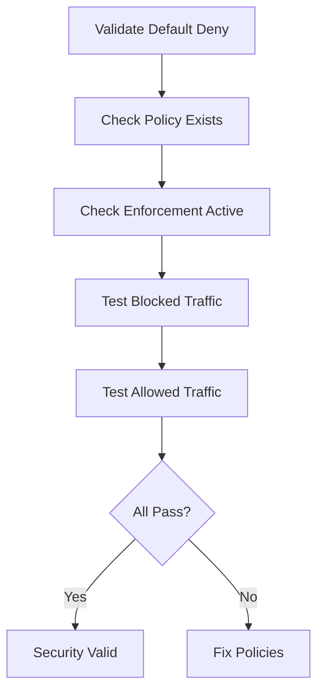

# Validating Cilium Default Deny Ingress Policy Enforcement

Author: [nawazdhandala](https://github.com/nawazdhandala)

Tags: Cilium, Kubernetes, Network Policy, Validation, Security

Description: How to validate that Cilium default deny ingress policies are properly enforced, blocking unauthorized traffic while allowing legitimate communication.

---

## Introduction

Validating default deny ingress means confirming that unauthorized traffic is actually blocked while permitted traffic flows correctly. This is a security validation that should be part of your CI/CD pipeline and regular audits.

The key checks are: default deny policies exist in all relevant namespaces, endpoints show policy enforcement is active, unauthorized traffic is actually dropped, and authorized traffic passes through allow policies.

## Prerequisites

- Kubernetes cluster with Cilium and default deny policies
- kubectl and Cilium CLI configured
- Hubble enabled

## Validating Policy Existence

```bash
#!/bin/bash
# validate-default-deny.sh

echo "=== Default Deny Validation ==="
ERRORS=0

for ns in $(kubectl get namespaces -o jsonpath='{.items[*].metadata.name}'); do
  if [[ "$ns" == "kube-system" || "$ns" == "kube-public" || "$ns" == "kube-node-lease" ]]; then
    continue
  fi
  
  POLICIES=$(kubectl get ciliumnetworkpolicies -n "$ns" \
    -o jsonpath='{.items[*].metadata.name}' 2>/dev/null)
  
  if echo "$POLICIES" | grep -q "default-deny"; then
    echo "OK: $ns has default deny policy"
  else
    echo "FAIL: $ns missing default deny policy"
    ERRORS=$((ERRORS + 1))
  fi
done

echo "Errors: $ERRORS"
```

## Validating Enforcement

```bash
# Check endpoints are enforcing ingress policy
kubectl get ciliumendpoints -n default -o json | jq '.items[] | {
  name: .metadata.name,
  enforcing: .status.policy.ingress.enforcing
}' | jq 'select(.enforcing != true)'
```

## Testing with Traffic Probes

```bash
# Deploy a test pod that should be blocked
kubectl run test-probe --image=busybox:1.36 --restart=Never -- sleep 3600

# Attempt to reach a service (should be blocked)
kubectl exec test-probe -- wget -qO- --timeout=3 http://backend:8080 2>&1
# Expected: timeout/connection refused

# Clean up
kubectl delete pod test-probe
```



## Verification

```bash
kubectl get ciliumnetworkpolicies --all-namespaces
hubble observe --verdict DROPPED --last 5
cilium endpoint list | head -10
```

## Troubleshooting

- **Policy exists but not enforcing**: Check Cilium agent health. Endpoints may need regeneration.
- **Traffic not blocked as expected**: Verify the policy selector matches the target pods.
- **Allowed traffic also blocked**: Check allow policies are in the correct namespace and select the right labels.

## Conclusion

Validate default deny by checking policy existence, verifying enforcement on endpoints, and testing with actual traffic probes. Automate these checks in CI/CD to ensure your zero-trust posture is maintained through all cluster changes.