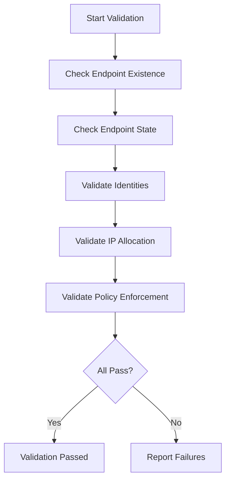

# Validating Cilium Endpoint CRD Health and Correctness

Author: [nawazdhandala](https://github.com/nawazdhandala)

Tags: Cilium, Kubernetes, Validation, Endpoints, Networking

Description: How to validate CiliumEndpoint custom resources to ensure correct identity assignment, IP allocation, policy enforcement, and overall endpoint health in production.

---

## Introduction

Validating CiliumEndpoint resources means confirming every pod has a corresponding endpoint, each endpoint has the correct identity, and policies are enforced as expected. This is proactive verification you run before deployments, during audits, or in CI/CD pipelines.

A validation failure might indicate a misconfiguration that will cause problems under specific conditions, like a policy that does not match the right identity or an endpoint missing IPv6 addressing in a dual-stack cluster.

This guide provides validation checks you can run manually or automate.

## Prerequisites

- Kubernetes cluster with Cilium installed (v1.14+)
- kubectl and Cilium CLI configured
- jq installed for JSON processing

## Validating Endpoint Existence

```bash
#!/bin/bash
# validate-endpoints-exist.sh

NAMESPACES=$(kubectl get namespaces -o jsonpath='{.items[*].metadata.name}')
ERRORS=0

for ns in $NAMESPACES; do
  PODS=$(kubectl get pods -n "$ns" --field-selector=status.phase=Running \
    -o jsonpath='{range .items[?(@.spec.hostNetwork!=true)]}{.metadata.name}{"\n"}{end}')
  for pod in $PODS; do
    if ! kubectl get ciliumendpoint "$pod" -n "$ns" &>/dev/null; then
      echo "FAIL: Pod $ns/$pod has no CiliumEndpoint"
      ERRORS=$((ERRORS + 1))
    fi
  done
done

if [ "$ERRORS" -eq 0 ]; then
  echo "PASS: All pods have corresponding CiliumEndpoints"
else
  echo "FAIL: $ERRORS pods missing CiliumEndpoints"
  exit 1
fi
```

## Validating Endpoint State and Identity

```bash
# Check for endpoints not in ready state
cilium endpoint list -o json | \
  jq '[.[] | select(.status.state != "ready")] | length'

# Check for reserved identities assigned unexpectedly
kubectl get ciliumendpoints --all-namespaces -o json | jq -r '
  .items[] |
  select(.status.identity.id < 100) |
  "WARNING: \(.metadata.namespace)/\(.metadata.name) has reserved identity"'
```



## Validating IP Allocation

```bash
# Check for duplicate IPs
kubectl get ciliumendpoints --all-namespaces -o json | jq -r '
  [.items[] | .status.networking.addressing[]? | .ipv4 // empty] |
  group_by(.) | .[] | select(length > 1) |
  "DUPLICATE IP: \(.[0]) assigned to \(length) endpoints"'

# Check for endpoints without IP addresses
kubectl get ciliumendpoints --all-namespaces -o json | jq -r '
  .items[] |
  select(.status.networking.addressing == null or
    (.status.networking.addressing | length) == 0) |
  "NO IP: \(.metadata.namespace)/\(.metadata.name)"'
```

## Validating Policy Enforcement

```bash
kubectl get ciliumendpoints --all-namespaces -o json | jq -r '
  .items[] |
  select(.status.policy.ingress.enforcing == false or
    .status.policy.egress.enforcing == false) |
  "NOT ENFORCING: \(.metadata.namespace)/\(.metadata.name)"'
```

## Verification

```bash
cilium connectivity test
cilium status
kubectl get crd ciliumendpoints.cilium.io \
  -o jsonpath='{.status.conditions[?(@.type=="Established")].status}'
```

## Troubleshooting

- **Validation script times out**: Use `--chunk-size=100` with kubectl or process namespaces in parallel.
- **False positives on host-networked pods**: Filter out pods with `hostNetwork: true`.
- **Many shared identities**: Normal when pods have the same labels. Cilium groups identical label sets under one identity.
- **IP conflicts**: Serious issue. Restart Cilium agents on affected nodes and check IPAM config.

## Conclusion

Regular validation of CiliumEndpoint CRDs catches configuration drift before it causes outages. The key validations are endpoint existence, ready state, identity correctness, IP uniqueness, and policy enforcement status. Automate these in CI/CD for continuous assurance.