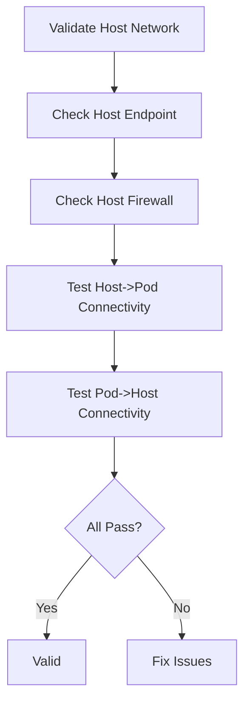

# Validating Cilium Host Network Mode Configuration

Author: [nawazdhandala](https://github.com/nawazdhandala)

Tags: Cilium, Kubernetes, Host Network, Validation, Networking

Description: How to validate that Cilium correctly handles host network mode pods, including policy enforcement, connectivity, and identity assignment.

---

## Introduction

Validating host network mode ensures that pods running in the node network namespace are handled correctly by Cilium. This includes verifying that host firewall policies apply, that connectivity works between host-networked and regular pods, and that the node identity is correctly assigned.

## Prerequisites

- Kubernetes cluster with Cilium installed
- Host firewall enabled
- kubectl and Cilium CLI configured

## Validating Host Endpoint

```bash
#!/bin/bash
echo "=== Host Network Validation ==="

# Check host endpoint exists on each node
for node in $(kubectl get nodes -o jsonpath='{.items[*].metadata.name}'); do
  CILIUM_POD=$(kubectl get pods -n kube-system -l k8s-app=cilium \
    --field-selector spec.nodeName="$node" -o jsonpath='{.items[0].metadata.name}')
  HOST_EP=$(kubectl exec -n kube-system "$CILIUM_POD" -- \
    cilium endpoint list -o json | jq '.[] | select(.status.labels.security-relevant | join(",") | contains("reserved:host"))')
  if [ -n "$HOST_EP" ]; then
    echo "OK: Node $node has host endpoint"
  else
    echo "FAIL: Node $node missing host endpoint"
  fi
done
```

## Validating Host Firewall

```bash
# Check host firewall is enabled
HF_ENABLED=$(kubectl get configmap cilium-config -n kube-system \
  -o jsonpath='{.data.enable-host-firewall}')
if [ "$HF_ENABLED" = "true" ]; then
  echo "PASS: Host firewall enabled"
else
  echo "FAIL: Host firewall not enabled"
fi
```

## Testing Connectivity

```bash
# Test host-networked pod can reach regular pods
kubectl exec host-net-pod -- curl -s --connect-timeout 5 http://regular-service/

# Test regular pods can reach host-networked services
kubectl exec deploy/regular-app -- curl -s --connect-timeout 5 http://<node-ip>:8080/
```



## Verification

```bash
cilium status
cilium endpoint list | grep host
```

## Troubleshooting

- **Host endpoint missing**: Cilium agent may need restart on that node.
- **Host firewall not enabled**: Apply Helm upgrade with `hostFirewall.enabled=true`.
- **Connectivity fails**: Check for conflicting iptables rules on the node.

## Conclusion

Validate host network mode by checking host endpoints exist, host firewall is enabled, and bidirectional connectivity works. Host network mode requires explicit configuration for proper Cilium integration.