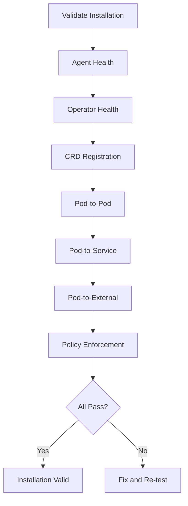

# Validating a Cilium Installation for Correctness

Author: [nawazdhandala](https://github.com/nawazdhandala)

Tags: Cilium, Kubernetes, Validation, Installation, Networking

Description: How to validate a fresh Cilium installation to confirm proper networking, policy enforcement, encryption, and observability are all functioning correctly.

---

## Introduction

After installing Cilium, validation ensures that all components are operational and the data plane is correctly forwarding traffic. A successful `cilium install` does not guarantee everything works. Agents might be running but BPF programs might not be loaded, IPAM might allocate IPs but routing might be broken, and policies might be created but not enforced.

Comprehensive validation tests networking between pods, services, external access, and policy enforcement. Cilium provides a built-in connectivity test suite that covers most scenarios.

This guide walks through systematic validation of a Cilium installation.

## Prerequisites

- Kubernetes cluster with Cilium installed
- Cilium CLI and kubectl configured
- A test namespace for validation workloads

## Basic Health Checks

```bash
# Overall Cilium status
cilium status

# Verify all agents are running
kubectl get daemonset cilium -n kube-system
EXPECTED=$(kubectl get nodes --no-headers | wc -l)
READY=$(kubectl get daemonset cilium -n kube-system \
  -o jsonpath='{.status.numberReady}')
echo "Nodes: $EXPECTED, Ready agents: $READY"

# Verify operator is running
kubectl get deployment cilium-operator -n kube-system

# Check CRDs are installed
kubectl get crd | grep cilium
```

## Running the Connectivity Test Suite

```bash
# Run the full connectivity test
cilium connectivity test

# Run specific tests
cilium connectivity test --test pod-to-pod
cilium connectivity test --test pod-to-service
cilium connectivity test --test pod-to-external
cilium connectivity test --test pod-to-cidr

# Run with verbose output for debugging
cilium connectivity test --debug
```



## Validating Network Connectivity

```bash
# Deploy test pods
kubectl create namespace cilium-test
kubectl apply -n cilium-test -f \
  https://raw.githubusercontent.com/cilium/cilium/main/examples/kubernetes/connectivity-check/connectivity-check.yaml

# Check all test pods are running
kubectl get pods -n cilium-test -o wide

# Verify cross-node communication
kubectl exec -n cilium-test -it deployment/client -- \
  curl -s http://echo-service:8080
```

## Validating Policy Enforcement

```yaml
# test-deny-all.yaml
apiVersion: cilium.io/v2
kind: CiliumNetworkPolicy
metadata:
  name: deny-all
  namespace: cilium-test
spec:
  endpointSelector: {}
  ingress: []
  egress: []
```

```bash
# Apply deny-all policy
kubectl apply -f test-deny-all.yaml

# Verify traffic is blocked
kubectl exec -n cilium-test -it deployment/client -- \
  curl -s --connect-timeout 5 http://echo-service:8080
# Should timeout

# Clean up
kubectl delete -f test-deny-all.yaml
```

## Verification

```bash
cilium status
cilium connectivity test
echo "All validation checks passed"
```

## Troubleshooting

- **Pod-to-pod test fails**: Check routing configuration and ensure VXLAN/Geneve ports are open between nodes.
- **Pod-to-service test fails**: Verify kube-proxy replacement is configured correctly if enabled.
- **Pod-to-external test fails**: Check masquerade configuration and ensure nodes have internet access.
- **Policy test does not block traffic**: Verify policy enforcement mode. Check endpoint policy status.

## Conclusion

Validate every Cilium installation with the connectivity test suite before moving workloads to the cluster. The tests cover pod networking, service resolution, external access, and policy enforcement. Run them after installation, after upgrades, and after any configuration changes.